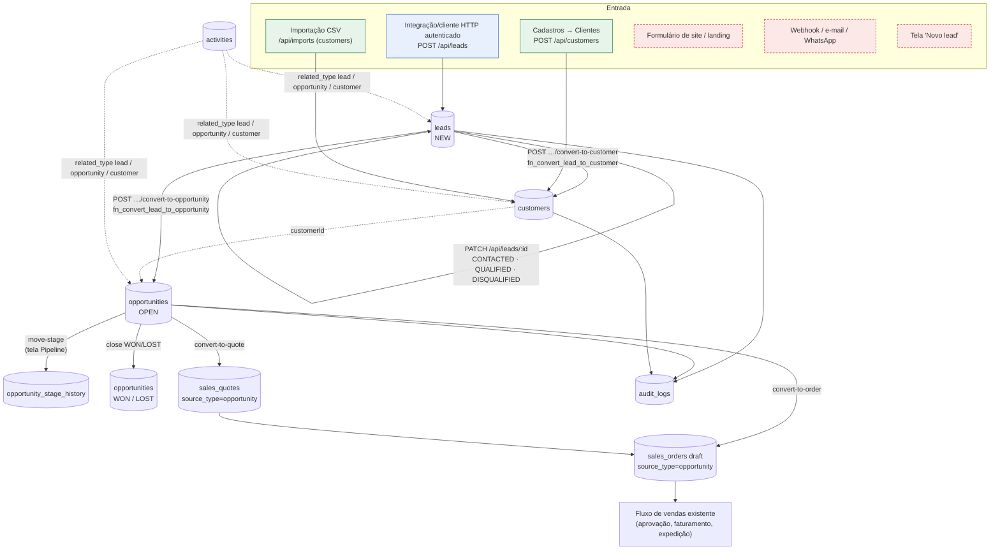

# Fluxo de dados do CRM — ATLAS.ERP (10/10/2026, atualizado na fase de correções)

> **Atualização (fase de correções, mesma branch):** conversões de lead corrigidas no banco (migration **0089**), API alinhada ao banco e ao isolamento entre empresas, e CRM operável pela interface. Resumo no §11; detalhes e evidências em [`../homologacao/RELATORIO-CORRECOES-CRM-E-PAINEIS.md`](../homologacao/RELATORIO-CORRECOES-CRM-E-PAINEIS.md). As migrations novas **não** foram aplicadas na produção nem no Neon remoto: o que vale "em produção" continua sendo o descrito nas seções 1–10.

Branch `claude/atlas-neon-ux-crm`. Levantamento feito no código (API, telas,
migrations 0054/0055), executado de verdade no PostgreSQL com o esquema
equivalente ao da produção (`tests/crm-funnel-db.test.ts`) e pela API HTTP do
app compilado. Na produção (consulta só de leitura, 10/10) há **0 leads e 0
oportunidades**: nada do que segue foi observado com dados reais de clientes.

Classificação usada em cada parte:

| Selo | Significado |
|---|---|
| **[testada]** | implementada e testada (teste automatizado ou chamada real nesta etapa) |
| **[não validada]** | implementada, mas não exercitada nesta etapa |
| **[parcial]** | implementada em parte (ex.: só API, sem tela) |
| **[configuração]** | depende de configuração/cadastro prévio para funcionar |
| **[não implementada]** | não existe no código |
| **[desconhecida]** | não foi possível determinar |

## 1. Diagrama do fluxo real



Vermelho tracejado = **não existe**. Versão em texto:

```
[API autenticada] ─POST /api/leads─► leads (NEW) ─PATCH─► CONTACTED/QUALIFIED/DISQUALIFIED
                                        │
                ┌───────────────────────┴───────────────────────┐
     convert-to-customer                                 convert-to-opportunity
                ▼                                                 ▼
 [Clientes / CSV] ─► customers ◄──── customerId ────── opportunities (OPEN)
                                                         │  move-stage ─► stage_history
                                                         │  close ─► WON / LOST
                                         convert-to-quote│convert-to-order
                                                         ▼
                                 sales_quotes ─► sales_orders (draft) ─► vendas
```

## 2. Origens dos dados

| Origem | Como entra | Selo |
|---|---|---|
| API `POST /api/leads` | sessão autenticada com `leads.create`; corpo validado por `leadSchema` | **[testada]** (HTTP 201; usuário só leitura recebe 403) |
| Tela para criar lead | CRM → Leads → "Novo lead" (fase de correções) | **[testada]** (E2E da interface) |
| Formulário público / landing page | nenhuma rota pública grava em `leads` | **[não implementada]** |
| Webhook, e-mail, WhatsApp, redes sociais | nada no código | **[não implementada]** |
| Importação de leads (CSV) | o registro de importação (`src/lib/import-export/registry.ts`) não tem a entidade `leads` | **[não implementada]** |
| Rotina agendada (cron) / Edge Function | nenhuma | **[não implementada]** |
| Clientes por Cadastros → Clientes | `POST /api/customers` (`createCollectionHandlers("customers")`) | **[não validada]** nesta etapa (fora do CRM; coberto pela suíte E2E geral) |
| Clientes por importação CSV | `/api/imports`, entidade `customers`, chave natural `document` | **[não validada]** nesta etapa |
| Clientes pela conversão de lead | `fn_convert_lead_to_customer` | **[testada]** com a 0089 (antes: só com cliente já cadastrado, §8) |
| Origem do lead (`lead_origins`: "Site", "Indicação"…) | cadastro `POST /api/lead-origins`; **não há origens pré-cadastradas** | **[configuração]** |

Conclusão: **hoje o único jeito de um lead nascer é uma chamada à API feita por
alguém autenticado**. O usuário comum, pela interface, não consegue criar nenhum.

## 3. Arquivos e endpoints

| Camada | Arquivo |
|---|---|
| Regras e acesso | `src/lib/api/crm-handlers.ts` (todas as rotas do CRM) |
| Validação | `src/lib/validations/crm.ts` (Zod) |
| Itens para o banco | `src/lib/commercial/rpc-items.ts` (`toRpcSalesItems`) |
| Banco | `supabase/migrations/0054_crm_foundation.sql`, `0055_crm_activities_conversions_and_reports.sql` |
| Telas | `src/app/app/(erp)/crm/page.tsx` (visão do módulo), `leads/`, `oportunidades/`, `atividades/`, `pipeline/` |
| Navegação | `src/lib/nav.ts` |
| Testes | `tests/crm-funnel-db.test.ts`, `tests/sales-rpc-items.test.ts` |
| Proposta de correção | `docs/CRM/proposta-0076-crm-conversoes.sql` (não aplicada) |

| Endpoint | Método | Permissão | Banco |
|---|---|---|---|
| `/api/lead-origins`, `/:id` | GET, POST, PATCH | `lead_origins.view/create/update` | `lead_origins` |
| `/api/leads` | GET, POST | `leads.view` / `leads.create` | `leads` |
| `/api/leads/:id` | GET, PATCH | `leads.view` / `leads.update` | `leads` (lead `CONVERTED` → 409) |
| `/api/leads/:id/convert-to-customer` | POST | `leads.convert` | `fn_convert_lead_to_customer` |
| `/api/leads/:id/convert-to-opportunity` | POST | `leads.convert` | `fn_convert_lead_to_opportunity` |
| `/api/pipelines`, `/:id` | GET, POST, PATCH | `pipelines.*` | `pipelines` |
| `/api/pipeline-stages`, `/:id` | POST, PATCH | `pipelines.create/update` | `pipeline_stages` |
| `/api/opportunities` | GET, POST | `opportunities.view/create` | `opportunities` |
| `/api/opportunities/:id` | GET, PATCH | `opportunities.view/update` | `opportunities` (não `OPEN` → 409) |
| `/api/opportunities/:id/move-stage` | POST | `opportunities.move_stage` | `fn_move_opportunity_stage` |
| `/api/opportunities/:id/close` | POST | `opportunities.close` | `fn_close_opportunity` |
| `/api/opportunities/:id/convert-to-quote` | POST | `opportunities.convert` | `fn_convert_opportunity_to_sales_quote` |
| `/api/opportunities/:id/convert-to-order` | POST | `opportunities.convert` | `fn_convert_opportunity_to_sales_order` |
| `/api/activities`, `/:id` | GET, POST, PATCH | `activities.*` | `activities` |
| `/api/crm/reports/*` (8 relatórios) | GET | `crm_reports.view` | `fn_crm_*` |

## 4. Tabelas envolvidas

| Tabela | Papel | Campos-chave |
|---|---|---|
| `lead_origins` | de onde veio o lead | `code`, `name`, `status` |
| `leads` | contato ainda não qualificado | `code` (gatilho, `LEAD-####`), `name`, `company_name`, `document`, `email`, `phone`, `origin_id`, `responsible_user_id`, `qualification`, `status`, `converted_customer_id` |
| `pipelines`, `pipeline_stages` | funil configurável e seus estágios | `sequence`, `probability_default`, `is_won`, `is_lost` |
| `opportunities` | negociação em andamento | `code` (gatilho), `customer_id`, `lead_id`, `pipeline_id`, `stage_id`, `estimated_value`, `probability`, `owner_user_id`, `status`, `closed_at`, `lost_reason` |
| `opportunity_stage_history` | por onde a oportunidade passou | `entered_at`, `exited_at` (primeiro registro por gatilho na criação) |
| `activities` | ligações, reuniões, tarefas | `activity_type`, `related_type`, `related_id`, `status` (gatilho confere se o registro relacionado existe) |
| `customers` | cliente oficial (tabela do ERP, não do CRM) | `UNIQUE(company_id, document)` |
| `sales_quotes`, `sales_orders` | comercial | `source_type = 'opportunity'`, `source_id` |
| `audit_logs` | trilha de auditoria | `entity`, `action` (lista fechada por `CHECK`) |

Todas têm `company_id` e RLS por `has_permission(company_id, código)`.

## 5. Validações

| Onde | O quê | Selo |
|---|---|---|
| Zod (`leadSchema`) | nome obrigatório; e-mail em formato válido; qualificação só `COLD/WARM/HOT`; IDs em UUID | **[testada]** |
| Zod (oportunidade) | título, pipeline e estágio obrigatórios; valor ≥ 0; probabilidade 0–100; itens com quantidade > 0 | **[testada]** |
| API | `company_id` vem **sempre** da sessão, nunca do corpo; o usuário não grava em outra empresa | **[testada]** |
| API (nova nesta etapa) | lead `CONVERTED` e oportunidade `WON/LOST` não podem ser editados → 409 com mensagem em português | **[testada]** (HTTP) |
| API (nova nesta etapa) | itens das conversões traduzidos para o formato do banco (`unit_price`…) — antes o orçamento/pedido falhava | **[testada]** (HTTP 201 + teste no banco) |
| Banco (RLS) | lead nasce `NEW`, sem cliente; ninguém grava `CONVERTED` por update direto; oportunidade nasce `OPEN` | **[testada]** |
| Banco | estágio deve pertencer ao pipeline; oportunidade fechada não muda de estágio nem fecha de novo | **[testada]** (mover e fechar) |
| Banco | documento do lead **não** é validado como CPF/CNPJ | **[não implementada]** |
| Banco | sair de `CONVERTED` por update direto | **[testada]** recusado com a 0089 (antes: aceito) |

## 6. Deduplicação

| Regra | Selo |
|---|---|
| Leads: **nenhuma**. O mesmo documento e o mesmo e-mail podem ser cadastrados quantas vezes se quiser | **[testada]** (o teste confirma que duplica) |
| Clientes: `UNIQUE(company_id, document)` — o banco recusa outro cliente com o mesmo documento | **[testada]** |
| Conversão lead → cliente: procura cliente com o **mesmo documento** e reaproveita | **[testada]** |
| Conversão lead → cliente repetida (inclusive simultânea): devolve o mesmo cliente | **[testada]** (0089, 2 conexões reais) |
| Lead sem documento: **recusado** com mensagem — `customers.document` é obrigatório | **[testada]** (0089) |
| Documento com e sem máscara (`11.222.333/0001-81` × `11222333000181`) | **[testada]** — a 0089 compara só os dígitos (antes: igualdade exata, duplicava) |

## 7. Relacionamentos e estados

```
lead_origins 1─* leads *─1 customers (converted_customer_id)
leads 1─* opportunities (lead_id)          customers 1─* opportunities (customer_id)
pipelines 1─* pipeline_stages 1─* opportunities 1─* opportunity_stage_history
opportunities 1─* sales_quotes / sales_orders (source_type='opportunity', source_id)
activities ─► lead | opportunity | customer (related_type + related_id, sem FK; checado por gatilho)
```

**Estados do lead:** `NEW` → `CONTACTED` → `QUALIFIED` (ou `DISQUALIFIED`) →
`CONVERTED`. Os três do meio são livres por PATCH; `CONVERTED` só por função de
conversão. Converter em oportunidade muda `NEW` para `QUALIFIED` (não para
`CONVERTED`).

**Qualificação** (independente do estado): Frio, Morno, Quente.

**Estados da oportunidade:** `OPEN` (andando pelos estágios do pipeline) →
`WON` ou `LOST` (com motivo). Fechar **não** cria orçamento nem pedido, e
converter em orçamento/pedido **não** fecha a oportunidade: são ações separadas.

**Existe o funil LEAD → PROSPECT → OPORTUNIDADE → ORÇAMENTO → PEDIDO → VENDA?**
Não como sequência única. O que existe:

| Etapa pedida | No ATLAS | Selo |
|---|---|---|
| Lead | `leads` (status NEW…) | **[parcial]** — só API |
| Prospect | não há entidade nem status "prospect"; o mais próximo é lead `QUALIFIED` | **[não implementada]** |
| Oportunidade | `opportunities` + estágios configuráveis | **[parcial]** — criar só por API; mover estágio pela tela |
| Orçamento | `convert-to-quote` → `sales_quotes` | **[testada]** (API) |
| Pedido | `convert-to-order` → `sales_orders` em rascunho | **[testada]** (API) |
| Venda | fluxo de vendas já existente (aprovação, faturamento) a partir do pedido | **[não validada]** nesta etapa a partir de um pedido vindo do CRM |

## 8. Integrações e limitações

| Item | Situação | Selo |
|---|---|---|
| CRM → Vendas (orçamento e pedido) | funciona pela API; exige oportunidade **com cliente**; pedido nasce rascunho | **[testada]** |
| Lead → cliente **novo** | falhava: `customers.legal_name` (o nome é `customers.name`). HTTP 500 genérico | **corrigido na 0089** (local); **produção: defeito até aplicar** |
| Lead → oportunidade | falhava: auditoria com ação `INSERT` (o permitido é `CREATE`). HTTP 500 | **corrigido na 0089** (local); **produção: defeito até aplicar** |
| Lead convertido em cliente **depois** da oportunidade | a oportunidade não recebe o cliente automaticamente; é preciso PATCH com `customerId` | **[não validada]** |
| Representante de vendas do cliente criado pelo lead | gravar o usuário na FK de representante violava a FK; a 0089 deixa vazio (o responsável vai para a oportunidade como dono) | decisão pendente |
| Relatórios do CRM (8 APIs) | existem, nenhuma tela os usa | **[parcial]** |
| Atividades | API completa; tela com registrar, editar, concluir e cancelar | **[testada]** (E2E da interface) |
| Notificações, e-mail ao responsável, lembretes | não há | **[não implementada]** |
| Atribuição automática de responsável / distribuição | não há; `responsible_user_id` é opcional | **[não implementada]** |
| Integrações externas (site, RD Station, WhatsApp, e-mail) | não há | **[não implementada]** |
| No Neon (`DATA_BACKEND=postgres`) | mesmo comportamento: as funções e a RLS são as mesmas | **[testada]** (app local em modo destino) |

**Configuração necessária antes do primeiro uso real:**
1. Cadastrar ao menos um **pipeline** com estágios (API `POST /api/pipelines` e
   `/api/pipeline-stages`) — sem isso não há oportunidade.
2. Cadastrar **origens** de lead, se quiser medir "leads por origem".
3. Conceder aos papéis as permissões `leads.*`, `opportunities.*`,
   `activities.*`, `pipelines.*`, `crm_reports.view`. O administrador da
   empresa tem todas. O papel de sistema **Vendedor** (0075) cria, edita,
   converte e move, mas **não** tem `opportunities.close` nem
   `pipelines.create` — fechar negócio e montar o funil ficam com o Gerente ou
   o administrador. Papéis personalizados precisam ser revistos.
4. Aplicar a correção do banco (proposta 0076) para que as conversões de lead
   funcionem.

## 9. Exemplos didáticos

**Exemplo 1 — o caminho que funciona hoje.** A empresa já tem a "Padaria Sol"
cadastrada como cliente (CNPJ 11.222.333/0001-81).

1. Uma integração chama `POST /api/leads` com `{ "name": "João", "companyName":
   "Padaria Sol", "document": "11222333000181", "qualification": "HOT" }`. O
   ATLAS valida, carimba a empresa do usuário logado e grava o lead `LEAD-0001`,
   estado **Novo**.
2. O vendedor liga e registra (por API) uma atividade "Ligação". Muda o lead
   para **Qualificado**.
3. `convert-to-customer`: o ATLAS acha o cliente pelo CNPJ, **não duplica**, e
   marca o lead como **Convertido**. O lead fica travado para edição.
4. Cria-se uma oportunidade "Fornecimento mensal" para a Padaria Sol no estágio
   "Qualificação" do pipeline. Na tela **Pipeline**, o vendedor arrasta para
   "Proposta" — o histórico registra a passagem.
5. `convert-to-quote` com os itens: nasce um **orçamento** ligado à
   oportunidade (`source_type = opportunity`). Daí em diante é o fluxo normal
   de Vendas.
6. Negócio fechado: `close` com `WON`. A oportunidade fica **Ganha**, com
   probabilidade 100 %, e não pode mais ser editada.

**Exemplo 2 — onde quebra hoje.** O lead "Maria — Mercado Lua" não tem cliente
cadastrado. `convert-to-customer` responde "Não foi possível concluir a operação"
(o banco tenta gravar numa coluna que não existe). `convert-to-opportunity`
também falha (ação de auditoria inválida). Contorno atual: cadastrar o cliente
em Cadastros → Clientes com o mesmo CNPJ e só então converter; criar a
oportunidade diretamente por `POST /api/opportunities` informando o cliente.

## 10. Oportunidades de melhoria (por prioridade)

1. **Aplicar a proposta 0076** (Supabase e Neon): conversões de lead passam a
   funcionar e o lead convertido fica protegido também no banco. Validada em
   cópia descartável: 12/12 verificações; os 3 `todo` do teste passam.
2. **Formulários no CRM**: "Novo lead", "Nova oportunidade", "Registrar
   atividade", botões "Converter em cliente/oportunidade/orçamento" e "Fechar"
   — a API já existe e está protegida (UX U-03).
3. **Telas de configuração** de pipelines, estágios e origens.
4. **Mensagem de erro útil** nas conversões (hoje 500 genérico) — vem junto da 0076.
5. **Deduplicação de leads**: avisar quando já existe lead ou cliente com o
   mesmo documento/e-mail; normalizar documento (só dígitos) na gravação.
6. **Entrada de leads externa**: formulário público ou webhook com chave por
   empresa, limite de taxa e origem automática — precisa de decisão de produto
   e de segurança.
7. **Ligar a oportunidade ao cliente** quando o lead dela for convertido depois.
8. **Painel do CRM** usando os 8 relatórios já prontos.
9. Decidir **quem vira representante de vendas** do cliente criado por lead.

## 11. Fase de correções (10/10/2026) — o que mudou

| Antes | Agora (local: banco do plano + 0089/0090, app compilado) |
|---|---|
| Lead → cliente novo falhava (`legal_name`) | funciona; reaproveita cliente com o mesmo CPF/CNPJ (só dígitos); lead sem documento é recusado com mensagem |
| Lead → oportunidade falhava (auditoria `INSERT`) | funciona; auditoria `CREATE`; 2ª conversão com oportunidade aberta é recusada (sem duplicar, inclusive em corrida) |
| Responsável do lead gravado como representante (FK violada) | representante vazio; decisão pendente |
| Lead convertido editável por update direto | congelado (RLS e API) |
| API: erros de regra viravam 500; IDs de outra empresa eram aceitos no corpo; 403 revelava existência | 403/404/409/422 com mensagem em português; referências conferidas na empresa da sessão; outra empresa → 404 |
| CRM só de consulta na interface | Leads (novo, editar, converter em cliente/oportunidade), Oportunidades (nova, editar, mudar estágio, ganha/perdida), Atividades (nova, editar, concluir, cancelar) |
| Orçamento/pedido da oportunidade | **só pela API** (corrigida e testada); sem botão porque o ATLAS não tem editor de itens em nenhuma tela |

Exemplo 2 do §9 agora: "Maria — Mercado Lua" com CNPJ → **Converter em cliente** cria o cliente; **Converter em oportunidade** cria a oportunidade já com o cliente. Sem CNPJ: a tela diz "O lead LEAD-… não tem CPF/CNPJ. Informe o documento no lead antes de convertê-lo em cliente."

Configuração ainda necessária antes do primeiro uso real: pipeline com estágios e origens (só por API, ainda sem tela) e a revisão dos papéis — o papel de sistema **Somente leitura** não tem nenhuma permissão do CRM.

## 12. Somente leitura e o CRM (missão de segurança multiempresa, 10/10/2026)

- **Regra vigente, preservada:** o papel de sistema **Somente leitura** não tem
  permissões do CRM. Em produção, o seed da 0075 dá a ele só as ações `read`,
  e os códigos do CRM usam `view`.
- **Mudança da migration 0076** (outra linha de trabalho): o modelo novo da
  Somente leitura de empresas novas concede todo `read/view`, **inclusive**
  `leads.view`, `opportunities.view`, `activities.view`, `pipelines.view`,
  `lead_origins.view` e `crm_reports.view`.
- **Ajuste da 0091:** quando a 0076 está aplicada, a 0091 tira esses módulos do
  modelo, mantendo a regra vigente até a decisão de produto (decisão nº 6 em
  `docs/homologacao/RELATORIO-HOMOLOGACAO-SEGURANCA-MULTIEMPRESA.md`). Se a
  decisão for dar leitura do CRM à Somente leitura, basta uma migration que
  remova a linha marcada "0091: sem CRM" do modelo e conceda os 6 códigos aos
  papéis existentes.

