# ATLAS.ERP — Manual de Administração

> **Versão documentada:** ATLAS.ERP com a interface atual (landing em `/`, entrada em `/login`, sistema em `/app`). Telas capturadas em ambiente local de QA em 27/09/2026; convite pela Administração da Empresa e papéis Gerente e Vendedor em 29/09/2026.
> **Dados das telas:** fictícios. Os e-mails usam domínios de teste (`example.com`, `.test`). O código do convite foi ocultado nas figuras.
> **Arquitetura:** os fluxos de acesso deste manual (convite, primeiro acesso, recuperação de senha) são os mesmos com os dois provedores de autenticação do ATLAS.ERP. Hoje a produção usa o **Supabase** (banco e autenticação); a homologação usa o **Neon** (PostgreSQL e Neon Auth), que será o provedor principal após a migração. Os e-mails de convite e de senha são enviados pelo provedor ativo.

Este manual é para quem **administra** o ATLAS.ERP:

- o **Administrador da Empresa**, que cuida dos usuários, papéis e estrutura de **uma** empresa;
- o **Owner / Administração Central**, que cuida da **plataforma**: empresas clientes, módulos contratados e membros da plataforma.

Para o uso do dia a dia, veja o [Manual do Usuário](MANUAL_DO_USUARIO.md).

---

## Índice

1. [Conceito: empresa, plataforma e acesso](#1-conceito-empresa-plataforma-e-acesso)
2. [Administração da Empresa](#2-administração-da-empresa)
3. [Usuários](#3-usuários)
4. [Papéis](#4-papéis)
5. [RBAC explicado de forma simples](#5-rbac-explicado-de-forma-simples)
6. [Administração Central](#6-administração-central)
7. [Empresas](#7-empresas)
8. [Usuários da plataforma](#8-usuários-da-plataforma)
9. [Segurança](#9-segurança)
10. [Operações administrativas](#10-operações-administrativas)
11. [Problemas conhecidos](#11-problemas-conhecidos)
- [Glossário](#glossário)

---

## 1. Conceito: empresa, plataforma e acesso

O ATLAS.ERP tem **três ambientes**, cada um com a sua cor de barra lateral e o seu escopo:

| Ambiente | Quem usa | O que controla | Como chegar |
|---|---|---|---|
| **ERP** (barra clara) | Todos os usuários da empresa | A operação: vendas, estoque, finanças… | Após o login |
| **Administração da Empresa** (faixa âmbar *"alterações aqui afetam somente esta empresa"*) | Administrador da empresa | Usuários, papéis, setores, cargos, unidades, módulos e foco dos painéis **desta** empresa | Barra lateral › **Administração da Empresa**, ou menu da conta |
| **Administração Central** (barra escura, selo *Plataforma ATLAS.ERP*) | Owner e Admin da plataforma | Empresas clientes, módulos contratados e membros da plataforma | Menu da conta › **Administração Central** |

**Regras que valem sempre:**

- As empresas são **isoladas** entre si. Um usuário de uma empresa nunca vê dados de outra.
- A Administração Central **não vê** pedidos, estoque, financeiro ou cadastros das empresas, e **não existe** modo "entrar como empresa".
- O acesso é **sempre por convite**. Ninguém cria a própria conta.
- **Administrador da Empresa não é Admin da plataforma.** O Owner (ou Admin da plataforma) convida só o **primeiro** administrador de cada empresa, pela Administração Central. Depois, é esse Administrador quem convida Gerentes, Operadores, Vendedores e demais usuários, sempre dentro da própria empresa. Um *Admin* criado em *Membros da plataforma* cuida da governança da plataforma e **não** opera nenhuma empresa.

---

## 2. Administração da Empresa

**Disponível para:** Administrador da Empresa (e, em modo somente leitura, para quem tem `users.read`; veja 11).

**Como acessar:** barra lateral do ERP › **Administração da Empresa** (rodapé). Para voltar, clique em **Voltar ao ERP**.

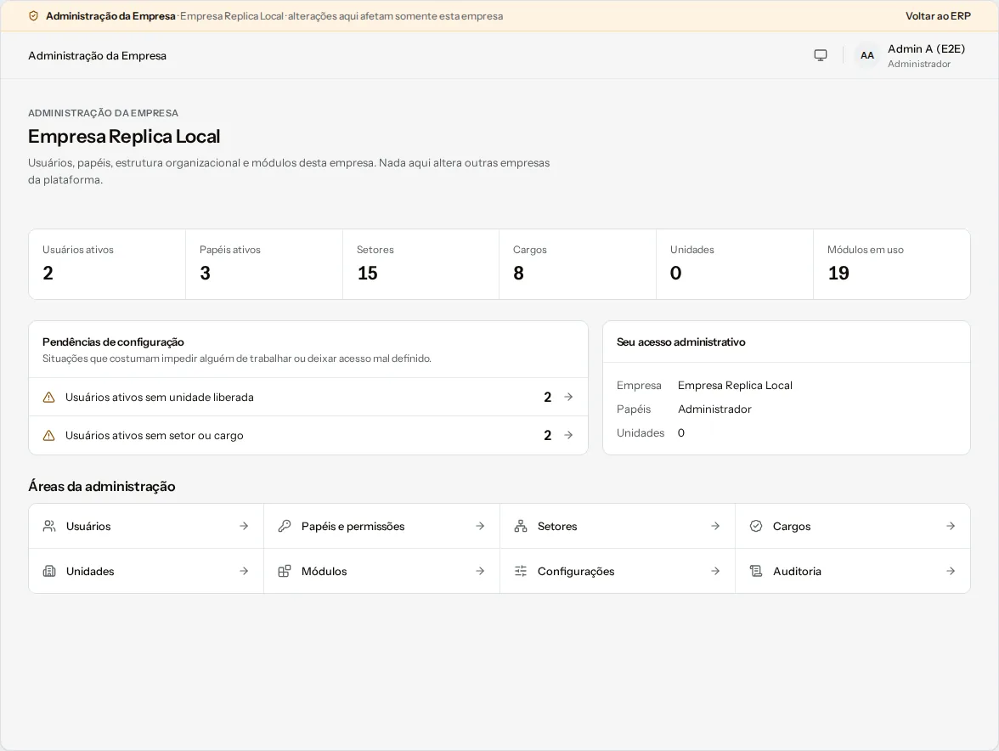
*Figura 1 — Visão geral da Administração da Empresa.*

A **Visão geral** mostra:

| Bloco | Conteúdo |
|---|---|
| Contadores | Usuários ativos, Papéis ativos, Setores, Cargos, Unidades, Módulos em uso. |
| **Pendências de configuração** | Situações que costumam impedir alguém de trabalhar: *usuários ativos sem login vinculado*, *sem papel*, *sem unidade liberada*, *sem setor ou cargo*, *papéis ativos sem nenhuma permissão*, *módulos contratados desabilitados*. Clique para abrir a lista filtrada. |
| **Seu acesso administrativo** | A sua empresa, os seus papéis e unidades. |
| **Áreas da administração** | Usuários, Papéis e permissões, Setores, Cargos, Unidades, Módulos, Configurações, Auditoria. |

| Área | 🔐 Permissão para ver | 🔐 Permissão para alterar |
|---|---|---|
| Usuários | `users.read` | `users.create`, `users.update`, `roles.manage` (papéis), `org.assign` (contexto) |
| Papéis e permissões | `roles.read` | `roles.manage` |
| Setores | `departments.view` | `departments.create`, `departments.update` |
| Cargos | `positions.view` | `positions.create`, `positions.update` |
| Unidades | `branches.read` | `branches.manage` |
| Módulos | `company_modules.view` | `company_modules.manage` |
| Configurações | `settings.view` ou `dashboard.configure` | `dashboard.configure` |
| Auditoria | `audit_logs.read` | — |

No celular, a administração funciona com o mesmo menu recolhível do ERP.

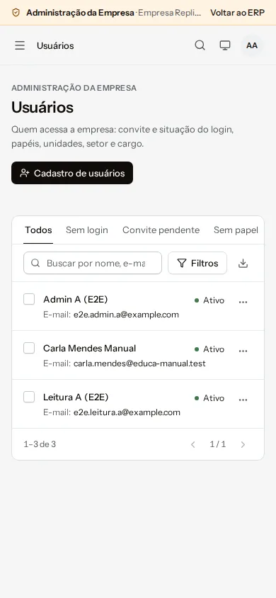
*Figura 2 — Usuários no celular.*

---

## 3. Usuários

**O que é:** quem acessa a empresa, com a situação do login, papéis, unidades, setor e cargo.

**Como acessar:** Administração da Empresa › **Usuários**.

🔐 **Permissão necessária:** `users.read` · **Disponível para:** Administrador da Empresa

### 3.1 Lista de usuários

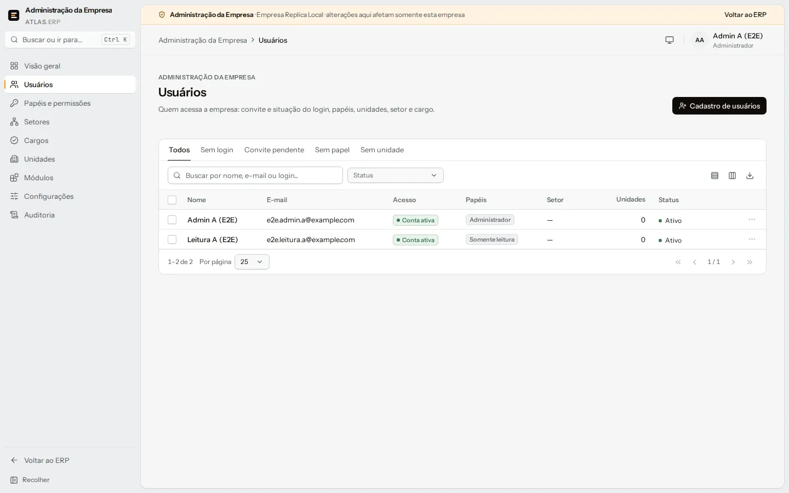
*Figura 3 — Lista de usuários.*

| Coluna | Significado |
|---|---|
| Nome, E-mail | Identificação. |
| **Acesso** | Situação do login (seção 3.8). |
| **Papéis** | Papéis atribuídos. *Nenhum papel* em âmbar significa que a pessoa entra, mas não vê módulos. |
| Setor, Unidades | Contexto organizacional. |
| Status | Ativo ou Inativo. |

**Visões rápidas:** **Todos**, **Sem login**, **Convite pendente**, **Sem papel**, **Sem unidade**. Busca por nome, e-mail ou login.

### 3.2 Visualizar um usuário

Clique na linha (ou **⋯ › Abrir**). O painel mostra, de cima para baixo:

1. **Acesso ao sistema**: a situação do login e as ações de convite e desativação.
2. **Contexto organizacional**: **Unidade principal**, **Setor** e **Cargo**, com **Descartar** e **Salvar contexto** (🔐 `org.assign`).
3. **Papéis**: a lista de papéis da empresa com caixas de seleção e o número de permissões de cada um (🔐 `roles.manage`). *"O conjunto de permissões do usuário é a soma dos papéis atribuídos."*
4. **Unidades com acesso**: os dados operacionais visíveis ao usuário ficam limitados a estas unidades.
5. **Histórico**: alterações feitas no usuário.

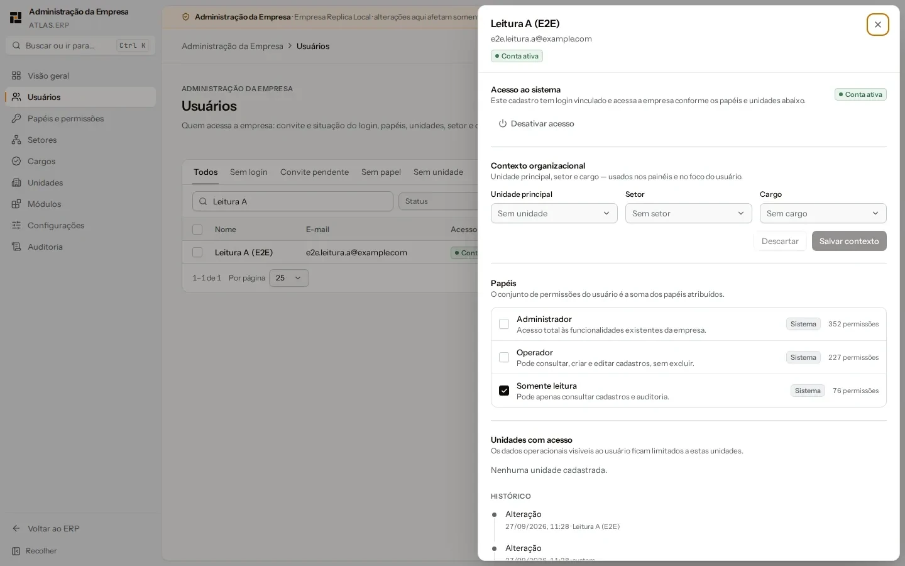
*Figura 4 — Painel de um usuário com o papel "Somente leitura".*

Quando você abre o **seu próprio** usuário, aparece o aviso **Este é o seu usuário** — *"Remover os próprios papéis ou unidades pode encerrar o seu acesso a esta administração."* O botão **Desativar acesso** fica bloqueado para você mesmo.

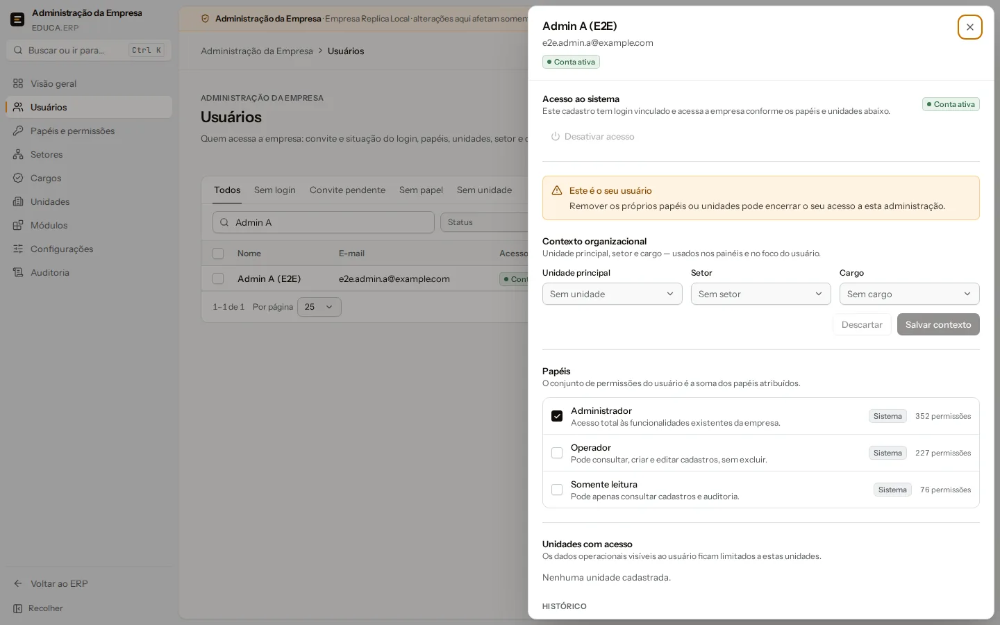
*Figura 5 — Painel do próprio administrador, com o aviso de proteção.*

### 3.3 Convidar um usuário (nome, e-mail e papel)

É o caminho principal para dar acesso a alguém: em um passo, o ATLAS.ERP cria o usuário **nesta empresa**, atribui o papel escolhido e envia o convite por e-mail.

🔐 `users.create` **e** `roles.manage` · **Disponível para:** Administrador da Empresa · **Como acessar:** Administração da Empresa › **Usuários** › **Convidar usuário**.

1. Clique em **Convidar usuário**.
2. Preencha **Nome** e **E-mail**.
3. Em **Papel**, escolha *Administrador*, *Gerente*, *Operador*, *Vendedor*, *Somente leitura* ou um papel criado em **Papéis e permissões**.
4. Clique em **Enviar convite**. A janela confirma **Convite enviado** (ou **Convite criado — envie o link**, se o e-mail não puder ser enviado), mostra a validade e o **Link do convite** com o botão **Copiar**. Clique em **Concluir**.

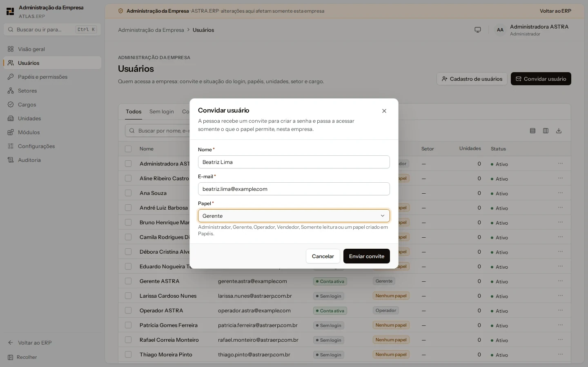
*Figura 6 — Janela "Convidar usuário": nome, e-mail e papel.*

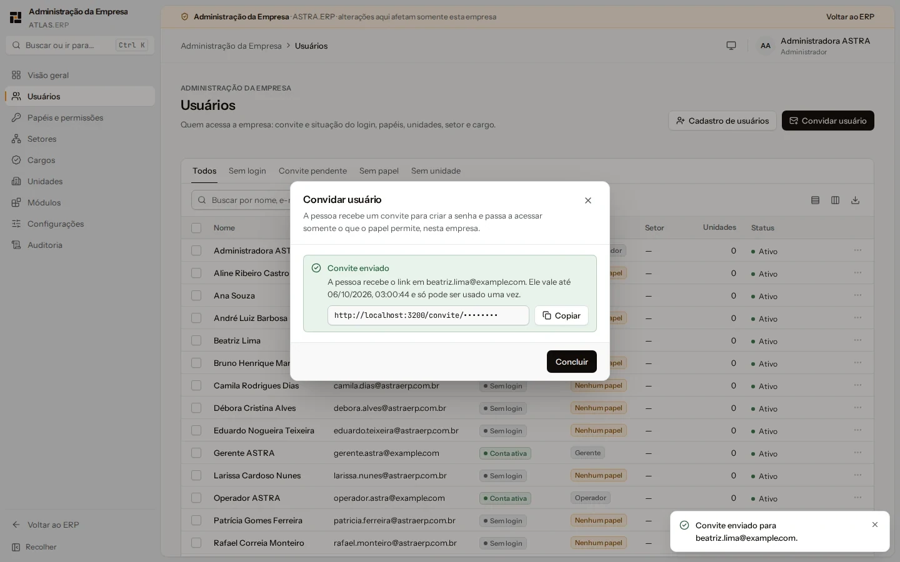
*Figura 7 — Convite enviado, com a validade e o link (código ocultado no manual).*

**Regras garantidas pelo banco de dados:**

- O usuário é criado **sempre na empresa de quem convida**. Não existe escolha de empresa nesta tela.
- Só convida quem tem `users.create` e `roles.manage` (por padrão, só o **Administrador**). Gerente, Operador, Vendedor e Somente leitura **não** veem o botão e recebem *Permissão negada* pela API.
- **Ninguém concede o que não tem:** um papel com permissões que você não possui é recusado (*"Você não pode conceder permissões que não possui"*). A mesma regra vale para atribuir papéis e para editar as permissões de um papel.
- O papel precisa ser **desta empresa** e estar **ativo**.

A pessoa convidada segue o fluxo da seção 3.9: cria a senha, aceita o convite e passa a ver **somente** o que o papel permite.

### 3.4 Cadastrar uma pessoa (sem convite)

O cadastro de usuário continua disponível para registrar pessoas antes de convidá-las. Um cadastro sem login recebe o convite pela seção 3.5.

🔐 `users.create` (ou `users.update`) · **Como acessar:** Usuários › **Cadastro de usuários**.

1. Clique em **Novo usuário**.
2. Preencha **Nome**, **E-mail** e **Login**; escolha **Perfil** e, se quiser, **Departamento**.
3. Clique em **Salvar**. Aviso: *"Usuário criado."*

| Campo | Obrigatório | Descrição |
|---|---|---|
| Nome | Sim | Nome da pessoa. |
| E-mail | Sim | Para onde vai o convite. Será o login de acesso. |
| Login | Sim | Identificador interno único. |
| Perfil | Sim | Classificação cadastral (Administrador, Gestor, Compras…). **Não dá acesso a módulos** (veja o aviso abaixo). |
| Departamento | Não | Classificação cadastral. |
| Status | Não | Ativo (padrão) ou Inativo. |

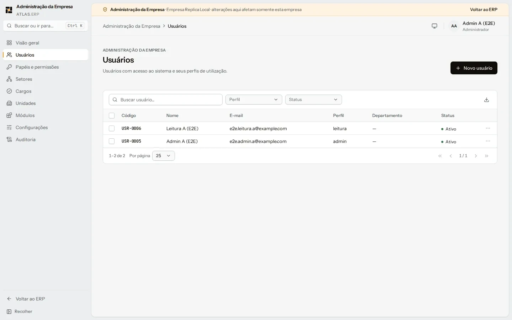
*Figura 8 — Cadastro de usuários.*

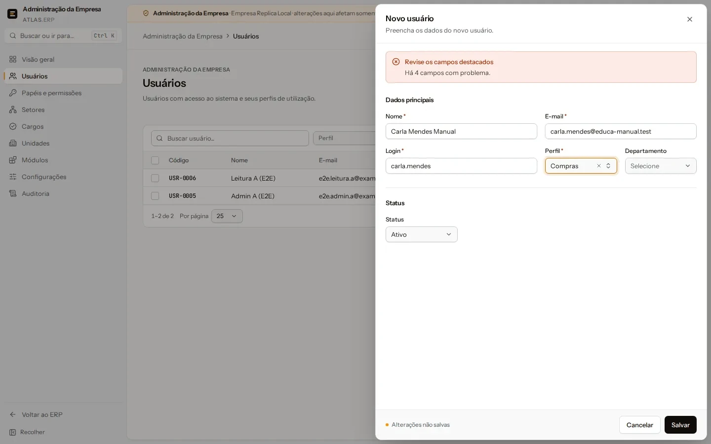
*Figura 9 — Painel "Novo usuário" preenchido.*

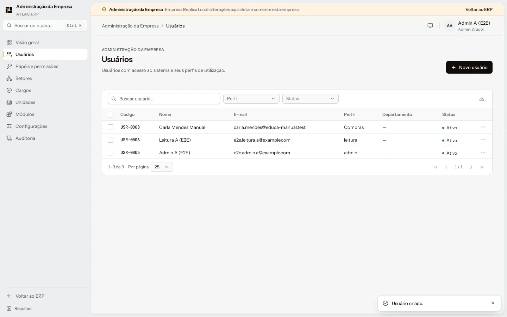
*Figura 10 — Aviso "Usuário criado.".*

> ⚠️ **Importante:** o campo **Perfil** do cadastro **não concede permissões**. Uma pessoa cadastrada com Perfil *Compras* entra no sistema **sem papel** e vê apenas *Início* e *Configurações*. O acesso real é dado pelos **Papéis** no painel do usuário (seção 3.9).

> ⚠️ A mesma limitação de **Inativar pelo menu da linha** descrita no Manual do Usuário vale para este cadastro. Para inativar, prefira **Editar › Status › Salvar**.

### 3.5 Enviar o convite a um cadastro existente

🔐 `users.update`

1. Em **Usuários**, use a visão **Sem login** e abra a pessoa.
2. Em **Acesso ao sistema** (situação *Sem login*: *"Este cadastro ainda não tem login. Envie um convite para o e-mail cadastrado — só essa pessoa poderá aceitá-lo."*), clique em **Enviar convite**.
3. O aviso *"Convite enviado para <e-mail>."* confirma. O painel passa a mostrar **Convite enviado**, com a validade (*"Ele vale até … e só pode ser usado uma vez."*) e o campo **Link do convite** com o botão **Copiar**.

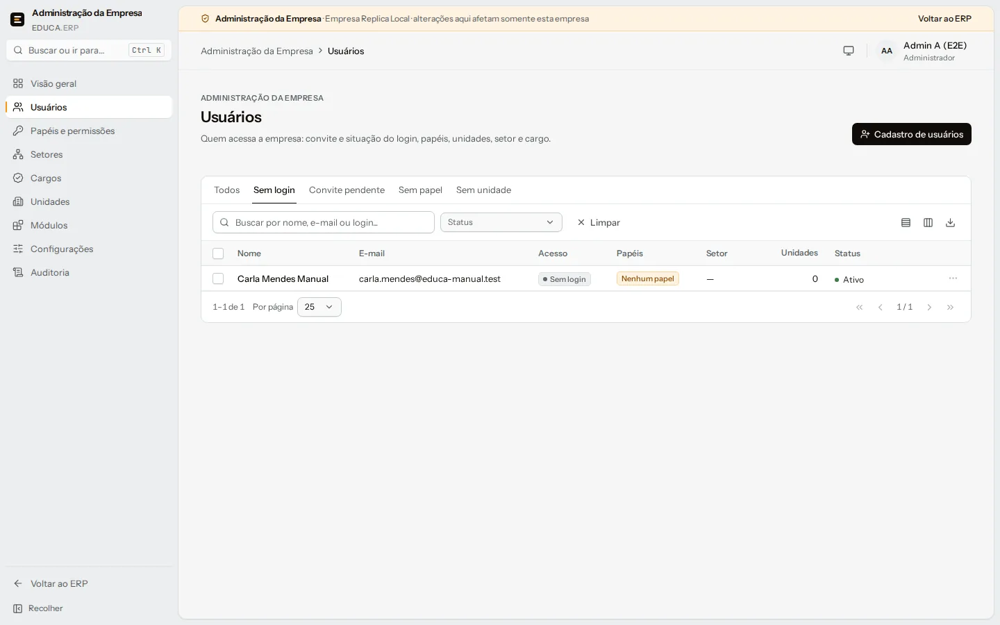
*Figura 11 — Visão "Sem login".*

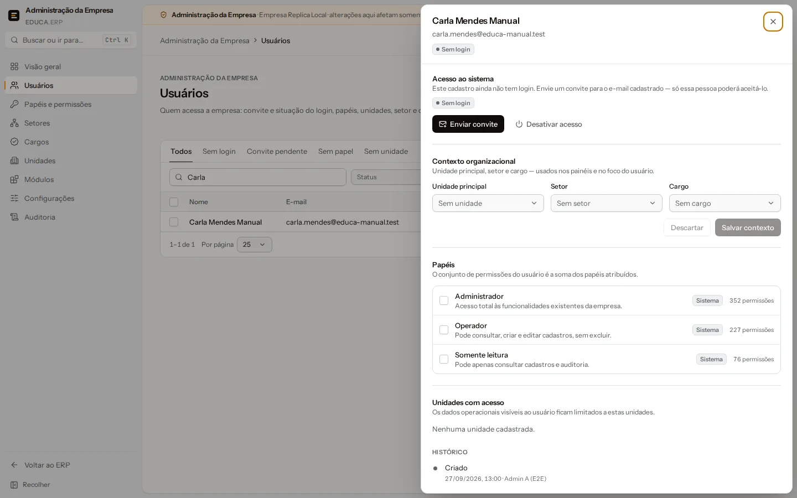
*Figura 12 — Usuário sem login, com o botão Enviar convite.*

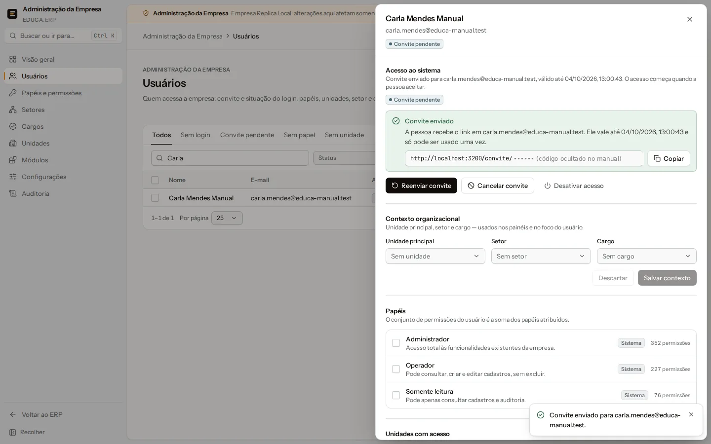
*Figura 13 — Convite enviado, com o link (código ocultado no manual).*

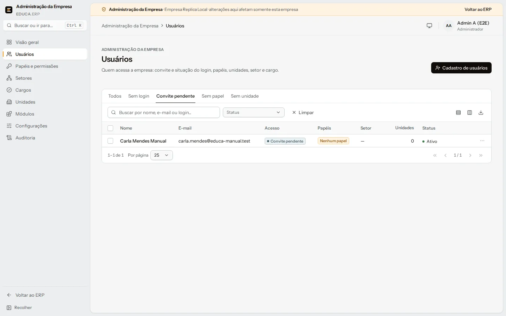
*Figura 14 — Visão "Convite pendente".*

**Cuidados:**

- O convite é pessoal: só quem tem acesso ao e-mail cadastrado consegue aceitá-lo.
- Se usar **Copiar** para enviar o link por outro canal, a pessoa que **ainda não tem senha** precisa abrir o link do **e-mail** para criar a senha (seção 3.10).

### 3.6 Reenviar ou cancelar um convite

Com o convite pendente, o painel mostra **Reenviar convite**, **Cancelar convite** e **Desativar acesso**.

- **Reenviar convite** gera um novo link e substitui o anterior.
- **Cancelar convite** pede confirmação: *"Cancelar convite? O link enviado deixa de funcionar imediatamente. Você pode enviar um novo convite depois."* Aviso: *"Convite cancelado."* *(Confirmação aberta e conferida; o cancelamento não foi confirmado neste manual.)*
- **Reenviar convite** foi executado durante a elaboração do manual.

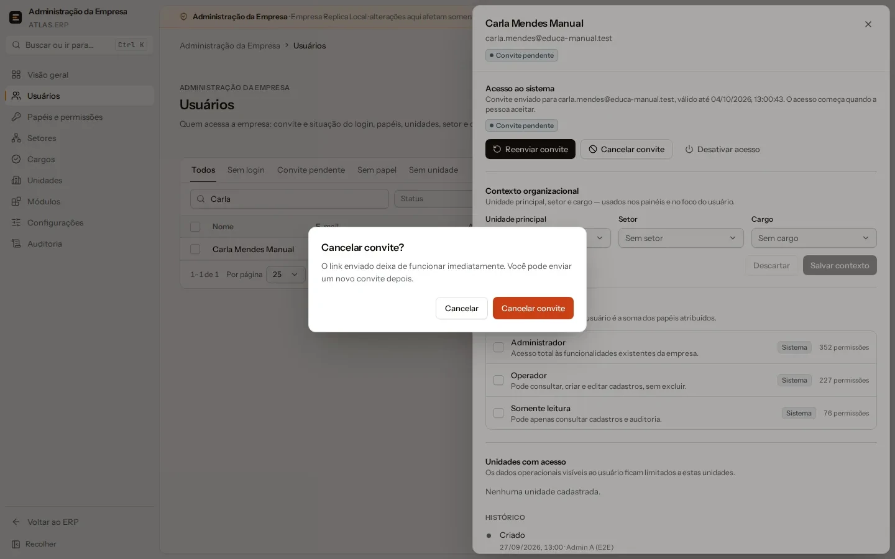
*Figura 15 — Confirmação de cancelamento do convite.*

### 3.7 Desativar e reativar o acesso

🔐 `users.update`

- **Desativar acesso**: a pessoa deixa de entrar na empresa. Aviso: *"<nome> foi desativado."*
- **Reativar**: devolve o acesso. Aviso: *"<nome> foi reativado."*

Você não pode desativar o próprio acesso. *(Botões conferidos na tela; a desativação não foi executada durante a elaboração do manual.)*

### 3.8 Situações de acesso

| Situação | Significado | O que fazer |
|---|---|---|
| **Conta ativa** | Tem login e entra normalmente. | — |
| **Convite pendente** | Convite enviado, ainda não aceito. | Aguardar, reenviar ou cancelar. |
| **Convite expirado** | O prazo do convite passou. | Reenviar convite. |
| **Sem login** | Cadastro sem conta de acesso. | Enviar convite. |
| **Desativado** | Acesso desligado pelo administrador. | Reativar, se for o caso. |

### 3.9 Papéis, contexto e unidades do usuário

**Atribuir um papel** (🔐 `roles.manage`): no painel do usuário, em **Papéis**, marque a caixa do papel. A alteração vale na hora. Aviso: *"Papel <nome> atribuído."* Desmarcar remove: *"Papel <nome> removido."*

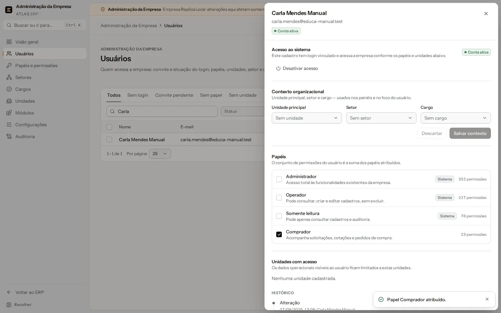
*Figura 16 — Papel "Comprador" atribuído a um usuário.*

**Contexto organizacional** (🔐 `org.assign`): escolha **Unidade principal**, **Setor** e **Cargo** e clique em **Salvar contexto**. O setor e o cargo orientam o **foco dos painéis** (seção 10.5).

**Unidades com acesso:** os dados operacionais visíveis ao usuário ficam limitados às unidades liberadas. Sem unidades cadastradas, aparece *"Nenhuma unidade cadastrada."*

### 3.10 Como a pessoa convidada aceita o convite

Este fluxo foi executado do início ao fim neste manual.

1. A pessoa recebe o e-mail e clica no link.
2. Na tela **Crie sua senha** (*"Primeiro acesso de <e-mail>"*), informa **Nova senha** (mínimo de 8 caracteres, com letras e números) e **Confirme a senha**, e clica em **Criar senha e continuar**.
3. Na tela **Aceitar convite**, confere organização, nome, e-mail, tipo de acesso e validade, e clica em **Aceitar e continuar**. Se não for a pessoa certa, usa **Não sou eu — sair**.
4. A pessoa entra no **Início** do ERP.

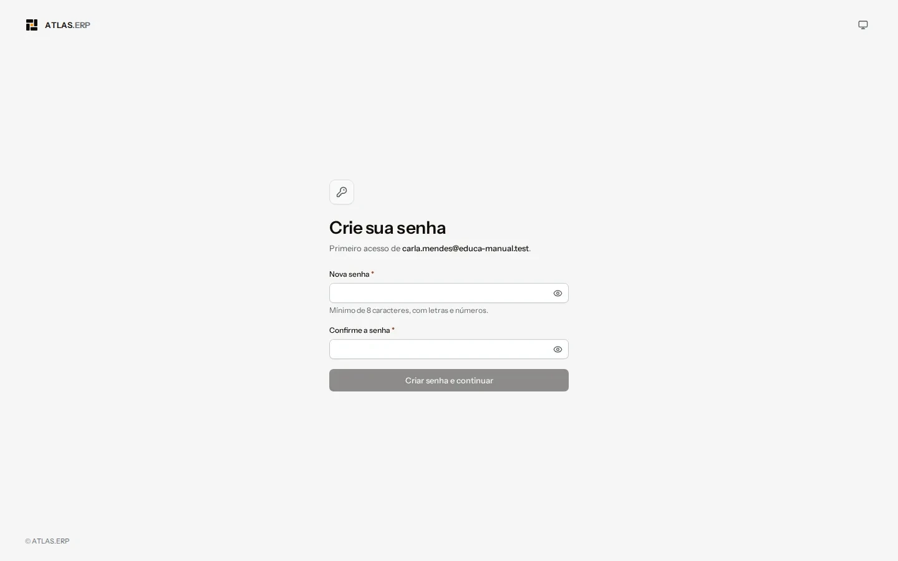
*Figura 17 — Primeiro acesso: "Crie sua senha".*

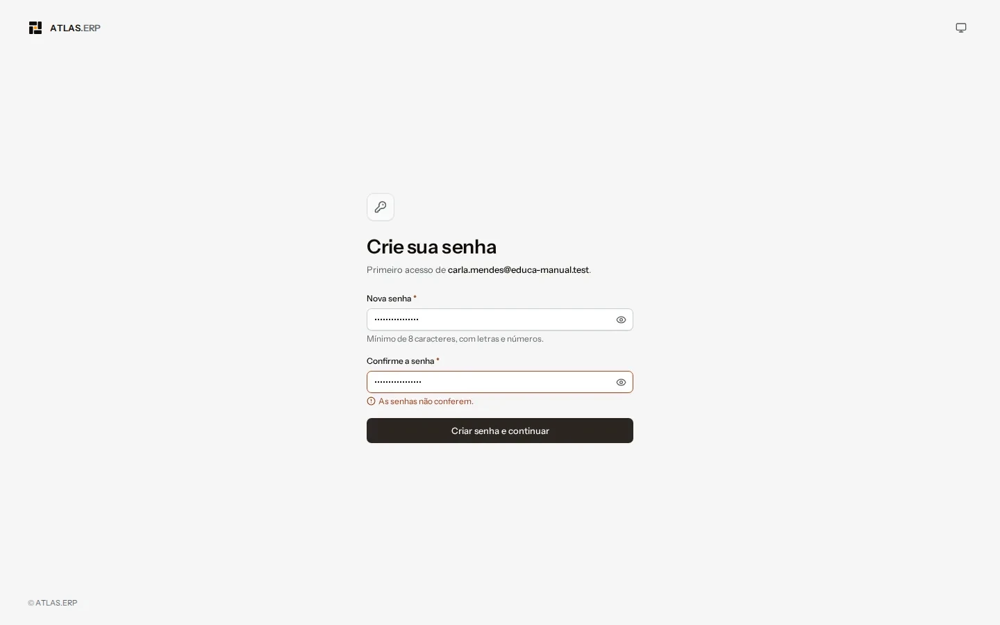
*Figura 18 — Validação: "As senhas não conferem."*

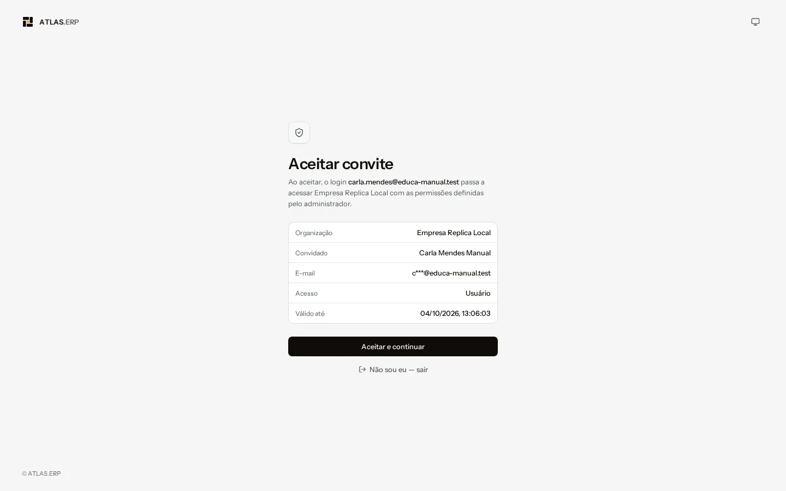
*Figura 19 — Tela "Aceitar convite".*

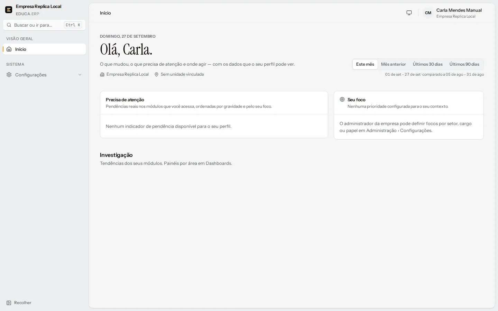
*Figura 20 — Primeiro acesso concluído. Sem papel, a pessoa vê apenas Início e Configurações.*

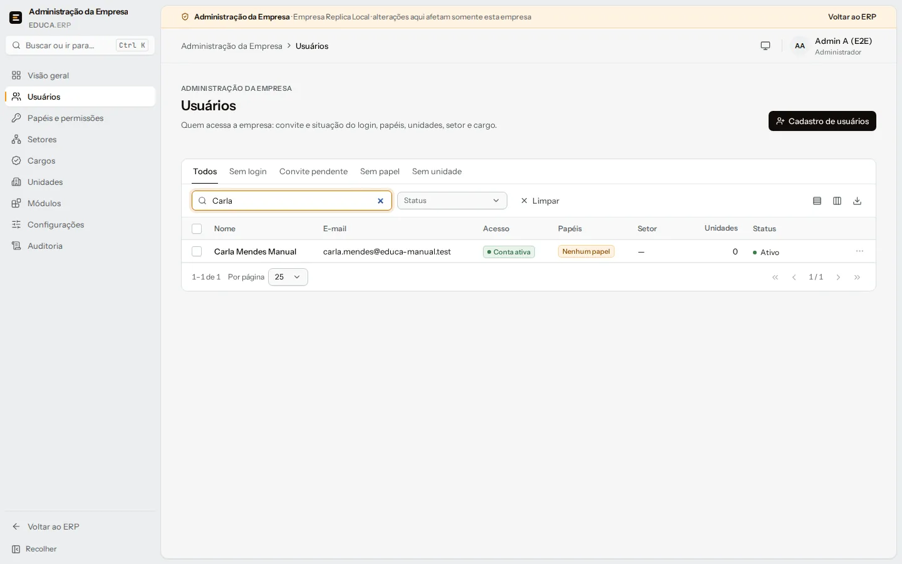
*Figura 21 — Na lista do administrador, a situação passa a "Conta ativa".*

**Quem já tem senha** e abre o link copiado vê **Você recebeu um convite** e o botão **Já tenho senha — entrar**.

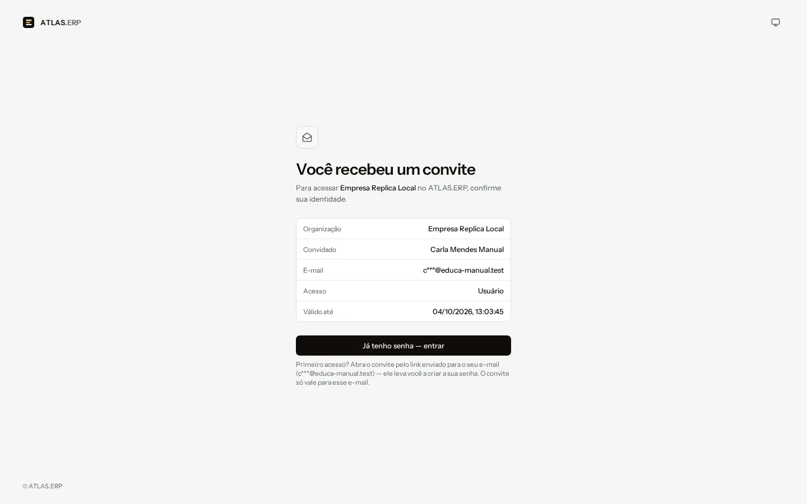
*Figura 22 — "Você recebeu um convite".*

**Link inválido:** *"Convite inválido — Este link de convite não existe. Confira se ele foi copiado por inteiro ou peça um novo ao administrador da sua organização."*

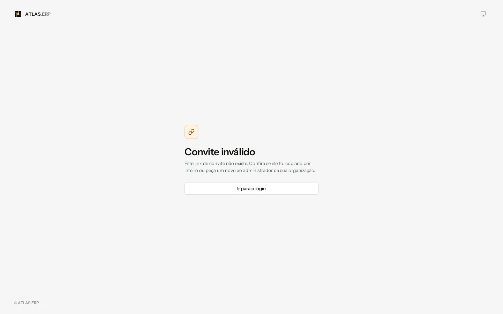
*Figura 23 — Convite inválido.*

---

## 4. Papéis

**O que é:** um papel reúne **permissões do catálogo**. O acesso de um usuário é a **soma** dos papéis atribuídos a ele.

**Como acessar:** Administração da Empresa › **Papéis e permissões**.

🔐 **Ver:** `roles.read` · **Criar, editar e salvar permissões:** `roles.manage`

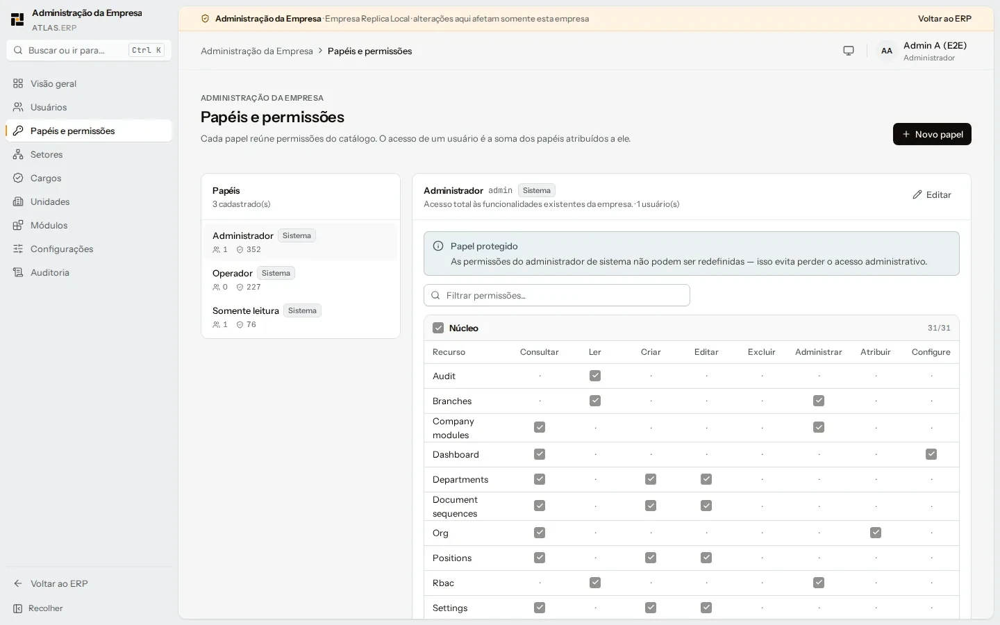
*Figura 24 — Papéis e permissões.*

### 4.1 Papéis de sistema

Toda empresa nasce com cinco papéis de sistema (selo **Sistema**), na hierarquia da operação:

| Papel | Descrição na tela | Permissões |
|---|---|---|
| **Administrador** | Acesso total às funcionalidades existentes da empresa. | 352 |
| **Gerente** | Opera e aprova em todos os módulos; sem administrar usuários, papéis, módulos e configurações. | 332 |
| **Operador** | Pode consultar, criar e editar cadastros, sem excluir. | 225 |
| **Vendedor** | Comercial e CRM: orçamentos, pedidos, clientes e funil; sem aprovar, cancelar ou reservar. | 39 |
| **Somente leitura** | Pode apenas consultar cadastros e auditoria. | 76 |

Só o **Administrador** convida usuários e define papéis (`users.create` + `roles.manage`). O **Operador** não cria nem edita usuários.

A contagem de permissões é a da empresa de demonstração e pode variar conforme o catálogo do ambiente.

O **Administrador** é um **papel protegido**: *"As permissões do administrador de sistema não podem ser redefinidas — isso evita perder o acesso administrativo."*

### 4.2 Consultar as permissões de um papel

Clique no papel na lista à esquerda. À direita aparece a **matriz de permissões**, agrupada por módulo (*Núcleo, Cadastros, Estoque, Compras, Comercial, Logística, Produção, Financeiro, Fiscal, Custos, Controladoria, CRM, Ativos, Manutenção, Qualidade, Projetos e Serviços, Workflow e Aprovações, Importação e Exportação, Relatórios*). Cada linha é um recurso; cada coluna, uma ação (Consultar, Ler, Criar, Editar, Excluir, Aprovar, Administrar, Atribuir…). Use **Filtrar permissões…** para achar um item.

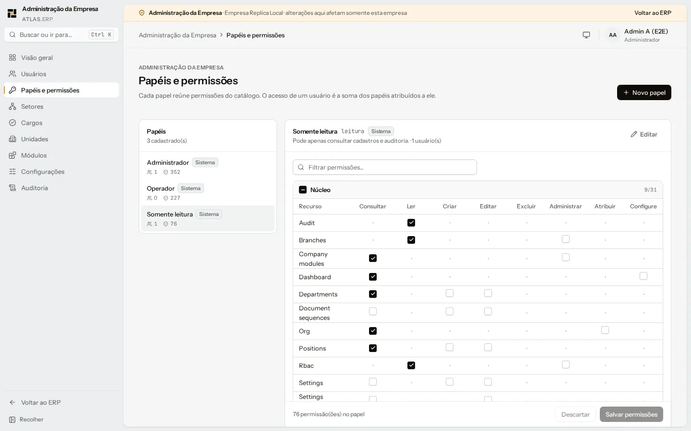
*Figura 25 — Matriz de permissões do papel "Somente leitura".*

### 4.3 Criar um papel — passo a passo validado

1. Clique em **Novo papel**.
2. Preencha **Código** (identificador único, ex.: `COMPRADOR`), **Nome** e, se quiser, **Descrição** e **Setor** (papel típico de um setor).
3. Clique em **Criar papel**. Aviso: *"Papel <nome> criado."* O papel nasce **sem permissões**.

| Campo | Obrigatório | Descrição |
|---|---|---|
| Código | Sim | Único na empresa. Não muda depois. |
| Nome | Sim | Nome exibido. |
| Descrição | Não | Explica para que serve o papel. |
| Setor | Não | Setor típico do papel. |

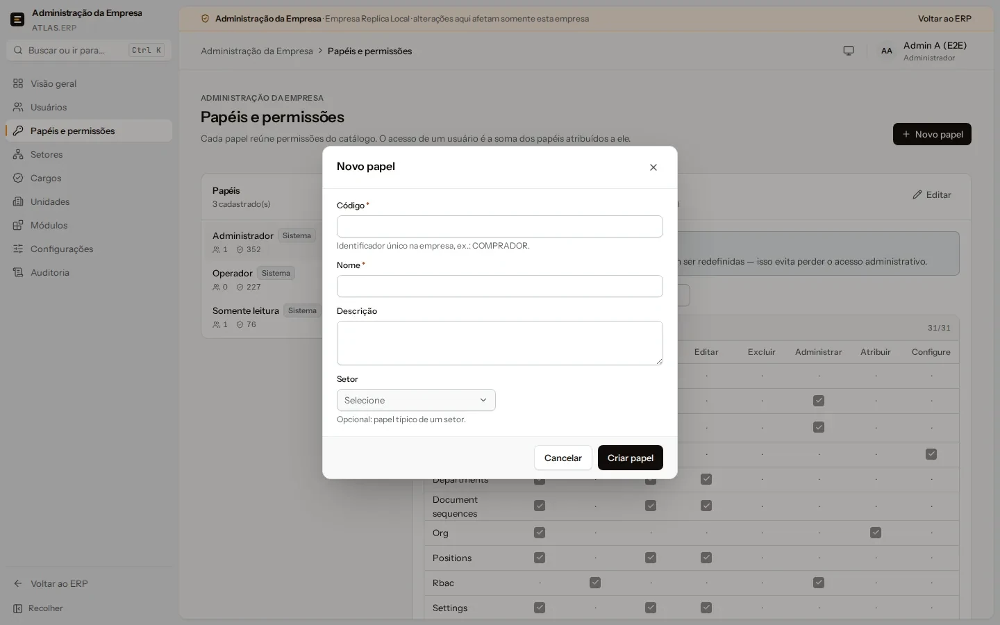
*Figura 26 — Janela "Novo papel".*

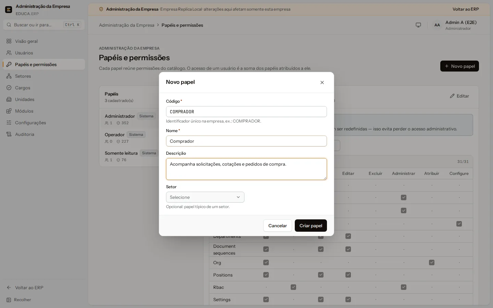
*Figura 27 — Novo papel "Comprador" preenchido.*

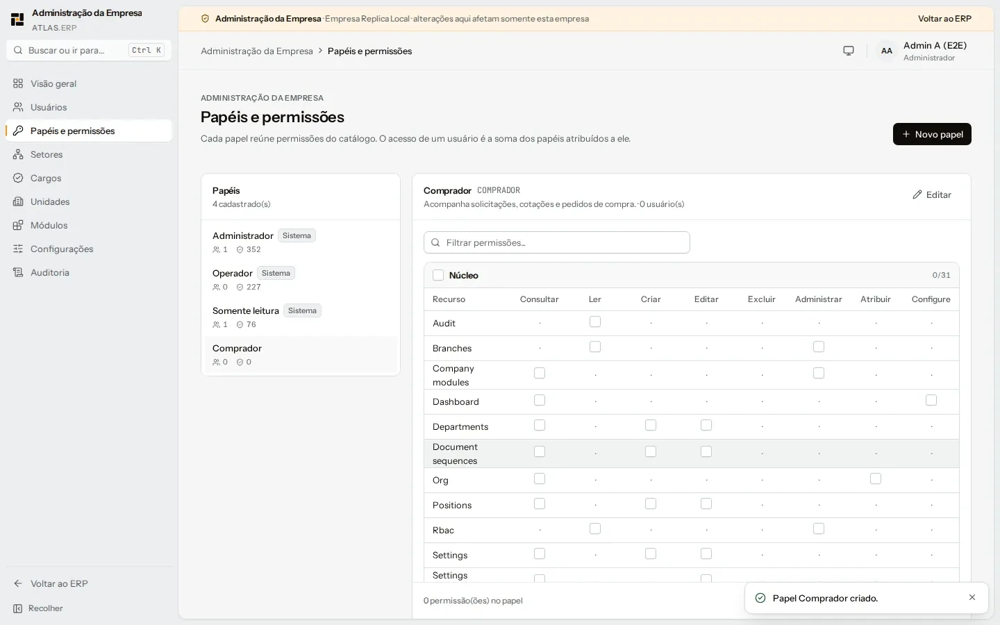
*Figura 28 — Papel criado, ainda sem permissões.*

### 4.4 Dar permissões a um papel

1. Selecione o papel.
2. Marque as permissões na matriz. A caixa no título do grupo (ex.: **Compras**) marca **todas as permissões do grupo**.
3. O rodapé mostra quantas foram adicionadas e removidas. Clique em **Salvar permissões** (ou **Descartar**).
4. Aviso: *"Permissões de <papel> salvas."*

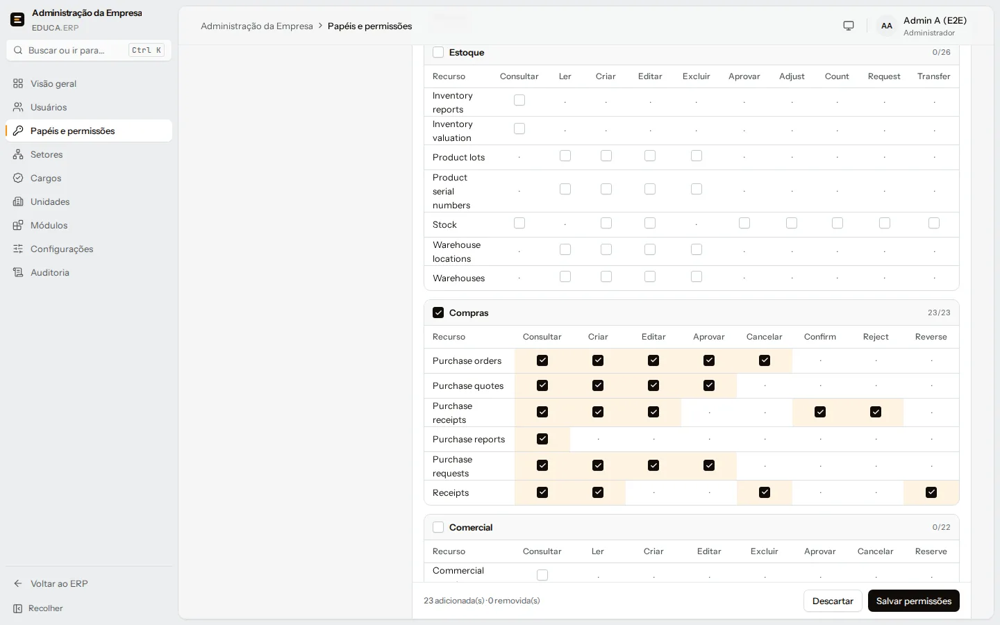
*Figura 29 — Grupo "Compras" marcado (23 permissões adicionadas).*

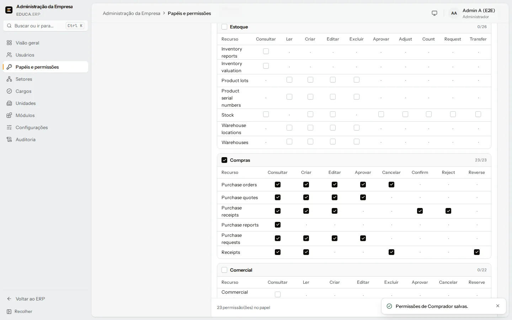
*Figura 30 — Permissões salvas.*

**Para editar nome, descrição, setor ou situação** de um papel, clique em **Editar** no topo da matriz. *(Botão conferido na tela; edição não executada neste manual.)*

**Cuidados ao montar um papel:**

- Inclua também a **leitura dos cadastros relacionados**. Exemplo real: um papel só com *Compras* vê a lista de pedidos de compra, mas a coluna **Fornecedor** mostra um código no lugar do nome, porque falta `suppliers.read`.
- Um papel ativo sem permissões aparece nas **Pendências de configuração**.

---

## 5. RBAC explicado de forma simples

RBAC (*controle de acesso por papéis*) é a regra que decide o que cada pessoa vê e faz.

```
Usuário  →  Papel(éis)  →  Permissões  →  Módulos e ações
Carla        Comprador       purchase_orders.view   →  vê Suprimentos › Pedidos de compra
                             purchase_orders.approve →  pode aprovar pedido de compra
```

1. **Usuário:** a pessoa, com o seu login.
2. **Papel:** um "crachá" com um conjunto de permissões. Uma pessoa pode ter vários; vale a **soma**.
3. **Permissão:** uma autorização pontual, no formato `recurso.ação` (ex.: `customers.read`, `sales_orders.approve`).
4. **Módulos e ações:** o menu mostra só os módulos com permissão de consulta; os botões de ação (Novo, Editar, Aprovar…) aparecem só com a permissão da ação.

Além disso:

- **Módulos da empresa** (seção 10.4): um módulo desabilitado some para todos, mesmo com permissão.
- **Unidades** (seção 3.8): limitam quais dados operacionais a pessoa vê.

### Exemplo validado de ponta a ponta

| Passo | Onde | Resultado |
|---|---|---|
| 1. Pessoa aceita o convite **sem papel** | Convite | Vê apenas **Início** e **Configurações**. |
| 2. Criar o papel **Comprador** e marcar o grupo **Compras** | Papéis e permissões | 23 permissões salvas. |
| 3. Atribuir **Comprador** à pessoa | Usuários › painel | *"Papel Comprador atribuído."* |
| 4. A pessoa entra de novo | ERP | Vê **Suprimentos**, **Logística e Estoque**, **Controladoria** e o fluxo *Compra ao recebimento* no Início. |
| 5. A pessoa abre Contas a receber | ERP | **Sem acesso a este recurso** (não tem permissão financeira). |

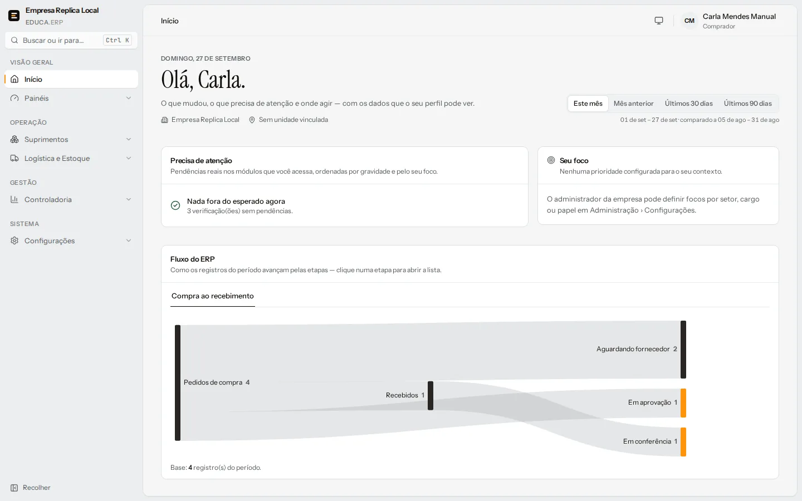
*Figura 31 — Início da usuária com o papel "Comprador".*

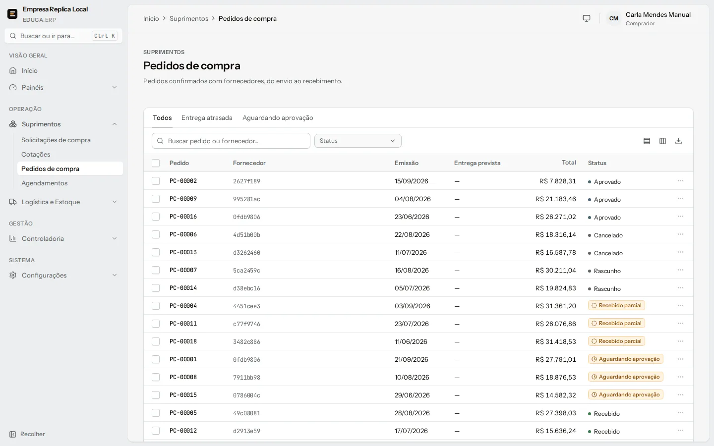
*Figura 32 — Pedidos de compra liberados pelo papel.*

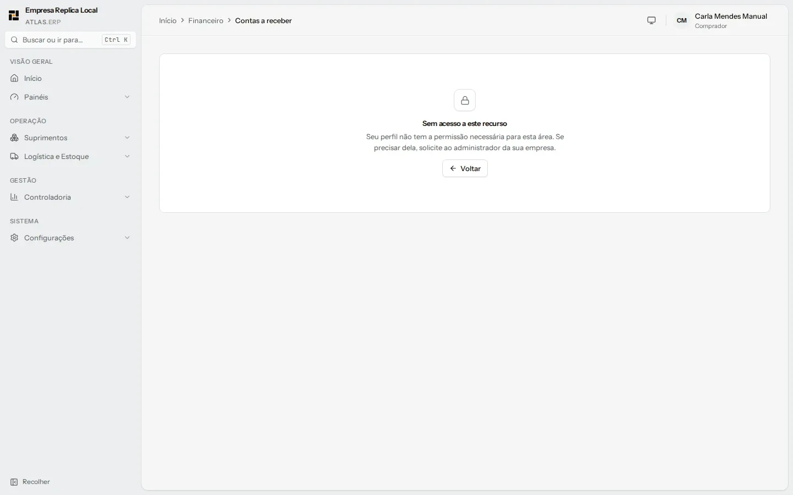
*Figura 33 — Contas a receber bloqueado: sem permissão financeira.*

---

## 6. Administração Central

**Disponível para:** Owner / Administração Central (membros da plataforma ATLAS.ERP).

**O que é:** a governança da plataforma: empresas como clientes, contratação de módulos e membros da plataforma. **Não** é usada por administradores de empresa.

**Como acessar:** menu da conta › **Administração Central**. Quem não é membro da plataforma vê **Acesso restrito à Administração Central** — *"Este ambiente é exclusivo dos membros da plataforma ATLAS.ERP (Owner e Admin)."*

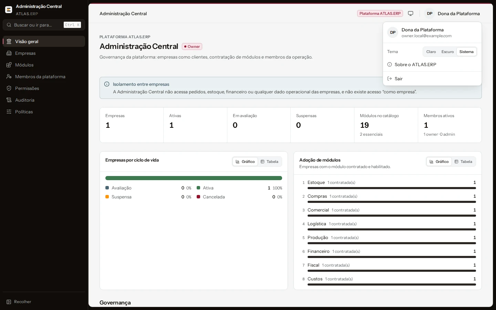
*Figura 34 — Menu da conta de um Owner.*

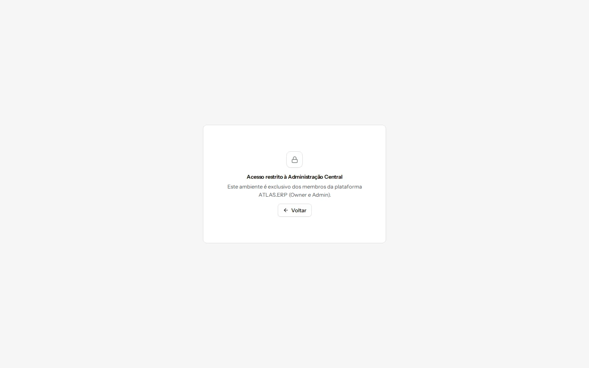
*Figura 35 — Administrador de empresa tentando abrir a Administração Central.*

### 6.1 Owner, Admin da plataforma e Administrador da Empresa

| | **Owner** (plataforma) | **Admin** (plataforma) | **Administrador da Empresa** |
|---|---|---|---|
| Onde atua | Administração Central | Administração Central | Administração da Empresa |
| Empresas clientes | Cria, ativa, suspende, cancela | Cria, ativa, suspende, cancela | Só a própria |
| Módulos contratados | Contrata/descontrata | Contrata/descontrata | Habilita/desabilita os **contratados** |
| Catálogo de módulos | Mantém (*Só Owner*) | Consulta | — |
| Membros da plataforma | Gerencia Owners e Admins | Gerencia apenas Admins | — |
| Usuários e papéis de uma empresa | Convida o **primeiro** administrador | Convida o primeiro administrador | Convida e gerencia todos (Gerente, Operador, Vendedor…) |
| Dados operacionais da empresa | **Não vê** | **Não vê** | Vê (conforme papéis) |
| Owners e membros da plataforma | Gerencia | Gerencia Admins | **Não** vê nem gerencia |

> **Não confunda:** o *Admin da plataforma* (Membros da plataforma) não é administrador de nenhuma empresa. Para alguém administrar a operação de uma empresa, convide-o como **administrador da empresa** (Empresas › Convidar administrador) ou, se a empresa já tiver administrador, peça a ele que convide pela Administração da Empresa › Usuários › **Convidar usuário** com o papel *Administrador*.

### 6.2 Visão geral

Mostra o aviso **Isolamento entre empresas**, os contadores (Empresas, Ativas, Em avaliação, Suspensas, Módulos no catálogo, Membros ativos), **Empresas por ciclo de vida**, **Adoção de módulos** (com **Gráfico/Tabela**) e as **Áreas da Administração Central**.

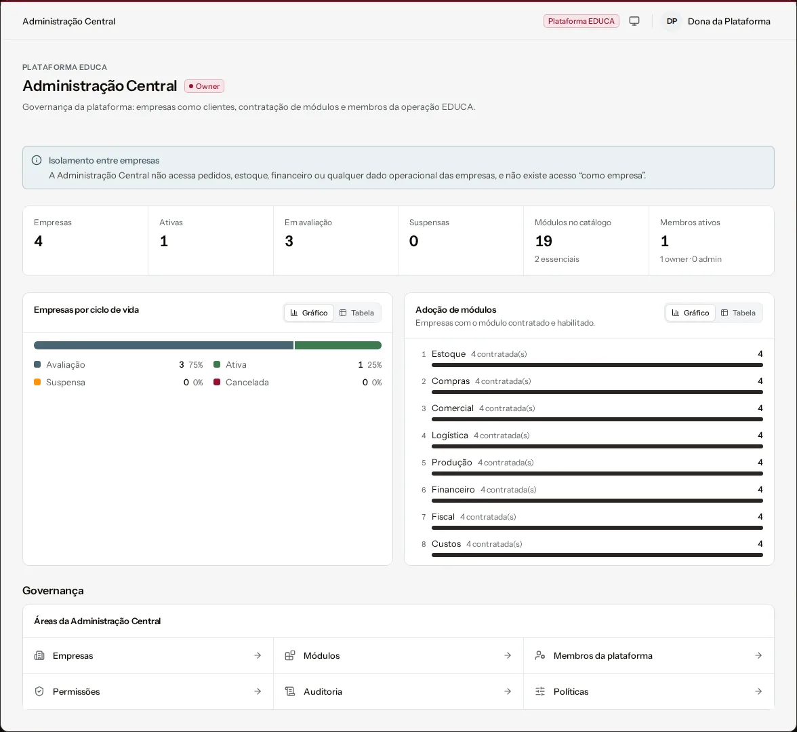
*Figura 36 — Visão geral da Administração Central.*

---

## 7. Empresas

🔐 **Ver:** `platform.companies.view` · **Criar:** `platform.companies.create` · **Ciclo de vida:** `platform.companies.lifecycle` · **Módulos:** `platform.company_modules.manage`

**Como acessar:** Administração Central › **Empresas**.

> **Identificação por código:** as empresas aparecem pelo identificador (ex.: *Empresa 62d8e72c*). A Administração Central não lê o cadastro (nome, documento) das empresas.

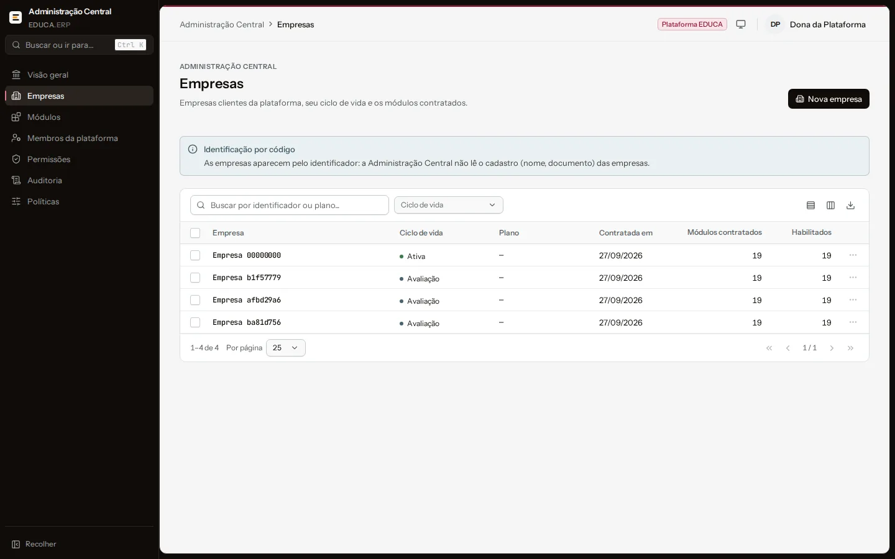
*Figura 37 — Lista de empresas.*

### 7.1 Criar uma empresa — passo a passo validado

1. Clique em **Nova empresa**.
2. Preencha **Nome da empresa** (obrigatório) e os demais dados.
3. Escolha a **Situação inicial** (padrão *Em avaliação*) e, se houver, o **Plano**.
4. Mantenha **Criar unidade inicial** ligado (recomendado) e informe **Código** e **Nome da unidade** (padrão *MATRIZ* / *Matriz*).
5. Clique em **Criar empresa**. A janela vira **Empresa criada** — *"… em avaliação, com os papéis padrão e os módulos essenciais e a unidade inicial."*

| Campo | Obrigatório | Descrição |
|---|---|---|
| Nome da empresa | Sim | Nome da empresa cliente. |
| Razão social, CNPJ / documento | Não | O documento não pode repetir outra empresa. |
| E-mail, Telefone, Endereço, Cidade, UF, CEP | Não | Dados de contato. |
| Situação inicial | Não | *Em avaliação* (padrão) ou outra situação. |
| Plano | Não | Código do plano contratado. |
| Criar unidade inicial | — | Ligado por padrão. |
| Código / Nome da unidade | Sim, se a unidade inicial estiver ligada | Unidade criada junto com a empresa. |

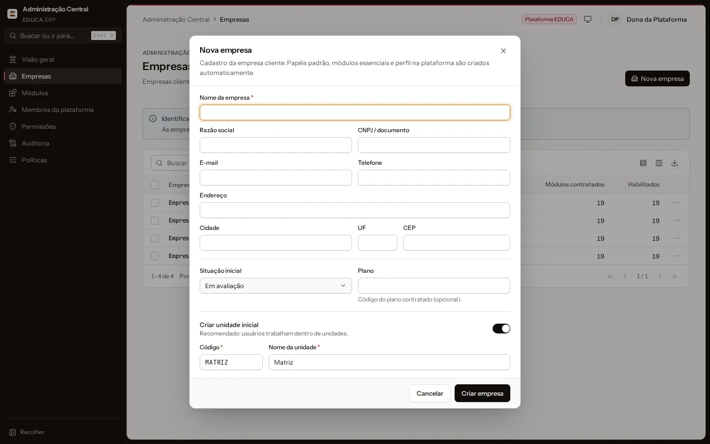
*Figura 38 — Janela "Nova empresa".*

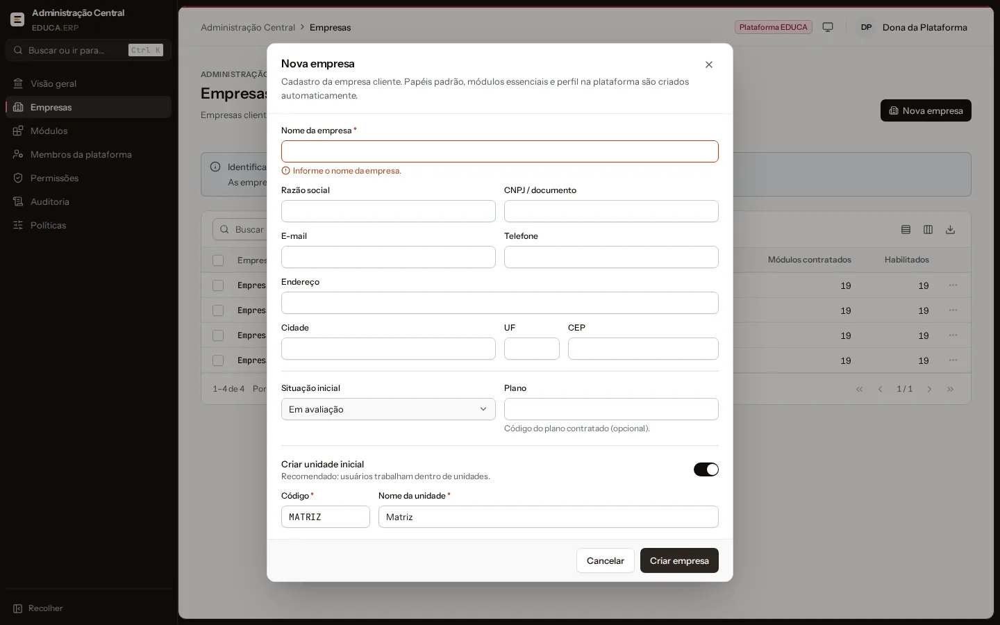
*Figura 39 — Validação: "Informe o nome da empresa."*

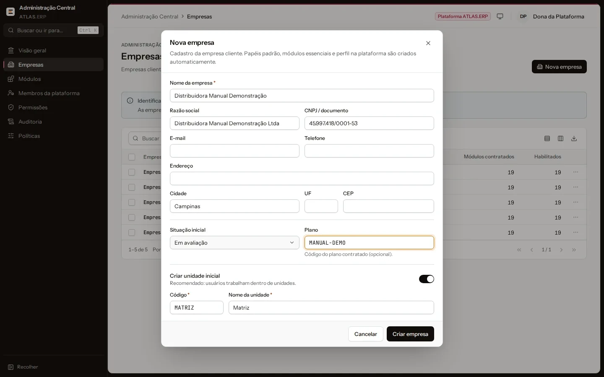
*Figura 40 — Nova empresa preenchida.*

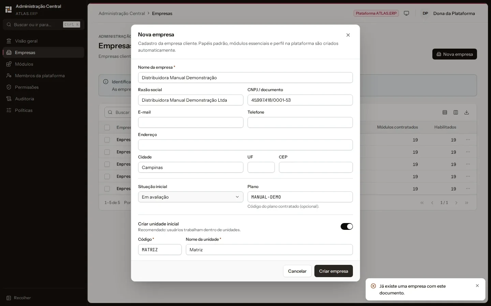
*Figura 41 — Documento já usado: "Já existe uma empresa com este documento."*

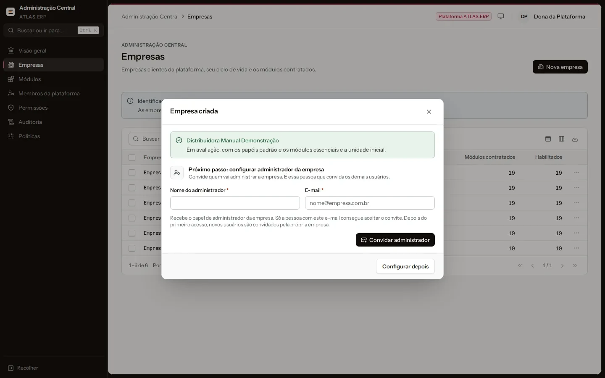
*Figura 42 — Empresa criada, com o próximo passo: configurar o administrador.*

### 7.2 Convidar o administrador da empresa

Logo após criar a empresa (ou depois, no detalhe dela), informe **Nome do administrador** e **E-mail** e clique em **Convidar administrador**. Aviso: *"Convite enviado ao administrador."* O bloco **Administrador da empresa** passa a mostrar **Convite pendente** e a validade. *"Recebe o papel de administrador da empresa. Só a pessoa com este e-mail consegue aceitar o convite. Depois do primeiro acesso, novos usuários são convidados pela própria empresa."*

Se preferir fazer depois, clique em **Configurar depois**.

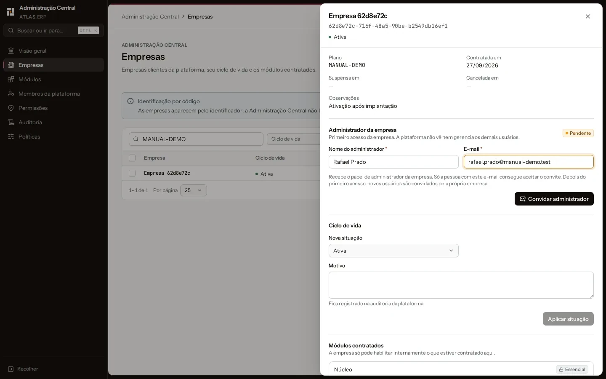
*Figura 43 — Convite do administrador da empresa preenchido.*

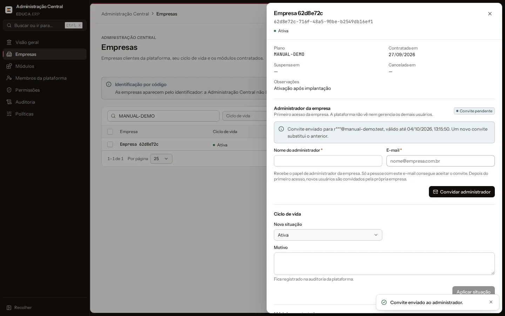
*Figura 44 — Convite enviado ao administrador.*

### 7.3 Detalhe e ciclo de vida

Abra a empresa (**⋯ › Abrir**). O painel mostra plano, datas (contratada, suspensa, cancelada), observações, **Administrador da empresa**, **Ciclo de vida** e **Módulos contratados**.

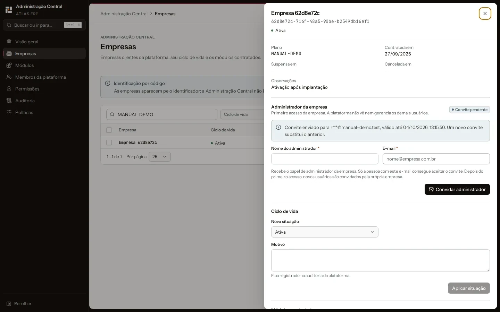
*Figura 45 — Detalhe da empresa.*

**Mudar a situação** (🔐 `platform.companies.lifecycle`):

1. Em **Ciclo de vida**, escolha a **Nova situação** (*Avaliação*, *Ativa*, *Suspensa*, *Cancelada*).
2. Escreva o **Motivo** (fica registrado na auditoria da plataforma).
3. Clique em **Aplicar situação** e confirme em **Aplicar**. Aviso: *"Ciclo de vida alterado para <situação>."*

Ao suspender, o sistema avisa: *"A empresa deixa de operar normalmente. Os dados dela não são apagados."*

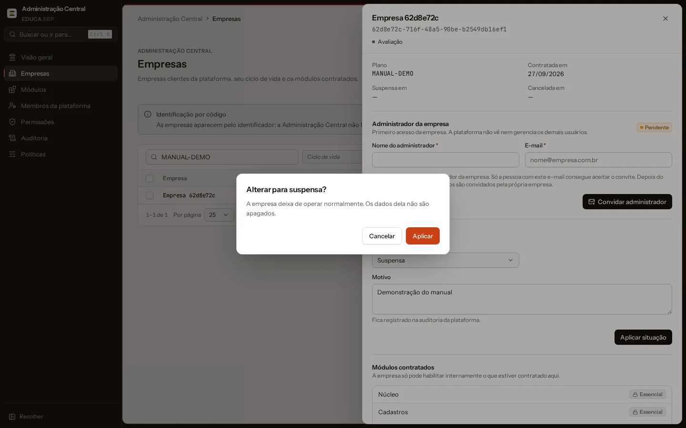
*Figura 46 — Confirmação "Alterar para suspensa?".*

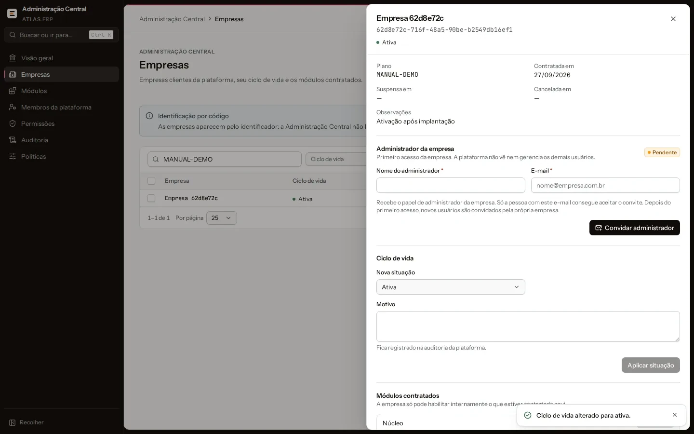
*Figura 47 — Empresa ativada.*

**Módulos contratados** (🔐 `platform.company_modules.manage`): no fim do painel, use a chave de cada módulo para contratar ou descontratar (aviso: *"<módulo> contratado."* / *"descontratado."*). Os módulos **Essenciais** (Núcleo, Cadastros) não têm chave e não podem ser descontratados. Quando a empresa desliga um módulo contratado, aparece *"desabilitado pela empresa"*. A empresa só pode habilitar internamente o que estiver contratado aqui. *(Conferido na tela; a contratação não foi executada durante a elaboração do manual.)*

---

## 8. Usuários da plataforma

### 8.1 Membros da plataforma

🔐 **Ver:** `platform.members.view` · **Gerenciar:** `platform.members.manage`

**O que é:** a governança da plataforma ATLAS.ERP (Owner e Admin da plataforma), com acesso à Administração Central. **Não** são usuários nem administradores de nenhuma empresa. A janela de convite avisa: *"Administrador de uma empresa não é convidado aqui."*

**Como acessar:** Administração Central › **Membros da plataforma**.

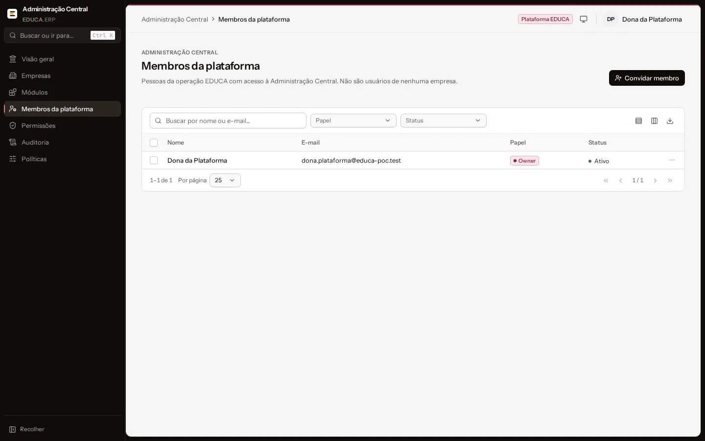
*Figura 48 — Membros da plataforma.*

**Convidar um membro:** **Convidar membro** › **Nome**, **E-mail**, **Papel** (*Admin da plataforma* ou *Owner*) › **Enviar convite**. *"A pessoa recebe um e-mail para criar a senha. Se já tiver conta no ATLAS.ERP, passa a ver a Administração Central no próximo acesso."*

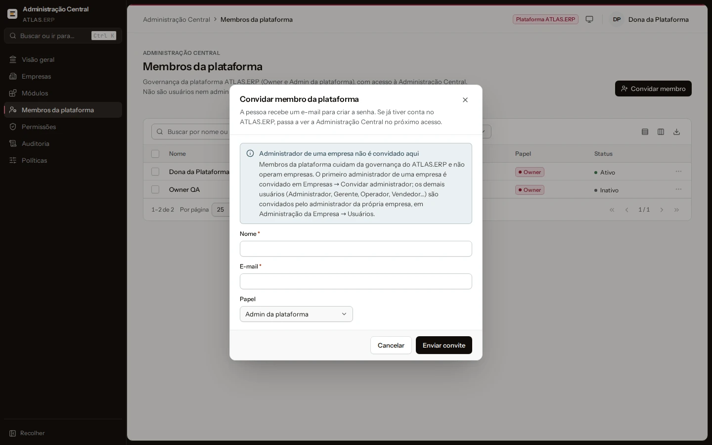
*Figura 49 — Janela "Convidar membro da plataforma".*

**Editar um membro:** **⋯ › Editar membro** › altere **Nome**, **Papel** ou **Status** › **Salvar**. O e-mail (login) não muda por aqui. *(Janelas de convite e edição abertas e conferidas; nenhum membro foi convidado ou alterado neste manual.)*

> **Regra de governança:** *"O último Owner ativo não pode ser rebaixado nem desativado — a plataforma sempre mantém um Owner."* Admins gerenciam apenas Admins; Owners são geridos somente por Owners.

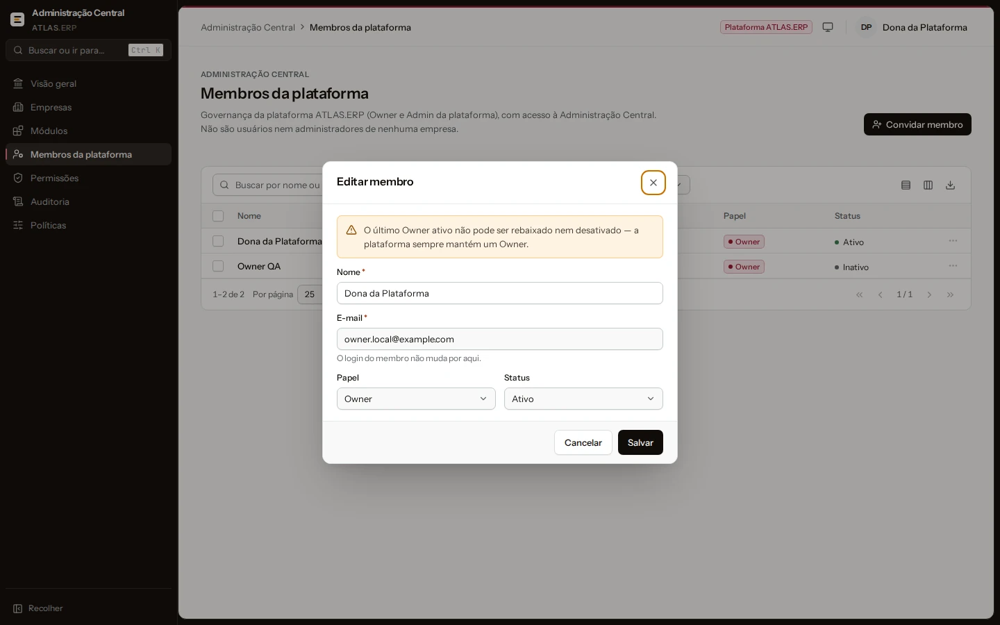
*Figura 50 — Edição de membro, com o aviso de proteção do último Owner.*

### 8.2 Permissões da plataforma

**Como acessar:** Administração Central › **Permissões**. Mostra, por permissão, o que o **Owner** e o **Admin** podem fazer. Itens marcados **Só Owner** (ex.: manter o catálogo de módulos) não estão disponíveis ao Admin. Estas permissões **não valem** dentro das empresas.


*Figura 51 — Permissões da plataforma (Owner × Admin).*

---

## 9. Segurança

| Mecanismo | Como funciona |
|---|---|
| **Convite obrigatório** | Ninguém cria conta sozinho. O convite é vinculado ao e-mail e só essa pessoa consegue aceitá-lo. |
| **Link de uso único e com validade** | Convites e links de senha valem por tempo limitado e uma única vez. |
| **Senha** | Mínimo de 8 caracteres, com letras e números. Criada pela própria pessoa. |
| **Isolamento entre empresas** | Cada empresa só enxerga os próprios dados. A plataforma não acessa dados operacionais. |
| **Sem "entrar como empresa"** | Não existe personificação nem modo suporte com acesso aos dados de um cliente. |
| **Papéis e permissões** | O acesso é a soma dos papéis. Botões e menus seguem as permissões; o servidor também confere cada operação. |
| **Proteções contra bloqueio** | O papel Administrador não pode ter as permissões redefinidas; ninguém desativa o próprio acesso; o último Owner não pode ser rebaixado. |
| **Auditoria** | Alterações de acesso, estrutura e cadastros ficam registradas (empresa e plataforma, separadamente). |

**Boas práticas**

- Dê a cada pessoa o **menor conjunto de papéis** necessário.
- Revise periodicamente a visão **Sem papel** e as **Pendências de configuração**.
- Desative o acesso de quem deixou a empresa, em vez de excluir o cadastro.
- Não compartilhe links de convite em canais públicos.

---

## 10. Operações administrativas

### 10.1 Setores

🔐 `departments.view` / `departments.create` / `departments.update`

Estrutura de setores da empresa (pode ter **Setor superior**). Setores orientam cargos, papéis típicos e o foco dos painéis.

1. **Novo(a) setor** › **Código** (ex.: COMPRAS, FIN, LOG), **Nome**, **Descrição**, **Setor superior** › **Criar**.
2. Aviso: *"Setor criado(a)."* Código repetido: *"Já existe um registro com este código."*
3. Na linha: ícone de lápis (**Editar**) e ícone de liga/desliga (**Desativar/Reativar**).


*Figura 52 — Setores.*


*Figura 53 — Janela "Novo(a) setor".*


*Figura 54 — Código já existente.*


*Figura 55 — Setor "Expedição" criado.*

### 10.2 Cargos

🔐 `positions.view` / `positions.create` / `positions.update` · Mesma mecânica: **Novo(a) cargo**. *(Janela aberta e conferida; criação não executada neste manual.)*


*Figura 56 — Cargos.*


*Figura 57 — Janela "Novo(a) cargo".*

### 10.3 Unidades

🔐 `branches.read` / `branches.manage` · Filiais e unidades de operação. O acesso de cada usuário é liberado por unidade. **Novo(a) unidade** › **Código** (até 32 caracteres, ex.: MATRIZ, SP01) e **Nome** › **Criar**. *(Janela aberta e conferida; criação não executada neste manual.)*


*Figura 58 — Unidades (nenhuma cadastrada no ambiente de teste).*


*Figura 59 — Janela "Novo(a) unidade".*

### 10.4 Módulos

🔐 `company_modules.view` / `company_modules.manage`

Módulos contratados pela empresa e quais estão habilitados. *"Desabilitar um módulo oculta suas telas e bloqueia suas permissões."* Os módulos **Essenciais** (Núcleo, Cadastros) não podem ser desligados. Módulos *Não contratados* dependem da Administração Central.

1. Use a chave ao lado do módulo.
2. Confirme em **Desabilitar** (ou **Habilitar**). Ao desabilitar: *"Ninguém da empresa poderá usar este módulo até ele ser habilitado de novo. Os dados são mantidos."*
3. Aviso: *"<módulo> desabilitado."*

*(Confirmação aberta e conferida; a desabilitação não foi confirmada neste manual.)*


*Figura 60 — Módulos da empresa.*


*Figura 61 — Confirmação "Desabilitar Estoque?".*

### 10.5 Configurações: foco dos painéis

🔐 `settings.view` (ver) · `dashboard.configure` (alterar)

Define quais áreas aparecem primeiro nos painéis (bloco **Seu foco**) para cada setor, cargo ou papel. As regras da empresa complementam o padrão da plataforma.

1. **Nova regra** › **Tipo de público** (Setor, Cargo ou Papel) › o público › **Foco** › **Prioridade** (menor número aparece primeiro) › opcional **Ocultar este foco para o público** › **Salvar regra**.
2. Aviso: *"Regra de foco salva."* (ou *"Foco ocultado para este escopo."*). *(Janela aberta e conferida; nenhuma regra foi salva neste manual.)*


*Figura 62 — Foco dos painéis.*


*Figura 63 — Janela "Nova regra de foco".*

### 10.6 Auditoria da empresa

🔐 `audit_logs.read`

Alterações de acesso, estrutura e cadastros registradas para esta empresa: data, usuário, entidade e ação. Busca por usuário e filtro **Ação**. O detalhe mostra o registro e as alterações.


*Figura 64 — Auditoria da empresa.*


*Figura 65 — Detalhe de um evento de auditoria.*

### 10.7 Módulos, auditoria e políticas da plataforma (Central)

**Módulos da plataforma** (🔐 `platform.modules.view`): catálogo de módulos, categoria, empresas contratantes, habilitados e permissões governadas.


*Figura 66 — Catálogo de módulos da plataforma.*

**Auditoria da plataforma** (🔐 `platform.audit.view`): ciclo de vida, módulos contratados e membros. Não inclui dados operacionais das empresas.


*Figura 67 — Auditoria da plataforma.*

**Políticas** (🔐 `platform.settings.view`): o seu acesso (membro, papel, permissões) e as regras de governança garantidas pelo banco: isolamento entre empresas, sem acesso como empresa, hierarquia de membros, contratação × habilitação, auditoria e visibilidade do cadastro.


*Figura 68 — Políticas da plataforma.*

---

## 11. Problemas conhecidos

| # | Onde | O que acontece | Orientação |
|---|---|---|---|
| 1 | Cadastros e Cadastro de usuários › **Inativar/Ativar** pelo menu e em lote | Apaga dados complementares do registro. | Alterar o **Status** pelo formulário **Editar**. |
| 2 | Cadastro de usuários › **Perfil** | Não concede papel. A pessoa entra sem acesso a módulos. | Atribuir **Papéis** no painel do usuário. |
| 3 | Papéis *Gerente*, *Operador* e *Somente leitura* | Entram na Administração da Empresa (visão geral, usuários, papéis) em modo leitura, porque têm `users.read`. Não convidam, não atribuem papéis e não alteram nada. | Avaliar se é desejado. |
| 4 | Empresas novas | O papel *Somente leitura* criado para empresas novas tem poucas permissões. | Revisar o papel após criar a empresa. |
| 5 | Papéis e permissões | A matriz mostra os recursos com nomes técnicos em inglês (*Audit, Branches, Company modules…*). | Use **Filtrar permissões** e a descrição ao passar o mouse. |
| 6 | Configurações › Dados da empresa | Sem acesso para todos: a permissão `companies.read` não existe no catálogo. | — |
| 7 | Produtos | Não carrega por falta de `product_categories.read` (e marcas/unidades) no catálogo. | — |
| 8 | Conta | Não há troca de senha logado (nem troca de e-mail). | **Esqueci minha senha**. |
| 9 | Auditoria | Entidades e ações aparecem com nomes técnicos (*sales_orders*, *Approve*). | — |
| 10 | Ambiente de QA | O e-mail de convite chega com o assunto *"Redefinir senha"* e o link aponta para o ambiente local. Em produção, o texto depende do provedor de e-mail configurado. | — |


*Figura 69 — Usuário "Somente leitura" na Visão geral da Administração da Empresa (problema nº 3).*


*Figura 70 — Usuário "Somente leitura" consultando Papéis e permissões, sem poder alterar.*


---

## Glossário

| Termo | Significado |
|---|---|
| **Administração Central** | Ambiente da plataforma ATLAS.ERP para gerir empresas clientes, módulos e membros. |
| **Administração da Empresa** | Ambiente do administrador de uma empresa para gerir usuários, papéis e estrutura. |
| **Admin (plataforma)** | Membro da plataforma que gerencia empresas e Admins. Não é administrador de empresa. |
| **Ciclo de vida** | Situação da empresa na plataforma: Avaliação, Ativa, Suspensa, Cancelada. |
| **Contexto organizacional** | Unidade principal, setor e cargo do usuário. |
| **Convite** | Link pessoal, com validade e uso único, para criar o acesso. |
| **Módulo contratado / habilitado** | Contratado: liberado pela plataforma. Habilitado: ligado pela empresa. |
| **Owner** | Membro máximo da plataforma. Sempre existe ao menos um. |
| **Papel** | Conjunto de permissões atribuído a usuários. |
| **Papel de sistema** | Papel padrão de toda empresa (Administrador, Gerente, Operador, Vendedor, Somente leitura). |
| **Permissão** | Autorização no formato `recurso.ação`. |
| **RBAC** | Controle de acesso baseado em papéis. |
| **Unidade** | Filial ou unidade de operação; limita os dados visíveis. |
