# EDUCA.ERP — Manual do Usuário

> **Versão documentada:** interface redesenhada do EDUCA.ERP (branch `claude/educa-redesign`), em modo PostgreSQL/Neon Auth, percorrida em ambiente local de QA em 27/09/2026.
> **Dados das telas:** fictícios, da empresa de testes *Empresa Replica Local*. Nenhum dado real de cliente aparece nas figuras.
> **Atenção:** a produção ainda usa a interface anterior. Os nomes de menus e botões deste manual valem para a versão redesenhada.

Este manual é para quem **usa** o EDUCA.ERP no dia a dia. A gestão de usuários, papéis e empresas está no [Manual de Administração](MANUAL_DE_ADMINISTRACAO.md).

Tudo o que está descrito aqui foi **executado na interface** durante a elaboração do manual. Quando uma função existe no sistema mas não pode ser usada pela tela, ou falhou no teste, isso está dito no próprio texto e reunido em [17. Problemas conhecidos](#17-problemas-conhecidos).

---

## Índice

1. [Sobre o EDUCA.ERP](#1-sobre-o-educaerp)
2. [Primeiros passos](#2-primeiros-passos)
3. [Início e Painéis](#3-início-e-painéis)
4. [Comercial](#4-comercial)
5. [Cadastros](#5-cadastros)
6. [Financeiro](#6-financeiro)
7. [Fiscal](#7-fiscal)
8. [Produção](#8-produção)
9. [CRM](#9-crm)
10. [Qualidade](#10-qualidade)
11. [Projetos e Serviços](#11-projetos-e-serviços)
12. [Workflow (aprovações)](#12-workflow-aprovações)
13. [Importação de dados](#13-importação-de-dados)
14. [Configurações](#14-configurações)
15. [Busca, filtros e tabelas](#15-busca-filtros-e-tabelas)
16. [Status e conceitos](#16-status-e-conceitos)
17. [Problemas conhecidos](#17-problemas-conhecidos)
18. [Perguntas frequentes](#18-perguntas-frequentes)
19. [Módulos complementares: Suprimentos, Logística e Estoque, Ativos e Manutenção, Controladoria](#19-módulos-complementares)
- [Glossário](#glossário)

### Como ler este manual

| Marca | Significado |
|---|---|
| 🔐 **Permissão necessária:** `clientes.read` | Nome técnico da permissão que o seu papel precisa ter. Sem ela, o menu não aparece ou a tela mostra **Sem acesso a este recurso**. |
| ✅ **Disponível** | Funciona pela interface e foi testado. |
| 🟡 **Disponível com restrição** | Funciona, mas com um limite descrito no texto. |
| 🔎 **Somente consulta** | A tela lista e detalha registros, mas **não** permite criar nem editar por ela. |
| ⛔ **Não disponível na interface** | Existe apenas por integração (API) ou ainda não tem tela. |
| ⚠️ **Limitação conhecida** | Falha ou débito registrado. Veja a seção 17. |

---

## 1. Sobre o EDUCA.ERP

### O que é

O EDUCA.ERP é um sistema de gestão empresarial integrado. Ele reúne em um só lugar a operação comercial, o relacionamento com clientes, as compras, o estoque e a logística, a produção, as finanças, o fiscal, a qualidade, os projetos e a manutenção de ativos.

### Como o sistema está organizado

A barra lateral esquerda agrupa os módulos em cinco blocos:

| Bloco | Módulos |
|---|---|
| **Visão geral** | Início, Painéis |
| **Operação** | Comercial, CRM, Suprimentos, Logística e Estoque, Produção |
| **Gestão** | Financeiro, Fiscal, Projetos e Serviços, Qualidade, Ativos e Manutenção, Controladoria |
| **Cadastros** | Produtos, Clientes, Fornecedores, Transportadoras, Motoristas, Veículos, Locais de estoque |
| **Sistema** | Configurações |

No rodapé da barra ficam **Administração da Empresa** (para administradores, veja o [Manual de Administração](MANUAL_DE_ADMINISTRACAO.md)) e **Recolher**, que estreita a barra.

### O que você vê depende do seu papel

Cada usuário recebe um ou mais **papéis** (por exemplo *Administrador*, *Operador*, *Somente leitura*). Cada papel reúne **permissões**. O menu mostra apenas os módulos permitidos para você. Se alguém enviar um link para uma tela que o seu papel não permite, o sistema mostra **Sem acesso a este recurso** com o botão **Voltar**.

### O que já dá para fazer pela tela nesta versão

| Tipo de tela | O que você faz | Exemplos |
|---|---|---|
| **Cadastros** | Criar, visualizar, editar, ativar/inativar, excluir, exportar | Clientes, Fornecedores, Transportadoras, Motoristas, Veículos |
| **Detalhe de pedido de venda** | Enviar para aprovação, aprovar, reservar estoque, liberar reserva, gerar conta a receber, cancelar | Comercial › Pedidos de venda › (pedido) |
| **Pipeline do CRM** | Mover oportunidades entre estágios | CRM › Pipeline |
| **Listas operacionais** | Consultar, filtrar, buscar, abrir o detalhe, exportar CSV | Orçamentos, Contas a receber, NF-e, Ordens de manutenção… |
| **Painéis** | Acompanhar indicadores, pendências e tendências | Início, Painel executivo, Painel financeiro… |

> 🔎 A maior parte das listas operacionais (Financeiro, Fiscal, Suprimentos, Logística, Produção, Qualidade, Projetos, Ativos, CRM › Leads/Oportunidades/Atividades, Comercial › Orçamentos/Faturamento) é **somente consulta** nesta versão. Os registros entram por outros fluxos ou por integração.

---

## 2. Primeiros passos

### 2.1 Receber o acesso

O acesso ao EDUCA.ERP é **sempre por convite**. O administrador da sua empresa cadastra você e envia um convite para o seu e-mail. No primeiro acesso você cria a sua senha. O passo a passo, com as telas, está em [Aceitar um convite](MANUAL_DE_ADMINISTRACAO.md#39-como-a-pessoa-convidada-aceita-o-convite).

### 2.2 Entrar no sistema

**Como acessar:** abra o endereço do EDUCA.ERP informado pela sua empresa. A tela **Acesse sua conta** aparece.

1. Informe o **E-mail**.
2. Informe a **Senha**. O ícone de olho mostra ou oculta o que foi digitado.
3. Clique em **Entrar**.

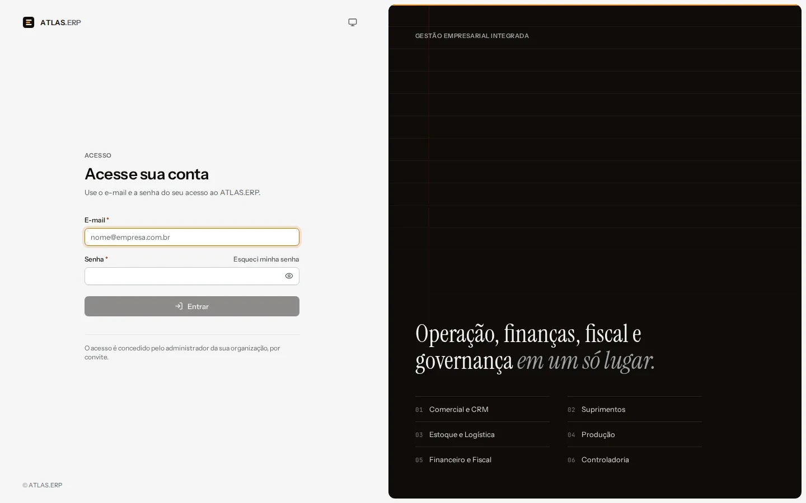
*Figura 1 — Tela "Acesse sua conta".*

| Campo | Obrigatório | Descrição |
|---|---|---|
| E-mail | Sim | O e-mail para o qual o convite foi enviado. |
| Senha | Sim | A senha criada no primeiro acesso. |

**Se os dados estiverem errados**, o sistema mostra *"E-mail ou senha inválidos. Confira os dados e tente novamente."*

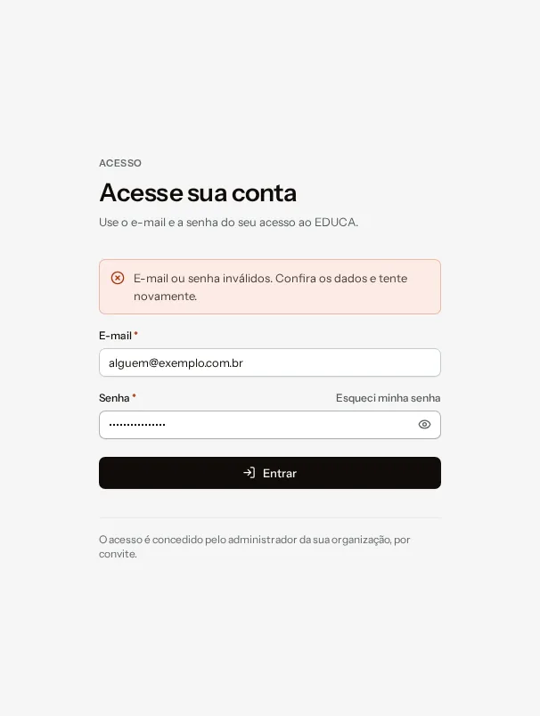
*Figura 2 — Mensagem de e-mail ou senha inválidos.*

### 2.3 Esqueci minha senha

1. Na tela de login, clique em **Esqueci minha senha**.
2. Em **Recuperar senha**, informe o **E-mail** e clique em **Enviar link**.
3. A tela **Verifique seu e-mail** confirma o envio. O link vale por tempo limitado e só pode ser usado uma vez.
4. Abra o e-mail e siga o link para criar uma nova senha.

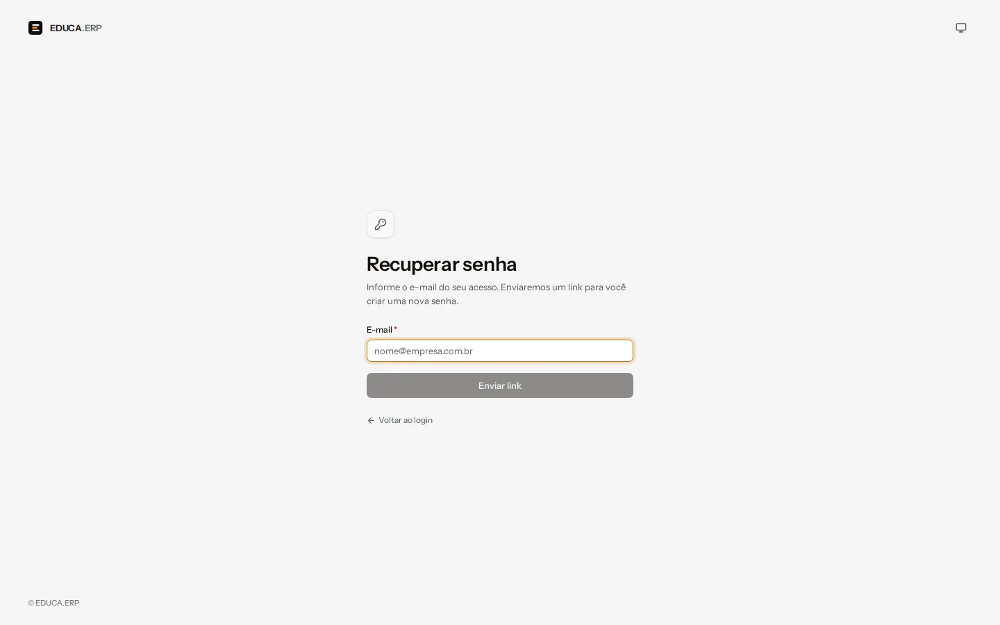
*Figura 3 — Tela "Recuperar senha".*

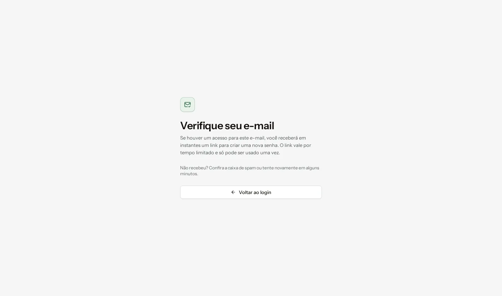
*Figura 4 — Confirmação "Verifique seu e-mail".*

Se o link estiver vencido ou já tiver sido usado, aparece **Link inválido ou expirado**, com as opções **Solicitar novo link** e **Voltar ao login**.

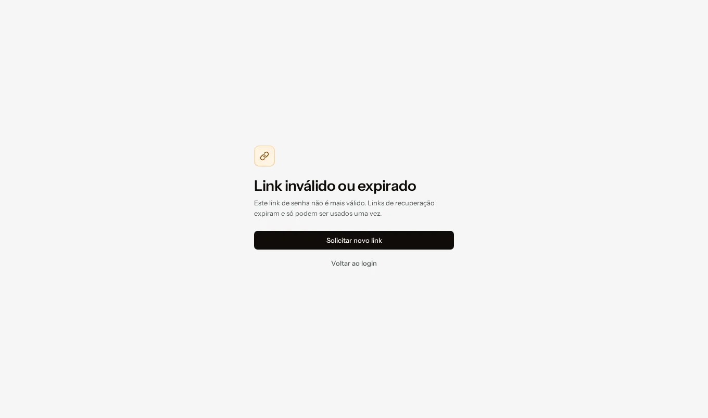
*Figura 5 — Link de redefinição inválido ou expirado.*

> ⚠️ **Limitação conhecida:** não há opção para **trocar a senha estando logado**. Para trocar a senha, saia do sistema e use **Esqueci minha senha**.

### 2.4 Conhecendo a tela

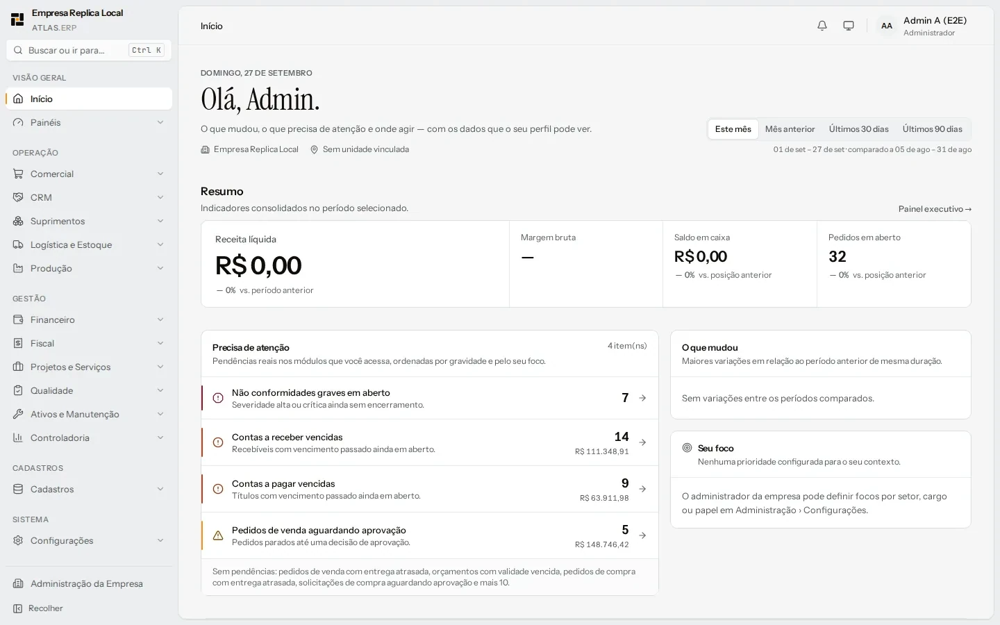
*Figura 6 — Estrutura da tela: barra lateral, trilha de navegação, área de trabalho e menu da conta.*

| Área | Para que serve |
|---|---|
| **Nome da empresa** (topo da barra lateral) | Mostra em qual empresa você está trabalhando. |
| **Buscar ou ir para…** (`Ctrl K`) | Abre a busca rápida de telas. Veja a seção 2.5. |
| **Barra lateral** | Os módulos permitidos para o seu papel. Clique no módulo para abrir as rotinas. |
| **Trilha de navegação** | Mostra onde você está (ex.: *Início › Cadastros › Clientes*). Clique em um nível para voltar a ele. |
| **Sino (Pendências)** | Aprovações de workflow que aguardam a sua decisão. |
| **Ícone de tela** | Alterna o tema (claro, escuro ou do sistema). |
| **Nome e papel** | Abre o menu da conta. |

### 2.5 Busca rápida (Ctrl K)

Pressione **Ctrl K** (ou clique em **Buscar ou ir para…**) e comece a digitar o nome de uma tela. Use as setas para escolher, **Enter** para abrir e **Esc** para fechar.

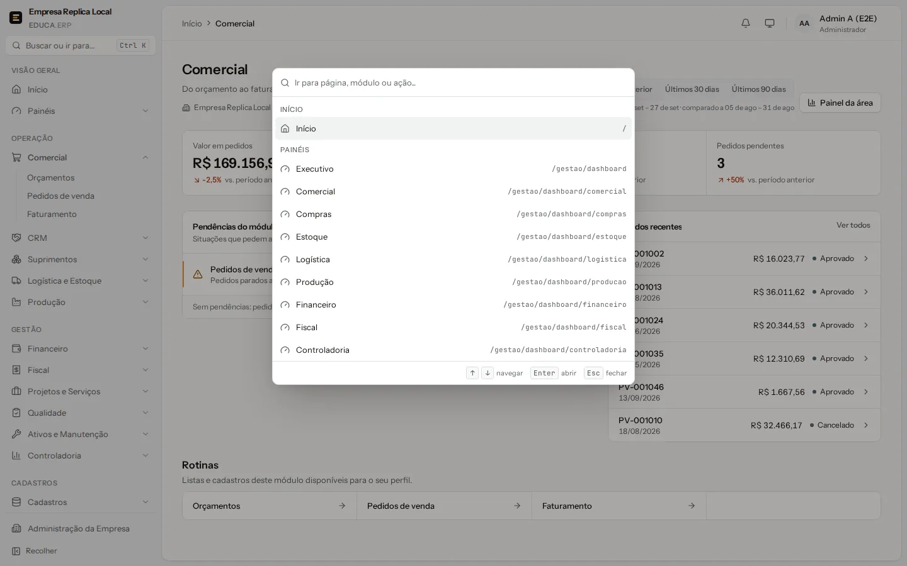
*Figura 7 — Busca rápida aberta com a lista de telas.*

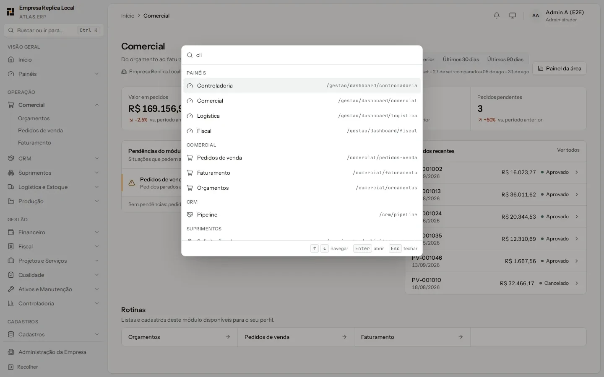
*Figura 8 — Busca rápida filtrando pelo texto digitado.*

> A busca rápida encontra **telas e rotinas**, não registros. Para achar um cliente ou um pedido, use a busca da própria lista (seção 15).

### 2.6 Menu da conta

Clique no seu nome, no canto superior direito. O menu mostra:

- nome, e-mail, empresa e **Papéis**;
- **Administração da Empresa** (só para quem tem permissão);
- **Preferências**, que abre *Configurações › Aparência*;
- **Tema**: *Claro*, *Escuro* ou *Sistema*;
- **Sair**.

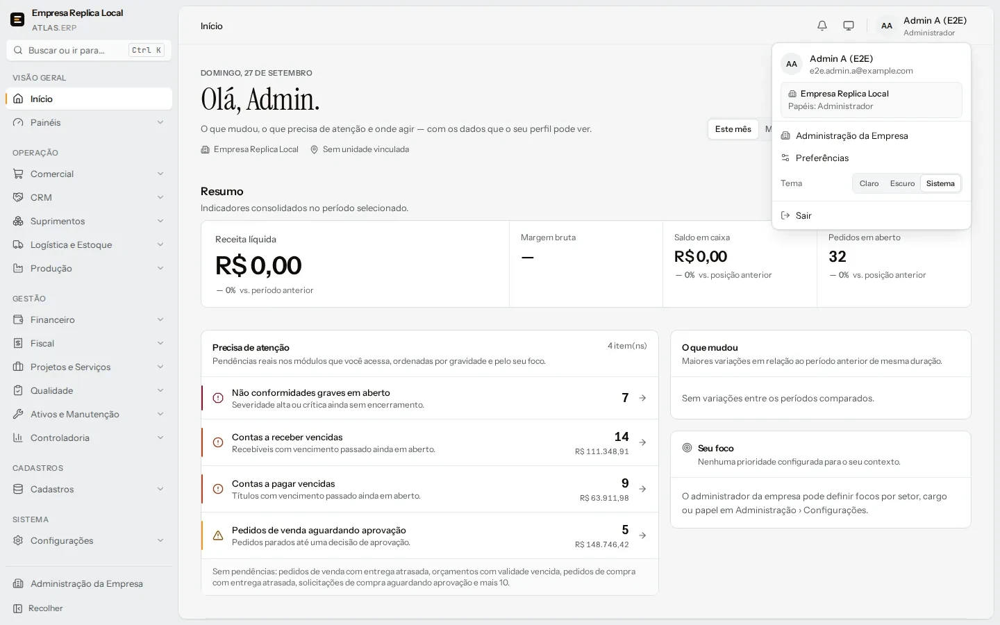
*Figura 9 — Menu da conta.*

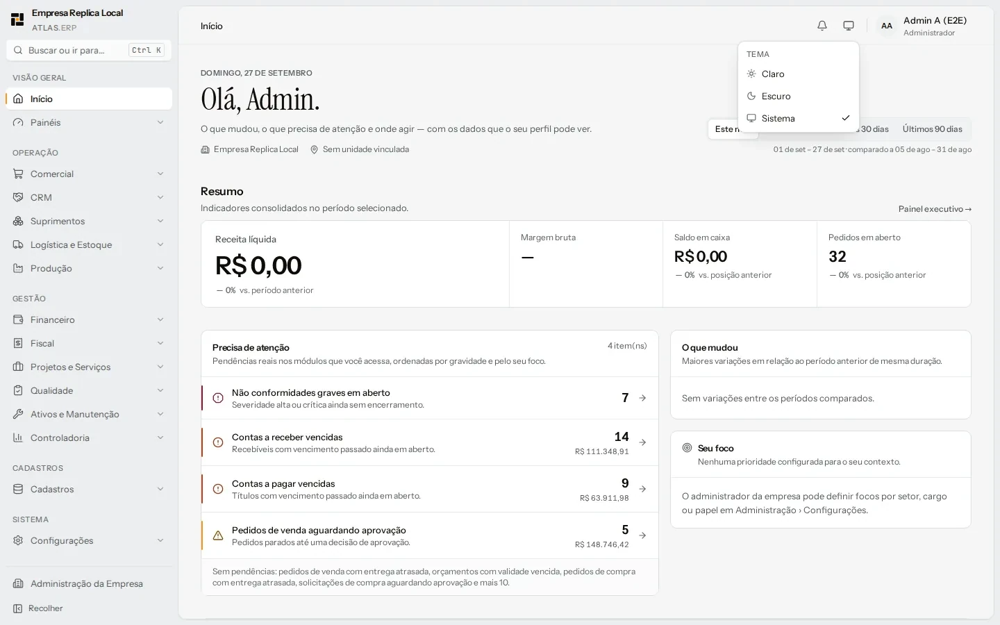
*Figura 10 — Troca rápida de tema pelo ícone de tela.*

### 2.7 Recolher a barra lateral

Clique em **Recolher**, no rodapé da barra, para ganhar espaço. A barra passa a mostrar só os ícones.

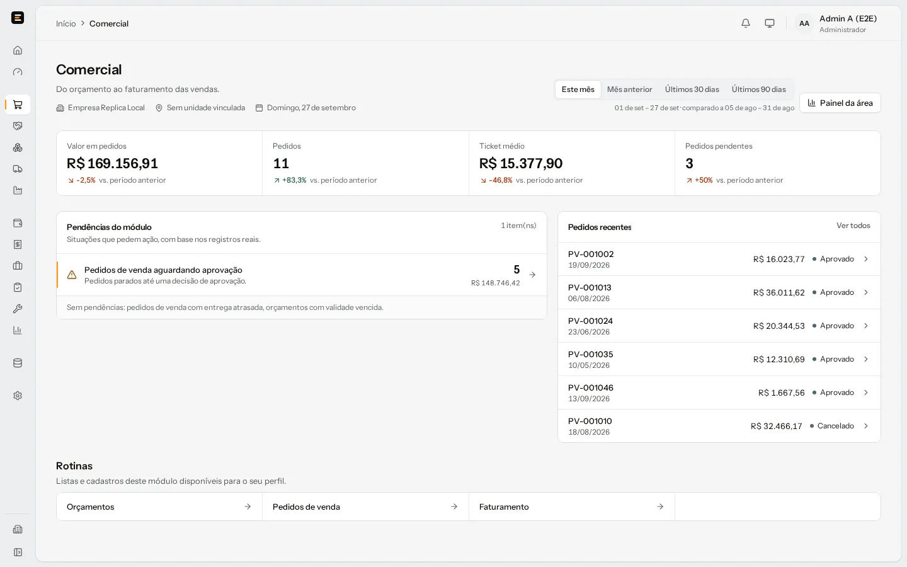
*Figura 11 — Barra lateral recolhida.*

### 2.8 Uso no celular

No celular, a barra lateral fica escondida. Toque em **Abrir menu** (ícone no topo) para ver os módulos. As tabelas viram cartões e os filtros ficam no botão **Filtros**.

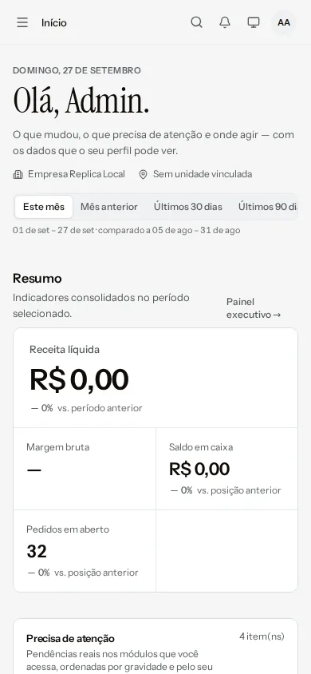
*Figura 12 — Início no celular.*

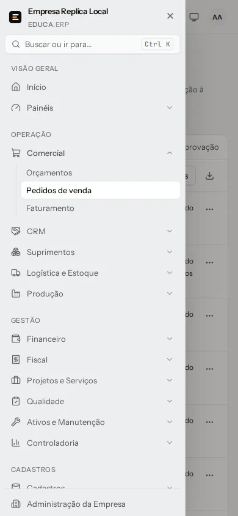
*Figura 13 — Menu aberto no celular.*

### 2.9 Sair

Menu da conta › **Sair**.

---

## 3. Início e Painéis

### 3.1 Início

**O que é:** a primeira tela depois do login. Ela resume o que mudou, o que precisa de atenção e onde agir, sempre com os dados que o seu papel permite ver.

**Como acessar:** barra lateral › **Início**.

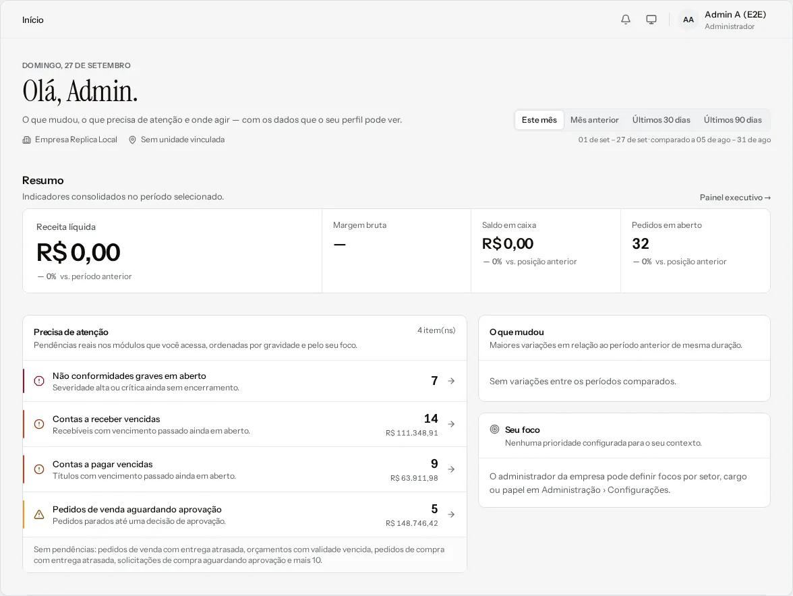
*Figura 14 — Tela Início ("Olá, <nome>.").*

| Bloco | O que mostra |
|---|---|
| **Período** (*Este mês*, *Mês anterior*, *Últimos 30 dias*, *Últimos 90 dias*) | Muda o recorte de todos os indicadores. A comparação é com o período anterior de mesma duração. |
| **Resumo** | Receita líquida, margem bruta, saldo em caixa, pedidos em aberto. O link **Painel executivo →** abre o painel completo. |
| **Precisa de atenção** | Pendências reais dos módulos que você acessa, por gravidade (ex.: *Contas a receber vencidas*, *Pedidos de venda aguardando aprovação*). Clique na linha para abrir a lista filtrada. |
| **O que mudou** | Maiores variações em relação ao período anterior. |
| **Seu foco** | Áreas priorizadas para o seu setor, cargo ou papel (configurado pelo administrador). |
| **Fluxo do ERP** | Como os registros avançam pelas etapas: *Pedido à entrega*, *Compra ao recebimento*, *Produção*. Clique numa etapa para abrir a lista. |
| **Investigação** | Tendências e distribuições (ex.: *A receber por vencimento*). |

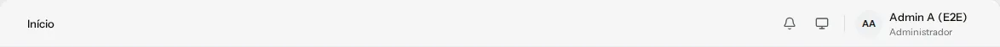
*Figura 15 — Troca do período de análise.*

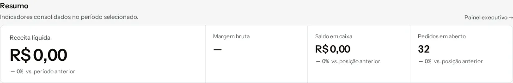
*Figura 16 — Bloco "Precisa de atenção".*

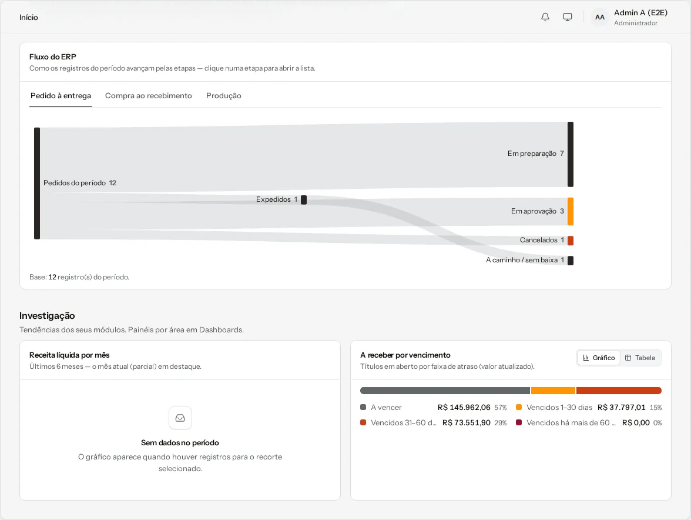
*Figura 17 — Fluxo do ERP (pedido à entrega).*

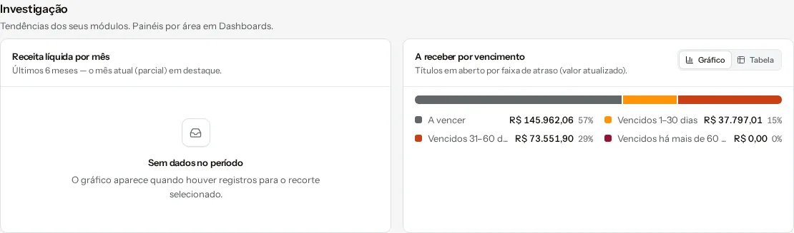
*Figura 18 — Bloco "Investigação".*

**Gráfico ou tabela:** nos blocos que têm os botões **Gráfico** e **Tabela**, você escolhe como ver os números.

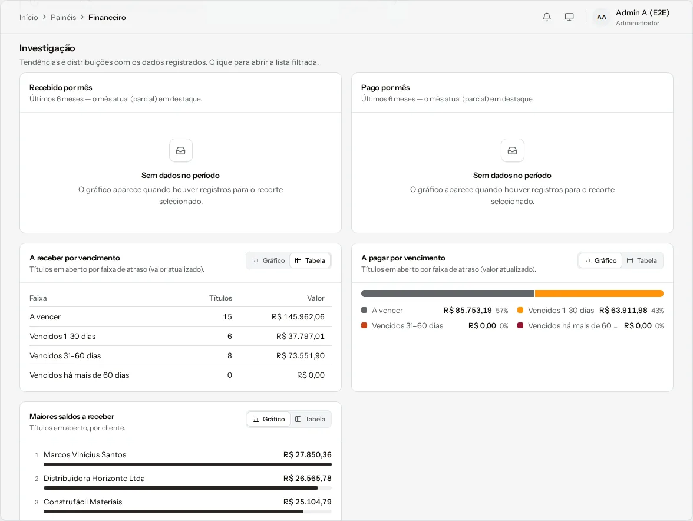
*Figura 19 — Bloco exibido como tabela.*

**Quando não há dados:** o bloco mostra *"Sem dados no período — O gráfico aparece quando houver registros para o recorte selecionado."*

### 3.2 Painéis por área

**O que é:** painéis de acompanhamento por área, com a mesma estrutura do Início (Resumo, Precisa de atenção, O que mudou, Fluxo do ERP, Investigação).

**Como acessar:** barra lateral › **Painéis** › escolha a área. Também pela busca rápida ou pelo botão **Painel da área** dentro de cada módulo.

| Painel | 🔐 Permissão necessária |
|---|---|
| Executivo | `reports.view` |
| Comercial | `commercial_reports.view` |
| Compras | `purchase_reports.view` |
| Estoque | `inventory_reports.view` |
| Logística | `logistics_reports.view` |
| Produção | `production_reports.view` |
| Financeiro | `financial_reports.view` |
| Fiscal | `fiscal_reports.view` |
| Controladoria | `controlling.view` |
| Qualidade | `nonconformities.view` |
| Manutenção | `maintenance_orders.view` |
| Operações | `shipments.view`, `stock.view` ou `production_orders.view` |
| TI e acessos | `users.read` |

*Painéis abertos e conferidos neste manual: Executivo, Comercial, Financeiro, Produção, TI e acessos e Operações. Os demais seguem a mesma estrutura e foram listados a partir do menu do sistema.*

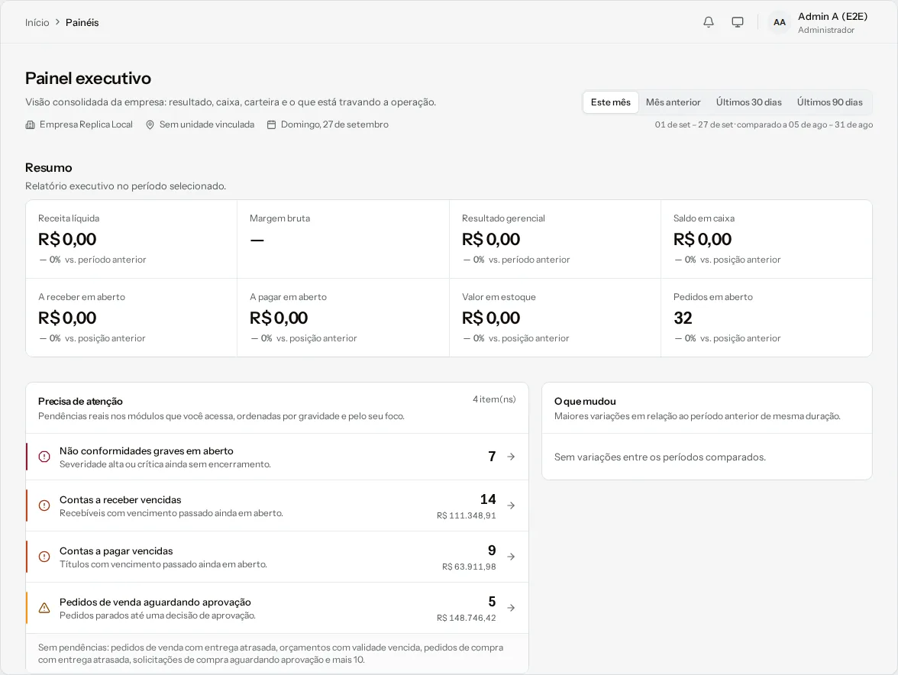
*Figura 20 — Painel executivo.*

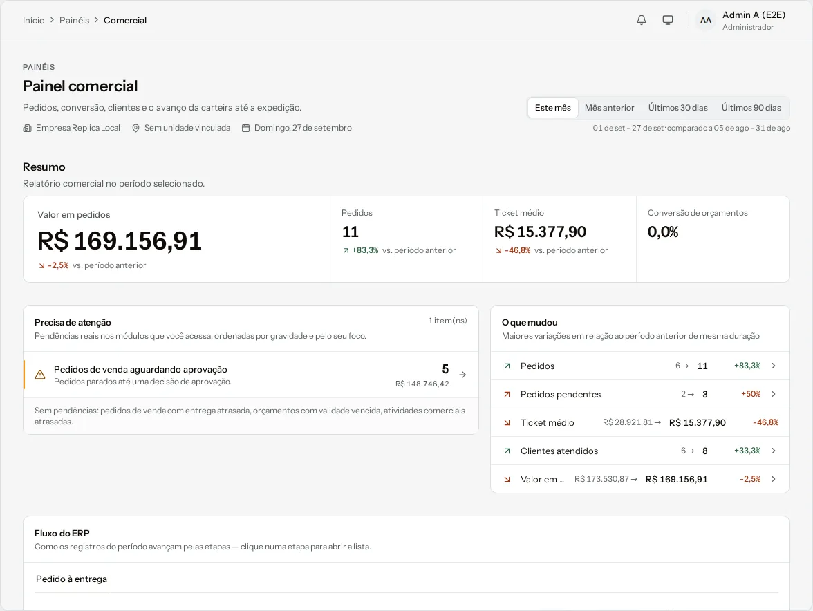
*Figura 21 — Painel comercial.*

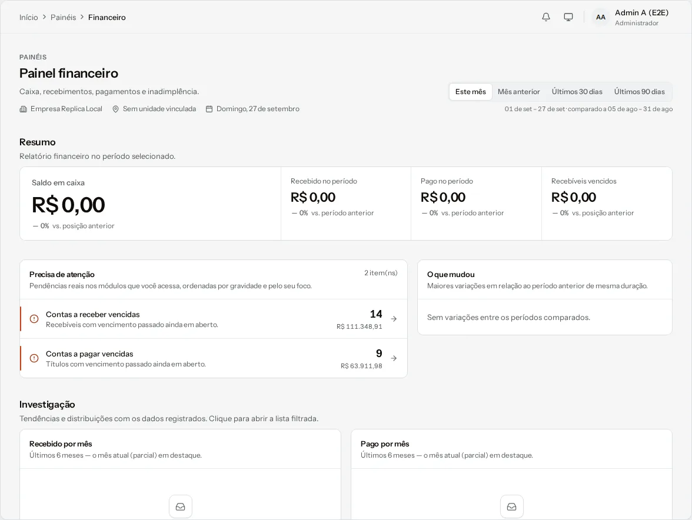
*Figura 22 — Painel financeiro.*

**Quando um bloco não carrega**, ele mostra *"Não foi possível carregar…"* e o botão **Tentar novamente**. Os outros blocos continuam funcionando.

*Figura 23 — Painel de produção com o resumo indisponível.*

> ⚠️ **Limitação conhecida:** o **Resumo** dos painéis de **Produção** e **Fiscal** (e o relatório de estoque) não carrega nesta versão: aparece *"Não foi possível carregar o relatório…"*. Os demais blocos desses painéis funcionam.

---

## 4. Comercial

**O que é:** do orçamento ao faturamento das vendas.

**Como acessar:** barra lateral › **Comercial**. A página inicial do módulo mostra indicadores (valor em pedidos, pedidos, ticket médio, pedidos pendentes), **Pendências do módulo**, **Pedidos recentes** e as **Rotinas**.

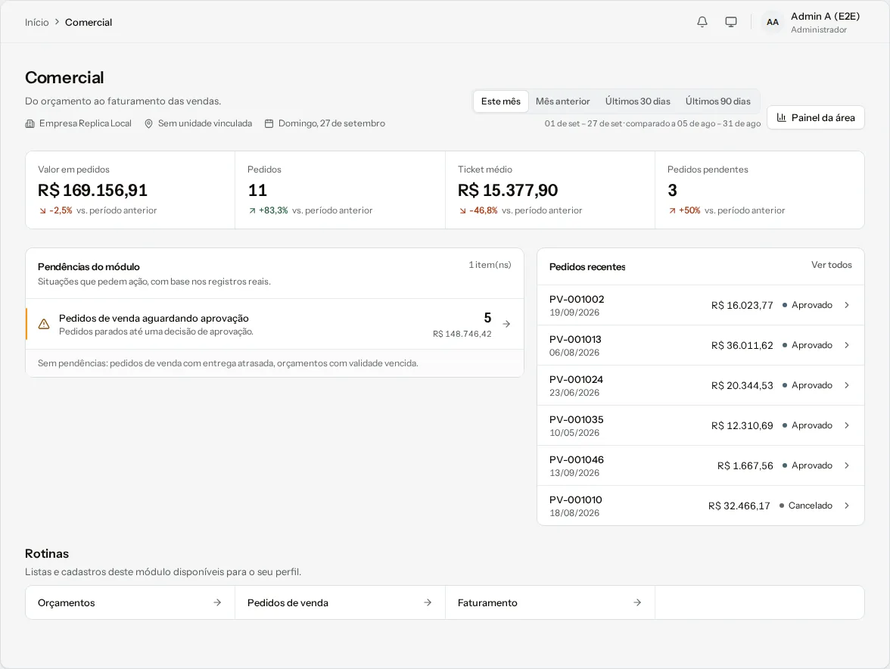
*Figura 24 — Página inicial do módulo Comercial.*

### 4.1 Orçamentos 🔎

🔐 **Permissão necessária:** `sales_quotes.view` · **Estado:** 🔎 Somente consulta

**Para que serve:** acompanhar as propostas de venda enviadas a clientes, do rascunho à aprovação ou expiração.

**Como acessar:** Comercial › **Orçamentos**.

1. Use as visões **Todos**, **Validade vencida** e **Aguardando cliente** para filtrar rapidamente.
2. Busque por orçamento ou cliente em **Buscar orçamento ou cliente…**.
3. Para ver os detalhes, clique na linha ou em **⋯ › Abrir**.

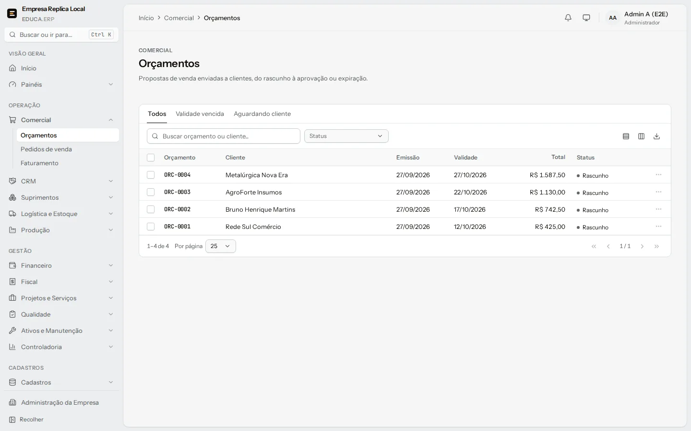
*Figura 25 — Lista de orçamentos.*

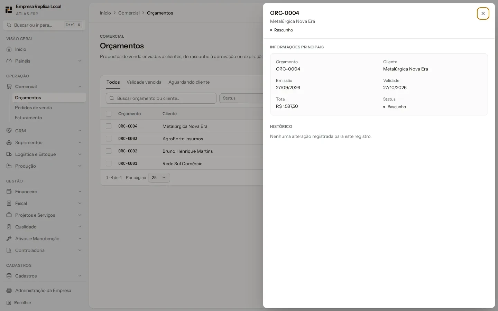
*Figura 26 — Detalhe do orçamento, com informações principais e histórico.*

**Status:** Rascunho, Enviado, Aprovado, Recusado, Expirado, Cancelado.

> ⛔ Criar, editar e converter orçamento em pedido **não estão disponíveis na interface** nesta versão.

### 4.2 Pedidos de venda

🔐 **Permissão necessária:** `sales_orders.view` · **Estado:** ✅ Disponível (consulta + ações no detalhe)

**Para que serve:** acompanhar e fazer andar os pedidos confirmados com clientes, da aprovação à expedição e conclusão.

**Como acessar:** Comercial › **Pedidos de venda**.

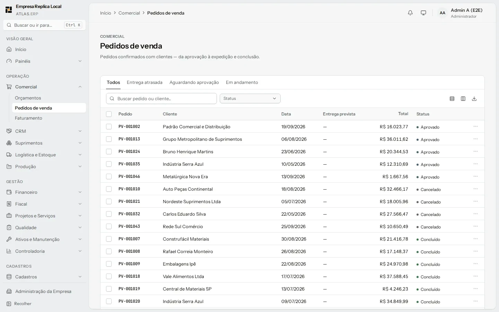
*Figura 27 — Lista de pedidos de venda.*

**Consultando:**

- Visões: **Todos**, **Entrega atrasada**, **Aguardando aprovação**, **Em andamento**.
- Busca: **Buscar pedido ou cliente…** (pressione **Enter**).
- Filtro **Status**.
- **Configurar colunas** escolhe as colunas visíveis. **Alternar densidade** deixa as linhas mais compactas. **Exportar CSV** baixa a lista.

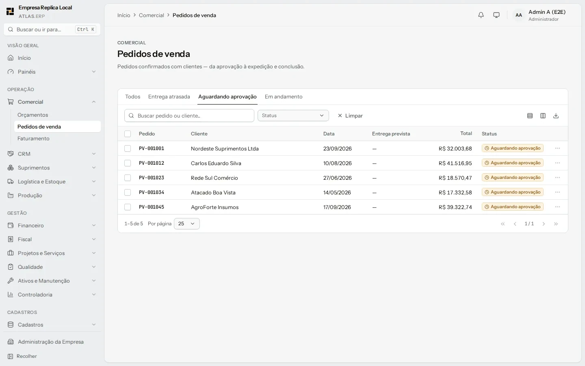
*Figura 28 — Visão "Aguardando aprovação".*

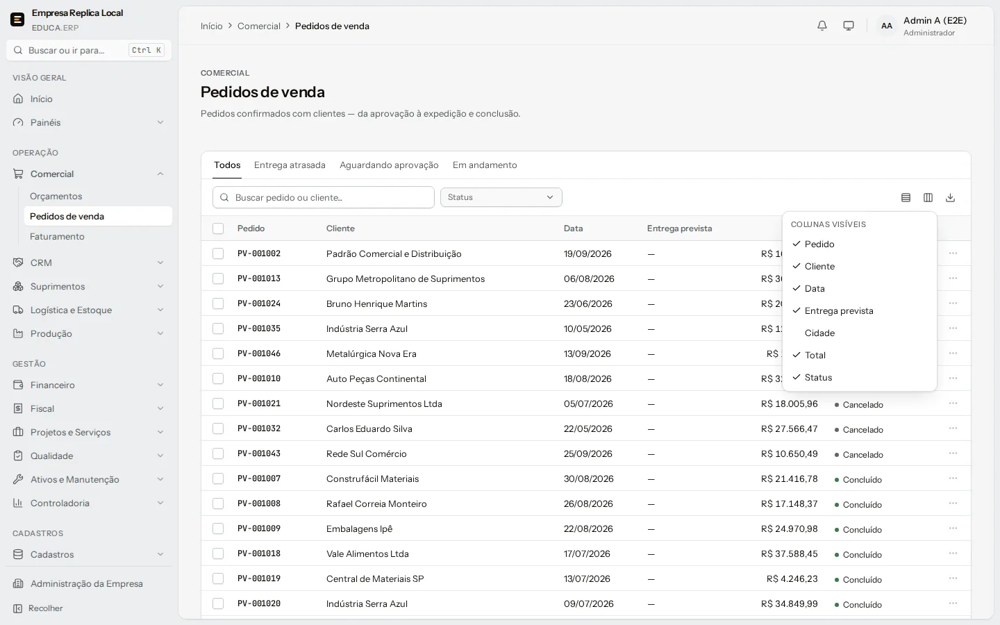
*Figura 29 — Menu "Colunas visíveis".*

#### Visualizando um pedido

Clique no pedido (ou **⋯ › Abrir**). A página do pedido mostra:

- **Total do pedido**, **Itens**, **Reservado** e **Expedido**;
- **Informações** (cliente, data, entrega prevista, endereço, documento fiscal);
- **Andamento** (percentual de reserva e de expedição);
- **Itens**, **Expedições**, **Financeiro** (títulos a receber gerados) e **Histórico**.

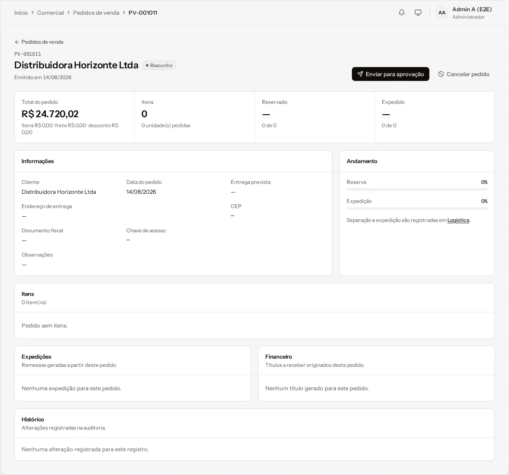
*Figura 30 — Página de um pedido em rascunho.*

#### Ações disponíveis

Os botões aparecem conforme o **status** do pedido **e** a sua permissão. Toda ação pede confirmação.

| Botão | Quando aparece | 🔐 Permissão | Resultado |
|---|---|---|---|
| **Enviar para aprovação** | Rascunho | `sales_orders.update` | Pedido vai para *Aguardando aprovação*. Aviso: *"Pedido enviado para aprovação."* |
| **Aprovar** | Aguardando aprovação | `sales_orders.approve` | Pedido *Aprovado*. Aviso: *"Pedido aprovado."* |
| **Reservar estoque** | Aprovado ou Reserva pendente | `sales_orders.reserve` | Reserva as quantidades no local escolhido. Aviso: *"Estoque reservado."* |
| **Liberar reserva** | Reservado ou Reserva pendente | `sales_orders.update` | Devolve as quantidades reservadas ao estoque. *(Botão conferido na tela; ação não executada neste manual.)* |
| **Gerar conta a receber** | Aprovado em diante | `accounts_receivable.approve` | Cria o título a receber. Aviso: *"Conta a receber gerada."* |
| **Cancelar pedido** | Rascunho até Reservado | `sales_orders.cancel` | Cancela o pedido e libera reservas. **Não pode ser desfeito.** |

**Fluxo completo validado neste manual:** Rascunho → **Enviar para aprovação** → **Aprovar** → **Reservar estoque** → Reservado; e **Gerar conta a receber** num pedido aprovado.

1. Abra um pedido em **Rascunho** e clique em **Enviar para aprovação**. Confirme.

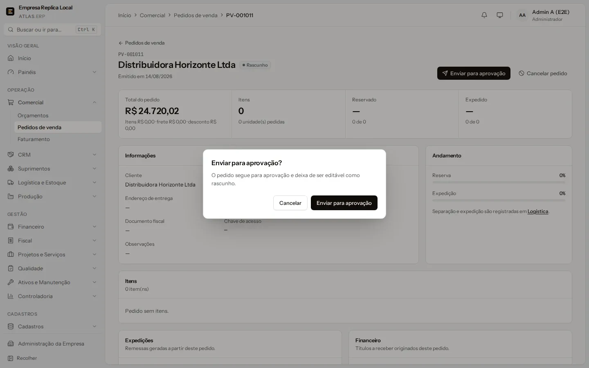
*Figura 31 — Confirmação "Enviar para aprovação?".*

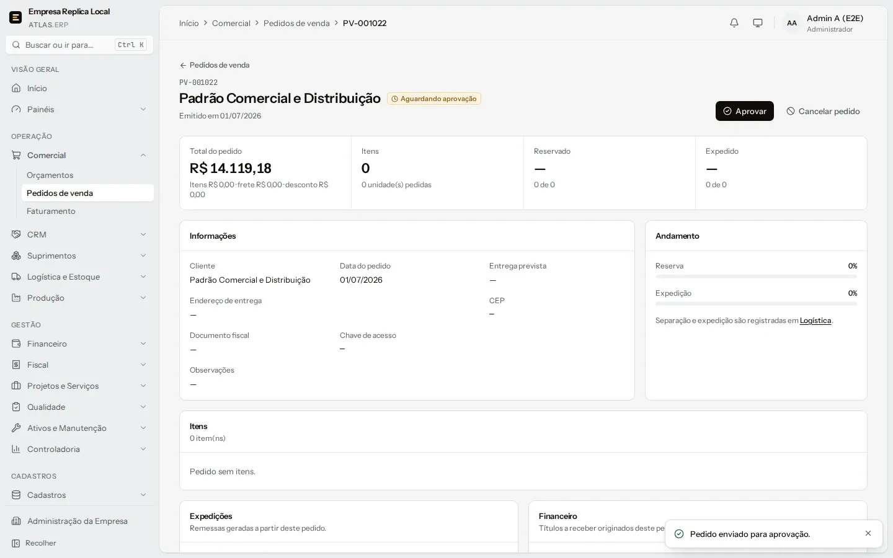
*Figura 32 — Pedido em "Aguardando aprovação".*

2. Com o pedido em **Aguardando aprovação**, clique em **Aprovar** e confirme.

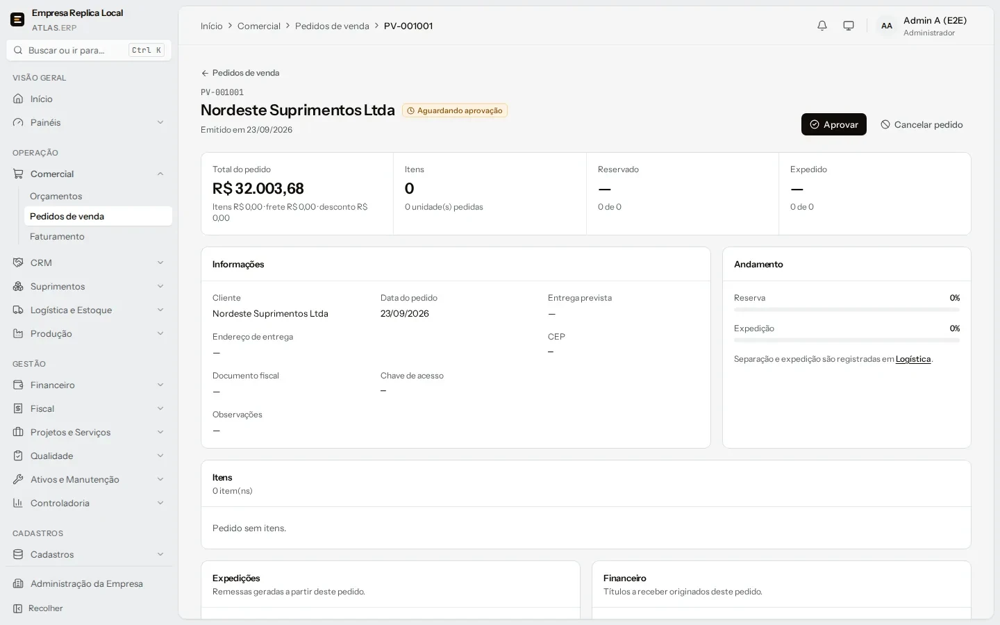
*Figura 33 — Pedido aguardando aprovação.*

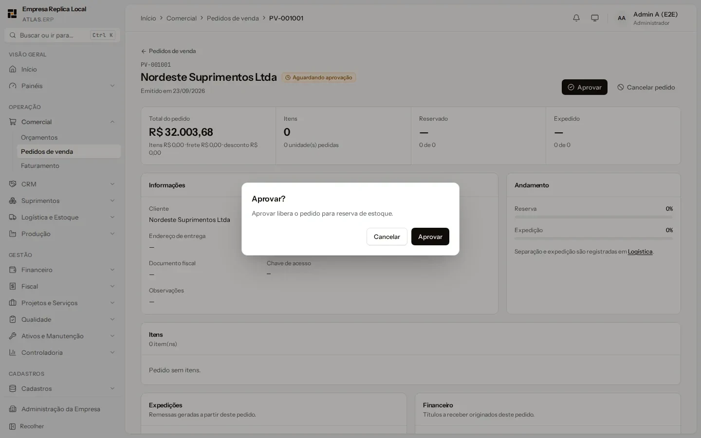
*Figura 34 — Confirmação "Aprovar?".*

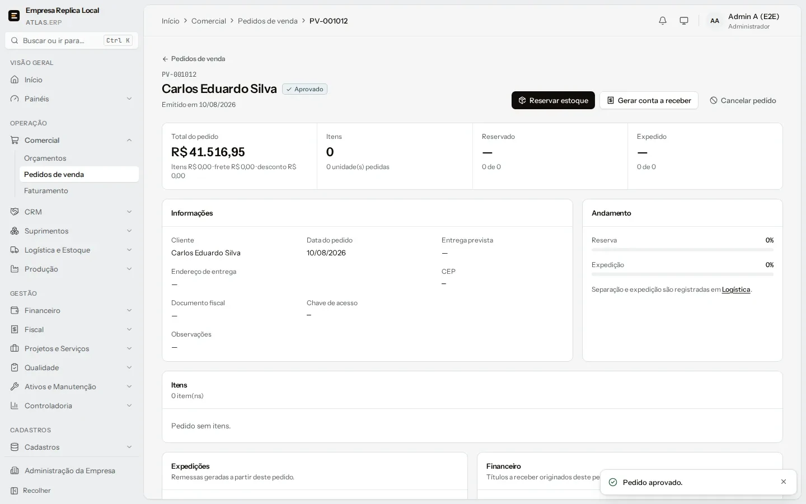
*Figura 35 — Pedido aprovado, com as ações Reservar estoque e Gerar conta a receber.*

3. Clique em **Reservar estoque**, escolha o **Local de estoque** e clique em **Reservar**.

| Campo | Obrigatório | Descrição |
|---|---|---|
| Local de estoque | Sim | Onde as quantidades serão reservadas. Itens sem saldo ficam com reserva pendente. |

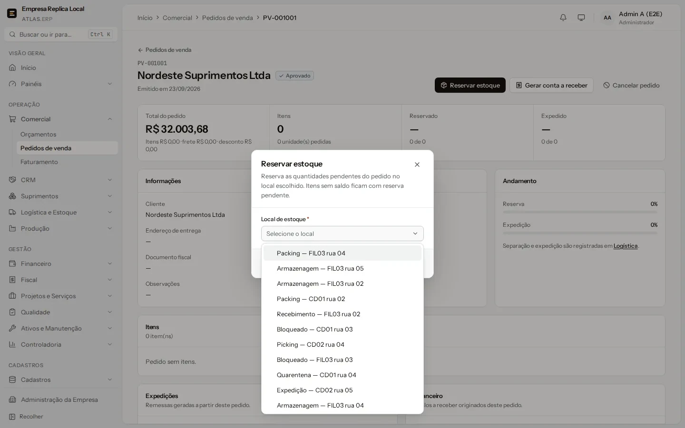
*Figura 36 — Janela "Reservar estoque".*

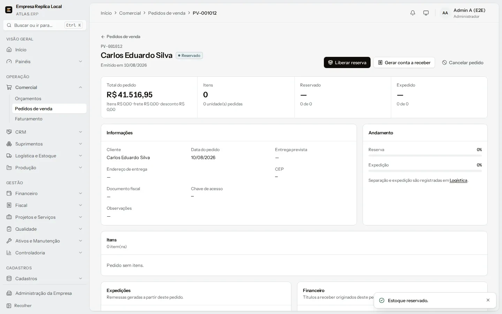
*Figura 37 — Pedido reservado, agora com a ação Liberar reserva.*

4. Para gerar o título financeiro, clique em **Gerar conta a receber** e confirme. O título aparece no bloco **Financeiro** do pedido e em *Financeiro › Contas a receber*.

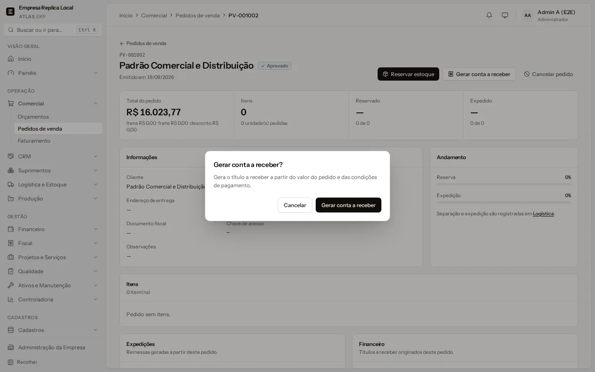
*Figura 38 — Confirmação "Gerar conta a receber?".*

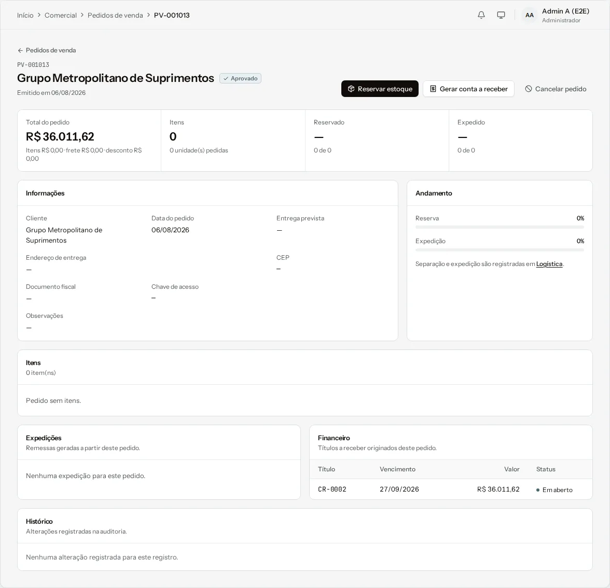
*Figura 39 — Título a receber gerado no bloco Financeiro do pedido.*

**Cancelando um pedido:** clique em **Cancelar pedido** e confirme. O cancelamento libera reservas e **não pode ser desfeito**.

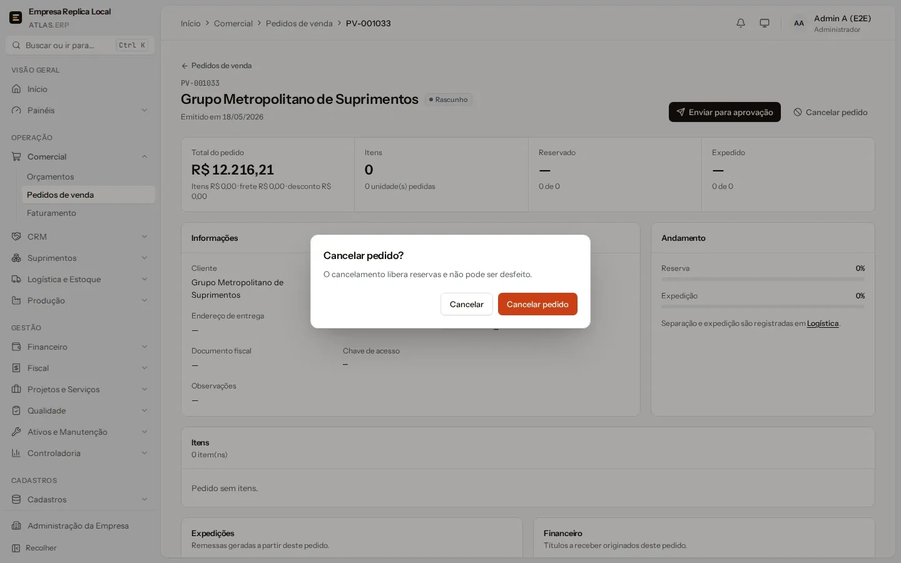
*Figura 40 — Confirmação de cancelamento.*

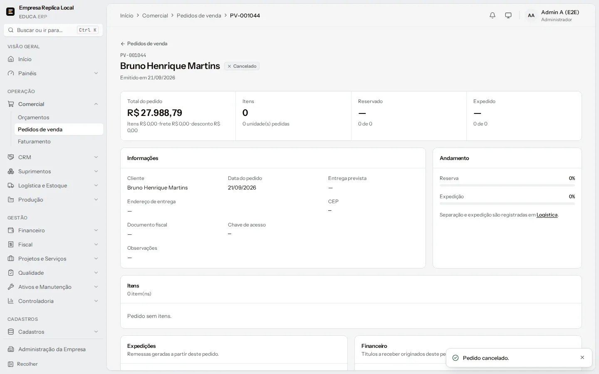
*Figura 41 — Pedido cancelado.*

**Cuidados:**

- Depois de clicar numa ação, o status pode levar alguns segundos para atualizar na tela.
- O botão **Gerar conta a receber** continua visível depois de gerado o título. Confira o bloco **Financeiro** antes de gerar de novo.
- Criar e editar pedidos **não está disponível na interface** nesta versão.

**Pedido inexistente:** se o endereço apontar para um pedido que não existe ou não pertence à sua empresa, aparece **Registro não encontrado** com o link **Voltar à lista**.

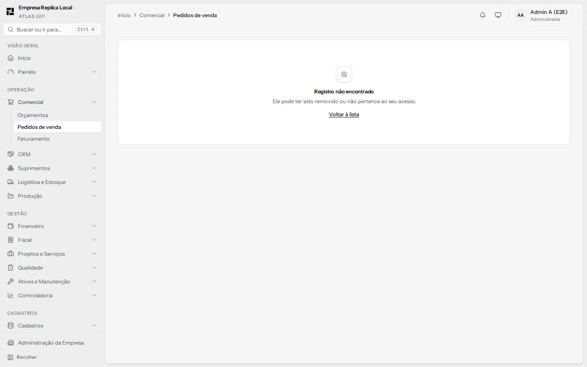
*Figura 42 — Registro não encontrado.*

**No celular:** a lista vira cartões e os filtros ficam no botão **Filtros**, que abre um painel com **Limpar** e **Ver resultados**.

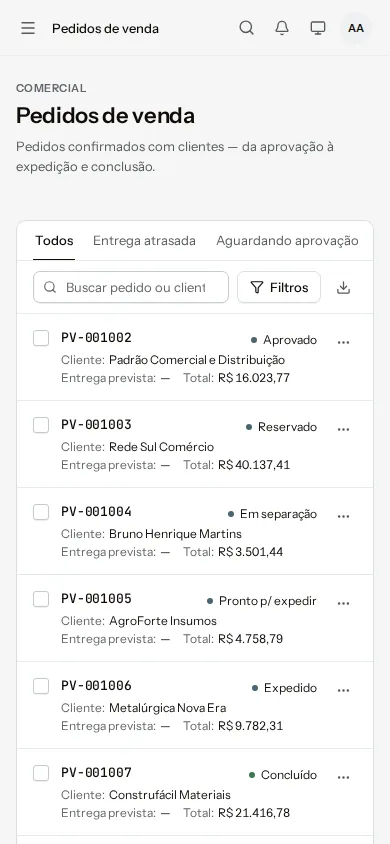
*Figura 43 — Pedidos no celular.*

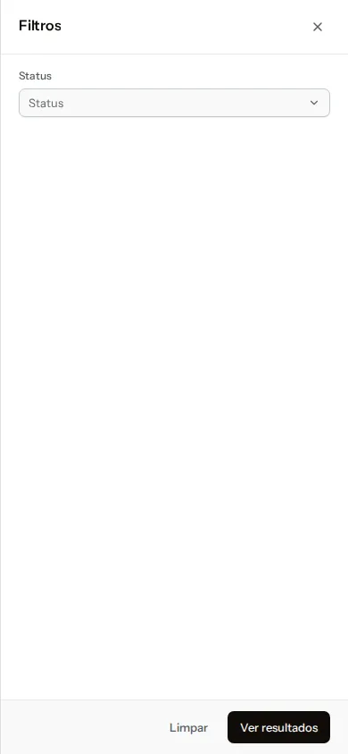
*Figura 44 — Painel de filtros no celular.*

### 4.3 Faturamento 🔎

🔐 **Permissão necessária:** `fiscal_documents.view` · **Estado:** 🔎 Somente consulta

**Para que serve:** ver os documentos fiscais emitidos a partir das vendas (mesma base do módulo Fiscal).

**Como acessar:** Comercial › **Faturamento**. Visões: **Todos**, **Pendentes de autorização**, **Rejeitadas / denegadas**.

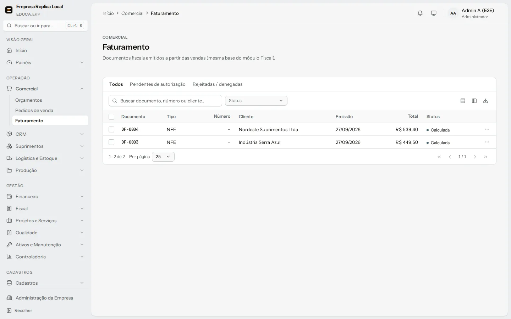
*Figura 45 — Faturamento.*

---

## 5. Cadastros

**O que é:** os cadastros-base usados pelos outros módulos: produtos, clientes, fornecedores, transportadoras, motoristas, veículos e locais de estoque.

**Como acessar:** barra lateral › **Cadastros**.

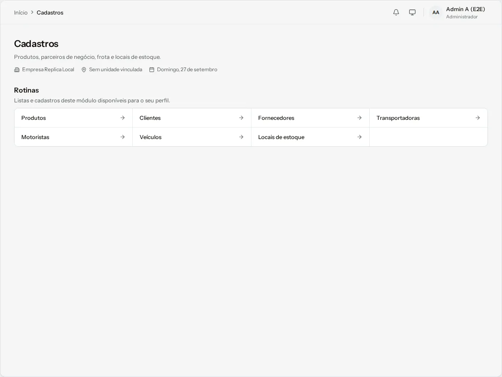
*Figura 46 — Rotinas do módulo Cadastros.*

| Cadastro | 🔐 Consultar | Criar / Editar / Excluir | Estado |
|---|---|---|---|
| Produtos | `products.read` | `products.create` / `.update` / `.delete` | ⚠️ Não carrega (veja 5.3) |
| Clientes | `customers.read` | `customers.create` / `.update` / `.delete` | ✅ Disponível |
| Fornecedores | `suppliers.read` | `suppliers.create` / `.update` / `.delete` | ✅ Disponível |
| Transportadoras | `carriers.read` | `carriers.create` / `.update` / `.delete` | ✅ Disponível |
| Motoristas | `drivers.read` | `drivers.create` / `.update` / `.delete` | ✅ Disponível |
| Veículos | `vehicles.read` | `vehicles.create` / `.update` / `.delete` | ✅ Disponível |
| Locais de estoque | `warehouse_locations.read` | `warehouse_locations.create` / … | 🟡 Consulta ok; criação falha (veja 5.4) |

Todos os cadastros funcionam do mesmo jeito. O passo a passo abaixo usa **Clientes**, que foi testado de ponta a ponta.

### 5.1 Clientes — passo a passo completo

**O que é:** o cadastro geral de clientes usados nas operações comerciais e de faturamento.

**Para que serve:** manter os dados de identificação, contato, endereço e condições comerciais de cada cliente.

**Como acessar:** Cadastros › **Clientes**.

**Antes de começar:** tenha em mãos o **CPF** (11 dígitos) ou o **CNPJ** (14 dígitos) do cliente.

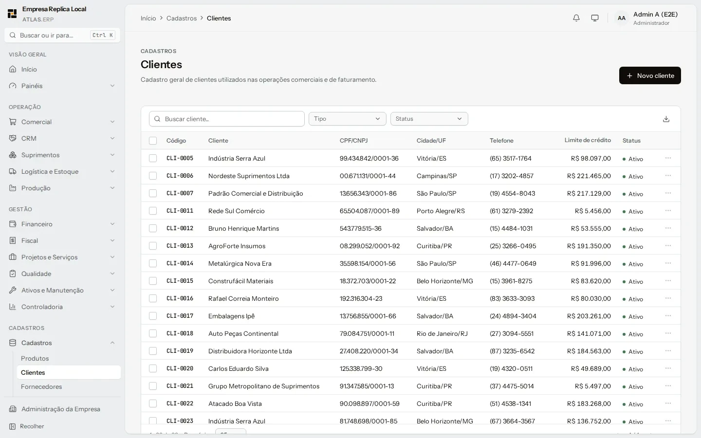
*Figura 47 — Lista de clientes.*

#### Criando um cliente

1. Clique em **Novo cliente**. O painel **Novo cliente** abre à direita.
2. Em **Tipo**, escolha *Pessoa Jurídica* ou *Pessoa Física*.
3. Preencha **Razão social / Nome** e **CPF/CNPJ**.
4. Preencha os demais dados que tiver (contato, endereço, condições comerciais).
5. Clique em **Salvar**. O aviso *"Cliente criado."* confirma, e o cliente aparece no topo da lista com um código automático (ex.: `CLI-0027`).

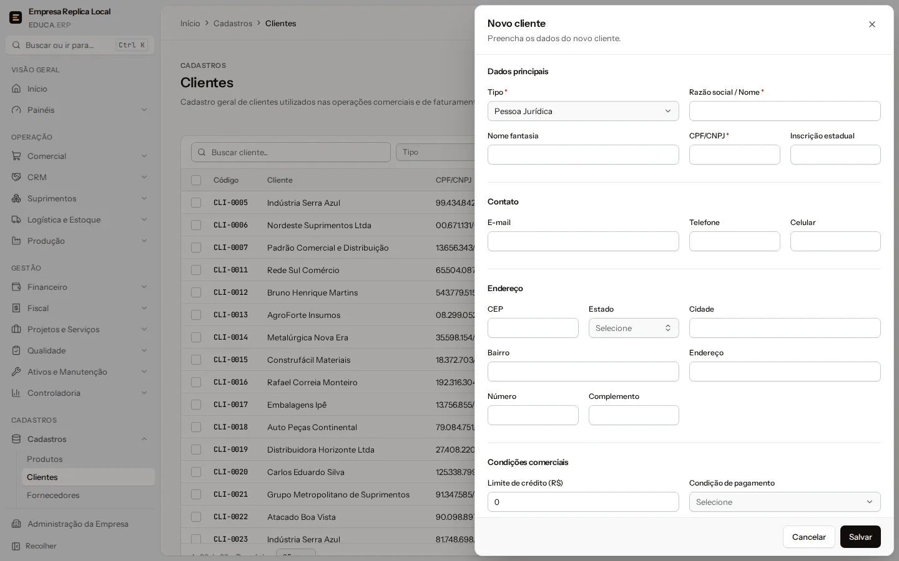
*Figura 48 — Painel "Novo cliente".*

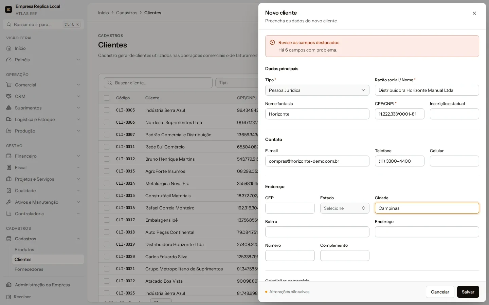
*Figura 49 — Cadastro preenchido antes de salvar.*

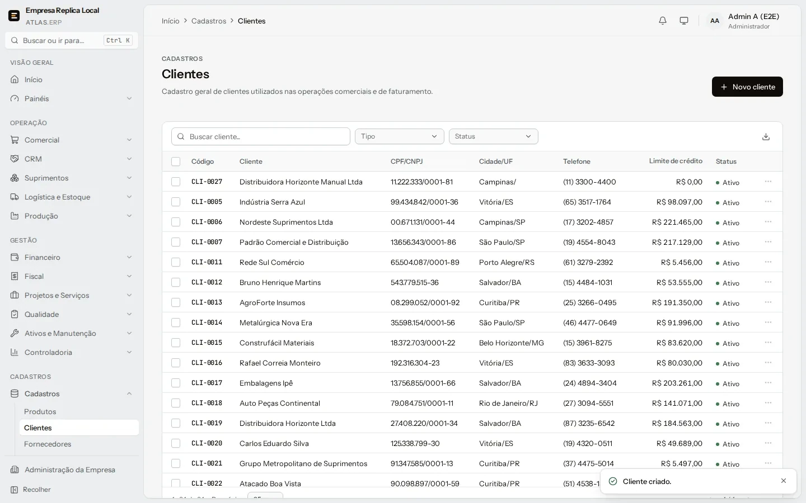
*Figura 50 — Aviso "Cliente criado." e o novo cliente no topo da lista.*

**Campos**

| Campo | Obrigatório | Descrição |
|---|---|---|
| Tipo | Sim | *Pessoa Jurídica* ou *Pessoa Física*. Define a validação do documento. |
| Razão social / Nome | Sim | Nome oficial do cliente. |
| Nome fantasia | Não | Nome comercial. |
| CPF/CNPJ | Sim | 11 dígitos para pessoa física; 14 para jurídica. |
| Inscrição estadual | Não | — |
| E-mail | Não | Precisa ter formato válido. |
| Telefone, Celular | Não | — |
| CEP, Estado, Cidade, Bairro, Endereço, Número, Complemento | Não | Endereço principal. |
| Limite de crédito (R$) | Não | Valor em reais. Padrão 0. |
| Condição de pagamento | Não | Lista de condições. |
| Status | Não | *Ativo* (padrão) ou *Inativo*. |

**Validação:** se faltar algo ou houver erro, o painel mostra no topo **Revise os campos destacados — Há N campos com problema** e a mensagem aparece embaixo de cada campo (ex.: *"Informe o nome ou razão social."*, *"CNPJ deve conter 14 dígitos."*).

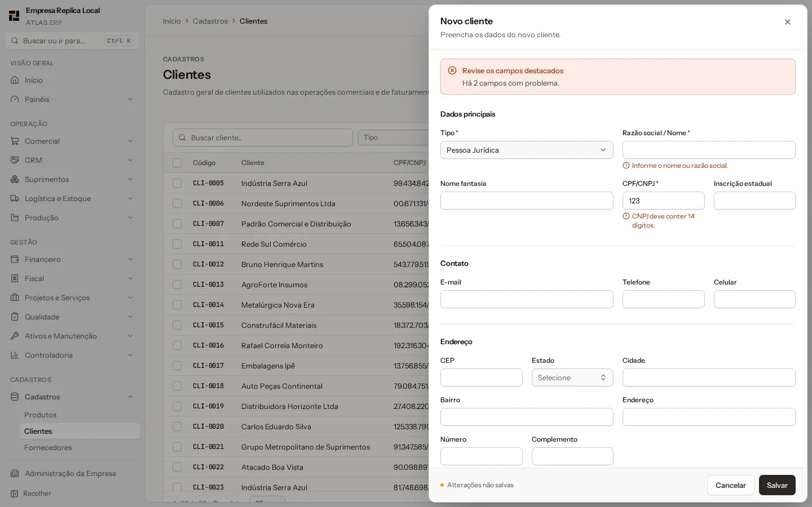
*Figura 51 — Erros de validação no cadastro de cliente.*

> ⚠️ **Limitação conhecida:** o aviso **Revise os campos destacados** também aparece assim que você começa a digitar, mesmo sem erro nenhum (veja a figura do cadastro preenchido). Se nenhum campo estiver marcado em vermelho, pode salvar normalmente.

#### Consultando

- **Buscar cliente…**: digite e pressione **Enter**.
- Filtros **Tipo** e **Status**. **Limpar** remove todos.
- Ícone de download: **Exportar CSV** do resultado filtrado.


*Figura 52 — Busca por "Horizonte Manual".*


*Figura 53 — Filtro de status "Inativo".*

#### Ações da linha

Clique em **⋯** (**Ações do registro**) no fim da linha:

| Ação | 🔐 Permissão | O que faz |
|---|---|---|
| **Visualizar** | `customers.read` | Abre o cadastro somente para leitura, com os botões **Fechar** e **Editar**. |
| **Editar** | `customers.update` | Abre o cadastro para edição. |
| **Inativar / Ativar** | `customers.update` | Troca a situação do cadastro. |
| **Excluir** | `customers.delete` | Exclui definitivamente, após confirmação. |


*Figura 54 — Menu de ações do registro.*


*Figura 55 — Cliente aberto para visualização.*

#### Editando

1. **⋯ › Editar** (ou **Visualizar › Editar**).
2. Altere os campos. O rodapé mostra **Alterações não salvas**.
3. Clique em **Salvar**. Aviso: *"Cliente atualizado."*


*Figura 56 — Edição do cliente.*


*Figura 57 — Aviso "Cliente atualizado."*

**Cancelar sem salvar:** se você clicar em **Cancelar** ou fechar o painel com alterações, o sistema pergunta **Descartar alterações?**. Escolha **Descartar** para perder as alterações ou **Continuar editando** para voltar.


*Figura 58 — Confirmação "Descartar alterações?".*

#### Inativando e reativando

Um cliente **inativo** continua na base e no histórico, mas deixa de ser usado em novas operações.

> ⚠️ **Limitação conhecida — importante:** usar **⋯ › Inativar**, **⋯ › Ativar** ou **Inativar selecionados** **apaga os dados complementares do cadastro** nesta versão (nome fantasia, e-mail, telefones, endereço, limite de crédito e condição de pagamento).
>
> **Forma segura de inativar ou reativar:** **⋯ › Editar** › no fim do formulário, em **Status**, escolha *Inativo* (ou *Ativo*) › **Salvar**. Esse caminho foi testado e preserva todos os dados.


*Figura 59 — Forma segura: alterar o Status pelo formulário de edição.*

*Figura 60 — Cliente inativado pelo formulário, com os dados preservados.*


*Figura 61 — Reativação pelo menu da linha: o cliente volta a Ativo, mas perde telefone e cidade (limitação).*

#### Ações em lote

Marque as caixas das linhas. A barra de lote mostra **N selecionado(s)**, **Exportar seleção**, **Inativar selecionados** e **Limpar seleção**.


*Figura 62 — Dois clientes selecionados.*


*Figura 63 — Confirmação "Inativar registros selecionados?".*

> ⚠️ **Inativar selecionados** tem a mesma limitação do menu da linha. Prefira inativar pelo formulário.

#### Excluindo

1. **⋯ › Excluir**.
2. Leia o aviso **Excluir cliente?** — *"A exclusão não pode ser desfeita. Registros vinculados a outros cadastros não podem ser excluídos — use a inativação nesses casos."*
3. Clique em **Excluir**. Aviso: *"Cliente excluído."*

Se o cliente tiver vínculos, o sistema recusa com *"Exclusão não permitida."*


*Figura 64 — Confirmação de exclusão.*


*Figura 65 — Cliente excluído.*

**Sem permissão de edição:** quem tem apenas `customers.read` (ex.: papel *Somente leitura*) vê a lista sem o botão **Novo cliente** e sem as opções de edição.


*Figura 66 — Clientes vistos por um usuário "Somente leitura".*

**No celular:**


*Figura 67 — Clientes no celular.*

### 5.2 Fornecedores, Transportadoras, Motoristas e Veículos

Funcionam exatamente como Clientes (seção 5.1): botão de criação, painel lateral, **⋯** com Visualizar / Editar / Inativar / Excluir, lote e exportação. A mesma ⚠️ limitação de inativação vale para todos.

> **Cobertura:** estas telas foram abertas e conferidas (lista, painel de criação, visualização). O fluxo completo de criar, editar, inativar e excluir foi executado apenas em **Clientes**, que usa o mesmo componente.

| Cadastro | Botão | Campos obrigatórios |
|---|---|---|
| Fornecedores | **Novo fornecedor** | Tipo, Razão social, CNPJ/CPF |
| Transportadoras | **Nova transportadora** | Razão social, CNPJ |
| Motoristas | **Novo motorista** | Nome, CPF, CNH, Categoria da CNH |
| Veículos | **Novo veículo** | Placa, Modelo |

O detalhe de cada cadastro mostra listas relacionadas: *Produtos vinculados* (fornecedor), *Motoristas vinculados* e *Veículos vinculados* (transportadora), *Transportadora vinculada* (motorista), *Transportadora* e *Motorista principal* (veículo).


*Figura 68 — Fornecedores.*


*Figura 69 — Fornecedor aberto para visualização.*


*Figura 70 — Transportadoras.*


*Figura 71 — Painel "Novo motorista".*


*Figura 72 — Veículos.*

### 5.3 Produtos ⚠️

🔐 `products.read` · **Estado:** ⚠️ Débito conhecido

> ⚠️ **Limitação conhecida:** a lista de **Produtos não carrega** nesta versão, nem para o administrador da empresa. Aparece *"Não foi possível carregar os dados — Você não tem permissão para esta operação (product_categories.read)."* O motivo é que as permissões de categorias, marcas e unidades de produto ainda não existem no catálogo. O painel **Novo produto** abre, mas as listas de catálogo (categoria, marca, unidade) ficam vazias.


*Figura 73 — Produtos: erro de permissão de categorias.*


*Figura 74 — Painel "Novo produto" (campos de catálogo sem opções).*

### 5.4 Locais de estoque 🟡

🔐 `warehouse_locations.read` · **Estado:** 🟡 Consulta disponível; criação com falha

A lista funciona (código, descrição, armazém, tipo, capacidade, status).


*Figura 75 — Locais de estoque.*

> ⚠️ **Limitação conhecida:** ao criar um local (**Novo local** › preencher › **Salvar**), o sistema mostra *"Não foi possível salvar o local de estoque."* Criar locais de estoque **não está disponível** nesta versão.


*Figura 76 — Falha ao salvar um novo local de estoque.*

---

## 6. Financeiro

**O que é:** contas a pagar e a receber, fluxo de caixa e centros de custo.

**Como acessar:** barra lateral › **Financeiro**. A página inicial traz saldo em caixa, recebido e pago no período, recebíveis vencidos, **Pendências do módulo**, **Títulos a receber recentes** e o botão **Painel da área**.


*Figura 77 — Página inicial do Financeiro.*

### 6.1 Contas a receber 🔎

🔐 `accounts_receivable.view` · **Estado:** 🔎 Somente consulta

**Para que serve:** acompanhar os títulos a receber de clientes, do lançamento à liquidação.

1. Financeiro › **Contas a receber**.
2. Visões **Todos**, **Vencidos**, **Em aberto**.
3. Busque por título, descrição ou cliente.
4. **⋯ › Abrir** mostra título, descrição, cliente, vencimento, valor, status e histórico.


*Figura 78 — Contas a receber.*


*Figura 79 — Visão "Vencidos".*


*Figura 80 — Detalhe de um título a receber.*


*Figura 81 — Contas a receber no celular.*

**Status comuns:** Em aberto, Vencido, Recebido.

**Como um título nasce:** pelo botão **Gerar conta a receber** no pedido de venda (seção 4.2) ou por integração.

> ⛔ Baixar (liquidar), renegociar ou lançar títulos **não está disponível na interface** nesta versão.

### 6.2 Contas a pagar 🔎

🔐 `accounts_payable.view` · 🔎 Somente consulta. Busca por título, descrição ou fornecedor.


*Figura 82 — Contas a pagar.*


*Figura 83 — Detalhe de um título a pagar.*

### 6.3 Fluxo de caixa 🔎

🔐 `financial_transactions.view`

Mostra saldo em contas, a receber em aberto, a pagar em aberto e saldo projetado; o gráfico **Saldo acumulado por semana** (com **Gráfico/Tabela**) e a tabela **Projeção por semana**. Títulos vencidos entram na primeira coluna.


*Figura 84 — Fluxo de caixa.*

### 6.4 Centros de custo 🔎

🔐 `cost_centers.view`


*Figura 85 — Centros de custo.*


*Figura 86 — Detalhe de um centro de custo.*

---

## 7. Fiscal

**O que é:** documentos fiscais e as tabelas que os sustentam (NCM, CFOP, regras tributárias). Todas as telas são 🔎 **somente consulta** nesta versão.


*Figura 87 — Página inicial do Fiscal.*

> ⚠️ **Limitação conhecida:** o resumo do **Painel fiscal** não carrega (*"Não foi possível carregar o relatório…"*).

| Rotina | Tela | 🔐 Permissão | Busca |
|---|---|---|---|
| Notas fiscais | **Documentos fiscais** | `fiscal_documents.view` | documento, número ou cliente |
| NF-e | **Notas fiscais eletrônicas (NF-e)** | `fiscal_documents.view` | NF-e, número ou cliente |
| NCM | **Classificação NCM** | `fiscal_ncms.view` | NCM ou descrição |
| CFOP | **Códigos CFOP** | `fiscal_cfops.view` | CFOP ou descrição |
| Regras tributárias | **Regras tributárias** | `tax_rules.view` | regra |


*Figura 88 — Documentos fiscais.*


*Figura 89 — Detalhe de um documento fiscal.*


*Figura 90 — Notas fiscais eletrônicas.*


*Figura 91 — Detalhe de uma NF-e.*


*Figura 92 — Classificação NCM.*


*Figura 93 — Códigos CFOP.*


*Figura 94 — Regras tributárias.*

> ⛔ Emitir, transmitir, cancelar NF-e e manter NCM/CFOP/regras **não estão disponíveis na interface** nesta versão.

---

## 8. Produção

**O que é:** ordens de produção e estruturas de produto (BOM).

| Rotina | 🔐 Permissão | Estado |
|---|---|---|
| Ordens de produção | `production_orders.view` | 🔎 Consulta. Lista vazia no ambiente testado. |
| Estruturas (BOM) | `production_boms.view` | 🔎 Consulta. Lista vazia no ambiente testado. |


*Figura 95 — Página inicial de Produção.*


*Figura 96 — Ordens de produção (sem registros).*


*Figura 97 — Estruturas de produto (sem registros).*

> ⚠️ **Limitação conhecida:** **não é possível criar ordens de produção** nesta versão, nem pela tela nem pelo fluxo integrado. O **Painel de produção** mostra o resumo indisponível.


*Figura 98 — Painel de produção com o resumo indisponível.*

---

## 9. CRM

**O que é:** leads, oportunidades, funil de vendas (pipeline) e atividades comerciais.


*Figura 99 — Página inicial do CRM.*

### 9.1 Leads 🔎

🔐 `leads.view` · Visões **Todos**, **Novos**, **Qualificados** · Busca por lead, empresa ou e-mail.


*Figura 100 — Leads.*


*Figura 101 — Detalhe de um lead.*

> ⚠️ **Limitação conhecida:** a **conversão de lead para oportunidade** encontra-se indisponível nesta versão (falha no servidor).

### 9.2 Pipeline ✅

🔐 **Consultar:** `opportunities.view` · **Mover:** `opportunities.move_stage`

**O que é:** o quadro do funil, com uma coluna por estágio e o total em aberto.

1. CRM › **Pipeline**. Se houver mais de um funil, escolha-o no seletor **Pipeline**.
2. Cada cartão mostra oportunidade, cliente, valor e chance.
3. Use as setas **‹** e **›** do cartão para mover a oportunidade para o estágio anterior ou o próximo.
4. O aviso *"<oportunidade>" movida para <estágio>.* confirma.


*Figura 102 — Pipeline de oportunidades.*


*Figura 103 — Oportunidade movida para "Proposta".*

**Sem permissão:** quem não tem acesso ao CRM vê **Sem acesso a este recurso**.


*Figura 104 — Sem acesso ao Pipeline.*

### 9.3 Oportunidades 🔎

🔐 `opportunities.view` · Visões **Todos**, **Abertas**, **Fechamento vencido**.


*Figura 105 — Oportunidades.*


*Figura 106 — Detalhe de uma oportunidade.*

### 9.4 Atividades 🔎

🔐 `activities.view` · Visões **Todos**, **Pendentes**, **Atrasadas**.


*Figura 107 — Atividades.*


*Figura 108 — Detalhe de uma atividade.*

> Alguns campos do detalhe aparecem com o código interno (ex.: *Tipo: CALL*, *Relacionado a: opportunity*).

---

## 10. Qualidade

Todas as telas são 🔎 **somente consulta**.

| Rotina | Tela | 🔐 Permissão |
|---|---|---|
| Não conformidades | **Não conformidades** | `nonconformities.view` |
| Inspeções | **Inspeções de qualidade** | `quality_inspections.view` |
| Ações | **Ações corretivas e preventivas** | `quality_actions.view` |
| Checklists | **Checklists de qualidade** | `quality_checklists.view` |


*Figura 109 — Página inicial de Qualidade.*


*Figura 110 — Não conformidades.*


*Figura 111 — Detalhe de uma não conformidade.*


*Figura 112 — Inspeções de qualidade.*


*Figura 113 — Ações corretivas e preventivas.*


*Figura 114 — Checklists de qualidade.*

---

## 11. Projetos e Serviços

Todas as telas são 🔎 **somente consulta**.

| Rotina | Tela | 🔐 Permissão |
|---|---|---|
| Projetos | **Projetos** | `projects.view` |
| Tarefas | **Tarefas** | `project_tasks.view` |
| Apontamentos | **Apontamentos de horas** | `time_entries.view` |
| Ordens de serviço | **Ordens de serviço** | `service_orders.view` |


*Figura 115 — Página inicial de Projetos e Serviços.*


*Figura 116 — Projetos.*


*Figura 117 — Detalhe de um projeto.*


*Figura 118 — Tarefas.*


*Figura 119 — Apontamentos de horas.*


*Figura 120 — Ordens de serviço.*

---

## 12. Workflow (aprovações)

🔐 **Permissão necessária:** `workflow.view` · **Estado:** 🟡 Disponível com restrição

**O que existe na interface:** o **sino** (Pendências) no topo da tela abre **Aprovações pendentes — Etapas de workflow aguardando sua decisão**. Quando não há nada, aparece *"Nenhuma aprovação aguardando você."*


*Figura 121 — Aprovações pendentes (sem itens).*

> ⛔ Criar e configurar workflows, e aprovar ou recusar etapas, **não está disponível na interface** nesta versão (existe apenas por integração).
>
> ⚠️ **Limitação conhecida:** iniciar um workflow falha nesta versão, por isso a lista de aprovações não recebe itens.

> As aprovações de **pedido de venda** (seção 4.2) **não** dependem do workflow: são feitas pelo botão **Aprovar** no próprio pedido.

---

## 13. Importação de dados

**Estado:** ⛔ **Não disponível na interface**

A importação de dados em lote existe apenas por integração (API). Não há tela de importação nesta versão.

**O que existe na interface:** a **exportação** de listas em CSV (ícone de download em qualquer lista; veja a seção 15).

---

## 14. Configurações

**Como acessar:** barra lateral › **Configurações** (bloco *Sistema*).


*Figura 122 — Rotinas de Configurações.*

### 14.1 Parâmetros do sistema 🔎

🔐 `settings.view`

Mostra as configurações globais, da empresa e do estabelecimento (precedência: *Estabelecimento › Empresa › Global*): módulo, chave, escopo, valor e status. Busca por módulo, chave ou valor; filtro **Escopo**.


*Figura 123 — Parâmetros do sistema.*

### 14.2 Aparência ✅

Disponível para todos. Escolha **Claro**, **Escuro** ou **Sistema** (segue o sistema operacional). A escolha vale para este navegador e é aplicada na hora. Também se chega aqui por **Menu da conta › Preferências**.


*Figura 124 — Aparência (tema claro).*


*Figura 125 — Tema escuro.*

### 14.3 Dados da empresa ⛔

🔐 `companies.read`

> ⚠️ **Limitação conhecida:** a permissão `companies.read` ainda não existe no catálogo. Por isso a tela **Dados da empresa** aparece como **Sem acesso a este recurso** para todos os papéis, inclusive o administrador.


*Figura 126 — Dados da empresa: sem acesso.*

---

## 15. Busca, filtros e tabelas

Todas as listas do EDUCA.ERP seguem o mesmo padrão.

| Recurso | Como usar |
|---|---|
| **Visões** (abas acima da lista) | Filtros prontos, como *Vencidos* ou *Aguardando aprovação*. **Todos** remove a visão. |
| **Busca** | Digite e pressione **Enter**. O **×** limpa. |
| **Filtros** | Listas suspensas ao lado da busca (ex.: *Status*). **Limpar** remove todos. No celular, ficam no botão **Filtros**. |
| **Ordenar** | Clique no título da coluna. |
| **Configurar colunas** | Ícone de colunas › marque ou desmarque em **Colunas visíveis**. |
| **Alternar densidade** | Ícone de linhas: deixa a tabela mais compacta. |
| **Exportar CSV** | Ícone de download. Em listas grandes, exporta a **página atual**; nas demais, o resultado filtrado. *(Botão conferido; o download não foi executado neste manual.)* |
| **Seleção em lote** | Caixas à esquerda. Aparece a barra com **Exportar seleção**. |
| **Abrir registro** | Clique na linha ou **⋯ › Abrir**. Alguns registros têm página própria (**Abrir página do registro**). |
| **Paginação** | No rodapé: **Por página** e navegação entre páginas. |

**Estados das listas**

| Estado | O que aparece |
|---|---|
| Carregando | Blocos cinzas animados no lugar do conteúdo. |
| Vazia | *"Nenhum registro ainda — Quando houver registros, eles aparecem aqui."* |
| Nada encontrado | *"Nenhum resultado para os filtros atuais"* com **Limpar filtros**. |
| Erro | *"Não foi possível carregar os dados"* com o motivo e **Tentar novamente**. |
| Sem permissão | **Sem acesso a este recurso** com **Voltar**. |
| Registro inexistente | **Registro não encontrado** com **Voltar à lista**. |


*Figura 127 — Estado de carregamento.*


*Figura 128 — "Nenhum resultado para os filtros atuais" (busca "PV, 001").*

> **Busca com vírgula:** testada em Pedidos de venda (*"PV, 001"*) e em Clientes (*"Silva, Ltda"*). Nas duas, a lista mostrou *"Nenhum resultado para os filtros atuais"*, sem erro. O débito antigo de erro com vírgula na busca **não se reproduziu** nesta versão.

---

## 16. Status e conceitos

### Situação de cadastro

| Status | Significado |
|---|---|
| **Ativo** | Pode ser usado em novas operações. |
| **Inativo** | Mantido na base e no histórico, mas fora de novas operações. |

### Pedido de venda

| Status | Significado | Próximo passo |
|---|---|---|
| Rascunho | Em elaboração | Enviar para aprovação |
| Aguardando aprovação | Enviado para decisão | Aprovar ou cancelar |
| Aprovado | Liberado para reserva | Reservar estoque, gerar conta a receber |
| Reserva pendente | Parte sem saldo | Reservar de novo ou liberar |
| Reservado | Quantidades reservadas | Separação (Logística) |
| Em separação | Picking em andamento | — |
| Pronto p/ expedir | Separado e embalado | Expedição |
| Expedido parcial / Expedido | Saiu do armazém | — |
| Concluído | Encerrado | — |
| Cancelado | Cancelado (não volta) | — |

### Orçamento

Rascunho · Enviado · Aprovado · Recusado · Expirado · Cancelado.

### Títulos financeiros

Em aberto · Vencido · Recebido/Pago.

### Acesso do usuário

Conta ativa · Convite pendente · Convite expirado · Sem login · Desativado. Veja o [Manual de Administração](MANUAL_DE_ADMINISTRACAO.md#37-situações-de-acesso).

### Alertas por cor

| Cor | Uso |
|---|---|
| Vermelho | Erro, vencido, crítico, ação destrutiva (Excluir, Cancelar pedido). |
| Âmbar | Atenção, pendente, aguardando. |
| Verde | Concluído, ativo, sucesso. |
| Neutro | Rascunho, cancelado, informativo. |

---

## 17. Problemas conhecidos

Problemas encontrados ao percorrer o sistema. Nenhum foi corrigido durante a produção do manual.

| # | Onde | O que acontece | O que fazer |
|---|---|---|---|
| 1 | Cadastros › **Inativar/Ativar** pelo menu da linha e **Inativar selecionados** | Apaga dados complementares do cadastro (nome fantasia, e-mail, telefones, endereço, limite de crédito, condição de pagamento). | Inativar/reativar por **Editar › Status › Salvar**. |
| 2 | Cadastros › Produtos | Lista não carrega: falta a permissão `product_categories.read` (e marcas/unidades). | Aguardar correção. |
| 3 | Cadastros › Locais de estoque › Novo local | *"Não foi possível salvar o local de estoque."* | Aguardar correção. |
| 4 | Formulários de cadastro | Aviso **Revise os campos destacados** aparece ao digitar, sem erro real. | Ignorar se nenhum campo estiver em vermelho. |
| 5 | CRM › Leads | Conversão de lead em oportunidade indisponível. | — |
| 6 | Workflow | Workflows não iniciam; não há aprovações pela tela. | Aprovar pedidos pelo botão **Aprovar** do pedido. |
| 7 | Produção | Não é possível criar ordens de produção. | — |
| 8 | Painéis de Produção e Fiscal (e relatório de estoque) | Resumo não carrega. | Usar os demais blocos e as listas. |
| 9 | Configurações › Dados da empresa | Sem acesso para todos (permissão `companies.read` inexistente). | — |
| 10 | Conta | Não há troca de senha logado. | Sair e usar **Esqueci minha senha**. |
| 11 | Detalhes de CRM, Manutenção e Auditoria | Alguns valores aparecem com código interno (ex.: *CALL*, *CORRECTIVE*, *opportunity*). | — |
| 12 | Pedido de venda | Após uma ação, o status pode levar alguns segundos para atualizar. | Aguardar ou recarregar a página. |

---

## 18. Perguntas frequentes

**Não vejo um módulo no menu. Por quê?**
O seu papel não tem a permissão daquele módulo. Peça ao administrador da empresa.

**Abri um link e apareceu "Sem acesso a este recurso".**
O mesmo motivo: a tela exige uma permissão que o seu papel não tem.

**Como troco a minha senha?**
Saia do sistema e use **Esqueci minha senha** na tela de login.

**Posso criar um pedido de venda pela tela?**
Não nesta versão. Pelo pedido você faz as ações de andamento (enviar, aprovar, reservar, gerar conta a receber, cancelar).

**Excluí um cliente por engano. Dá para recuperar?**
Não. A exclusão não pode ser desfeita. Por isso o sistema recomenda **inativar** registros que já têm vínculos.

**Inativei um cliente e ele perdeu o telefone.**
É a limitação nº 1 da seção 17. Recadastre os dados por **Editar** e, daqui em diante, inative pelo formulário.

**A lista de Produtos mostra erro de permissão, mesmo eu sendo administrador.**
É a limitação nº 2. Não é problema do seu usuário.

**Onde vejo quem alterou um registro?**
No bloco **Histórico** do detalhe do registro, ou em **Controladoria › Auditoria** (se tiver permissão).

**Como mudo o tema?**
Ícone de tela no topo, **Menu da conta › Tema** ou **Configurações › Aparência**.

**Consigo importar uma planilha?**
Não pela interface nesta versão. Dá para **exportar** listas em CSV.

---

## 19. Módulos complementares

Estes módulos também estão no menu. Todas as telas abaixo são 🔎 **somente consulta**: lista, visões, busca, filtros, detalhe e exportação.

### 19.1 Suprimentos

| Rotina | Tela | 🔐 Permissão |
|---|---|---|
| Solicitações de compra | **Solicitações de compra** | `purchase_requests.view` |
| Cotações | **Cotações de compra** | `purchase_quotes.view` |
| Pedidos de compra | **Pedidos de compra** | `purchase_orders.view` |
| Agendamentos | **Agendamentos de recebimento** | `purchase_receipts.view` |


*Figura 129 — Página inicial de Suprimentos.*


*Figura 130 — Solicitações de compra.*


*Figura 131 — Cotações de compra.*


*Figura 132 — Pedidos de compra.*


*Figura 133 — Detalhe de um pedido de compra.*


*Figura 134 — Agendamentos de recebimento (sem registros).*

### 19.2 Logística e Estoque

| Rotina | Tela | 🔐 Permissão |
|---|---|---|
| Recebimento | Recebimento de mercadorias | `purchase_receipts.view` |
| Estoque | Saldo de estoque (visões *Sem disponibilidade*, *Com reserva*) | `stock.view` |
| Movimentações | Movimentações de estoque | `stock.view` |
| Transferências | Transferências entre locais | `stock.view` |
| Inventário | Contagens de inventário | `stock.view` |
| Endereçamento | Endereçamento de estoque | `warehouse_locations.read` |
| Almoxarifado | Almoxarifado operacional | `stock.view` |
| Picking | Separação (picking) | `pick_lists.view` |
| Packing | Embalagem (packing) | `shipments.view` |
| Expedição | Expedições | `shipments.view` |
| Transportes | Transportes | `shipments.view` |
| Devoluções | Devoluções | `stock.view` |

No ambiente testado, só **Endereçamento** tinha registros. As demais telas mostram a lista vazia.


*Figura 135 — Página inicial de Logística e Estoque.*


*Figura 136 — Saldo de estoque (sem registros).*


*Figura 137 — Endereçamento de estoque.*


*Figura 138 — Expedições (sem registros).*

### 19.3 Ativos e Manutenção

| Rotina | Tela | 🔐 Permissão |
|---|---|---|
| Ativos | **Ativos** (visões *Todos*, *Em manutenção*) | `assets.view` |
| Ordens de manutenção | **Ordens de manutenção** (visões *Todos*, *Atrasadas*, *Aguardando peças*) | `maintenance_orders.view` |
| Planos de manutenção | **Planos de manutenção** | `maintenance_plans.view` |
| Categorias | **Categorias de ativo** | `asset_categories.view` |
| Locais | **Locais de instalação** | `asset_locations.view` |

O **Ativo** abre em página própria, com **Informações** (categoria, local, aquisição, custo, fabricante, modelo, número de série, situação), **Ordens de manutenção** do ativo e **Histórico**.


*Figura 139 — Página inicial de Ativos e Manutenção.*


*Figura 140 — Ativos.*


*Figura 141 — Página de um ativo.*


*Figura 142 — Ordens de manutenção.*


*Figura 143 — Detalhe de uma ordem de manutenção.*


*Figura 144 — Planos de manutenção.*


*Figura 145 — Categorias de ativo.*


*Figura 146 — Locais de instalação.*

### 19.4 Controladoria

**Relatórios** (🔐 qualquer permissão de relatório): atalhos para todos os painéis por área.


*Figura 147 — Relatórios.*

**Auditoria** (🔐 `audit_logs.read`): quem fez o quê e quando. Busca por usuário, filtro **Ação**, e o detalhe mostra data, registro e alterações.


*Figura 148 — Auditoria.*


*Figura 149 — Detalhe de um evento de auditoria.*

**Painéis TI e acessos** e **Operações**:


*Figura 150 — Painel "TI e acessos".*


*Figura 151 — Painel de operações.*

---

## Glossário

| Termo | Significado |
|---|---|
| **Ativo** (situação) | Registro em uso. Oposto de *Inativo*. |
| **Ativo** (patrimônio) | Máquina, equipamento ou veículo controlado em Ativos e Manutenção. |
| **BOM** | *Bill of Materials*: estrutura de componentes de um produto. |
| **CFOP** | Código Fiscal de Operações e Prestações. |
| **CSV** | Arquivo de planilha em texto, aberto no Excel ou similar. |
| **Detalhe** | Painel ou página com todas as informações de um registro. |
| **Inativar** | Tirar um registro de uso sem apagá-lo. |
| **Lead** | Contato comercial ainda não qualificado. |
| **NC** | Não conformidade. |
| **NCM** | Nomenclatura Comum do Mercosul. |
| **NF-e** | Nota Fiscal eletrônica. |
| **OM** | Ordem de manutenção. |
| **OS** | Ordem de serviço. |
| **Papel** | Conjunto de permissões atribuído a um usuário. |
| **Permissão** | Autorização para ver ou fazer algo (ex.: `customers.read`). |
| **Picking / Packing** | Separação / embalagem de mercadorias para expedição. |
| **Pipeline** | Funil de vendas por estágios. |
| **Reserva** | Quantidade de estoque separada para um pedido. |
| **Visão** | Filtro pronto no topo de uma lista. |
| **Workflow** | Fluxo de aprovação por etapas. |
